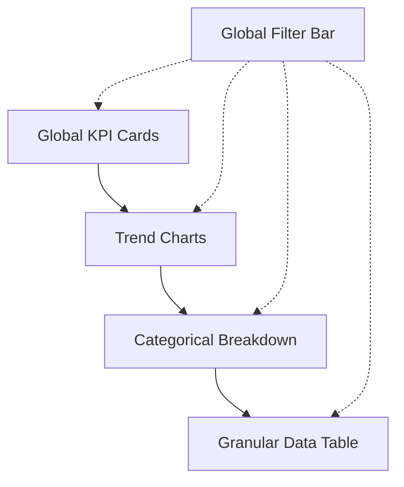

<!-- generated by .nezam/scripts/sync/sync-ai-folders.js — do not edit; edit .cursor/ and run pnpm ai:sync -->

---
name: dashboard-ia-patterns
description: Design patterns for information architecture and hierarchical data display.
version: 1.0.0
updated: 2026-05-13
changelog:
  - 2026-05-13: Initial version
---

# Dashboard IA Patterns

## Purpose
Ensures dashboards are logically structured, prioritizing critical KPIs while allowing deep-dive exploration through consistent navigation.

## Inputs
- User personas and primary goals.
- Key Performance Indicator (KPI) list.

## Step-by-Step Workflow
1. Apply "Summary-to-Detail" hierarchy (Global KPIs -> Trends -> Breakdown -> Tables).
2. Design a consistent global filter bar with time and segment controls.
3. Define standard card layouts and grid spacing for analytical widgets.
4. Implement context-aware drill-down interactions for all charts.

## Examples

## Validation & Metrics
- Scannability: Users should identify primary KPI status in < 3s.
- Consistency: 100% adherence to defined layout grid.

## Output Format
- Dashboard Wireframes (ASCII/Mermaid)
- IA Specification Document

## Integration Hooks
- `/PLAN` phase for analytical features.
- UX/UI review gates.
