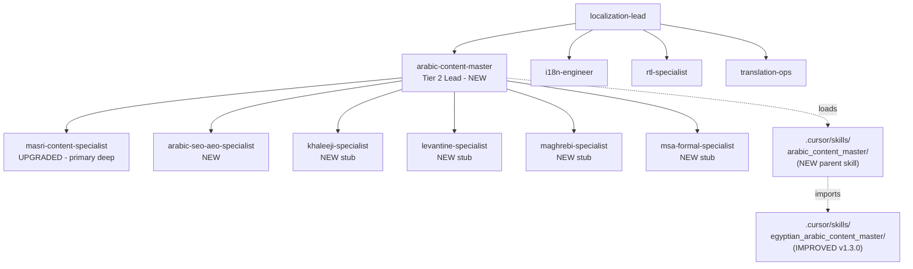

# Arabic Content Swarm Specialist + Skill Upgrade

## Goal

Add a swarm-grade Arabic content authority centered on Egyptian (Masri) excellence with MENA-wide awareness, and lift the underlying skill to v1.3.0 with verticals, extended channels, Ramadan/religious calendar, Arabic typography & a11y, expanded golden pairs, and a corrected manifest.

## Architecture (after change)

## Deliverable 1 - New parent skill `.cursor/skills/arabic_content_master/`

Files to create:

- `skill.md` - manifest pointer + persona overview, declares dialect routing.
- `arabic_content_master.md` - main persona: senior MENA Arabic copy lead, defaults to Masri, switches to other dialects on brief.
- `skill_manifest.json` - v1.0.0, locales `[ar-eg, ar-sa, ar-lb, ar-ma, ar, en]`, declares agents `[arabic-content-master, masri-content-specialist, arabic-seo-aeo-specialist]`, imports `egyptian_arabic_content_master` as default Egyptian module.
- `dialect_modules/README.md` - registry of dialect packs and when to load each.
- `dialect_modules/egyptian.md` - pointer to `../egyptian_arabic_content_master/` as the canonical Egyptian module (no duplication).
- `dialect_modules/khaleeji.md`, `levantine.md`, `maghrebi.md`, `msa_formal.md` - lightweight stubs (~30 lines each): when to use, key vocabulary differences from Masri, escalation note ("partner with native speaker / vendor").
- `shared/ramadan_religious_calendar.md` - Ramadan, Eid al-Fitr, Eid al-Adha, Mouled, Ashura tone presets; respectful-marketing guardrails (no humour during religious solemn moments, sahour/iftar timing for sends).
- `shared/arabic_typography_a11y.md` - font stack (Cairo, Noto Naskh Arabic, IBM Plex Sans Arabic), Tashkeel rules, RTL line-length (45-75 chars), Arabic vs Indo-Arabic numerals, screen-reader pronunciation tips, lang attributes (`lang="ar-EG"`).
- `shared/channel_playbooks_extended.md` - WhatsApp Business templates, IVR/voice-bot scripts, podcast intros/outros, customer-service reply patterns, push notifications (60-char Arabic limit), error/empty state copy.
- `evaluation/golden_pairs_arabic.jsonl` - **20+ entries** across hospitality, realestate, health, fintech, ecommerce, education, F&B, SaaS, official/government; Law 151/2020 safe synthetic data only.
- `contracts/dialect_router.yaml` - advisory map: (target_market, audience, register) -> dialect_module path.

## Deliverable 2 - Improve existing `.cursor/skills/egyptian_arabic_content_master/`

- `skill_manifest.json` - bump to **v1.3.0**, fix `pack_path` to `.cursor/skills/egyptian_arabic_content_master/`, populate `agents: ["masri-content-specialist"]`, add `commands: ["/PLAN content masri", "/SCAN seo masri"]`, add capabilities `arabic_typography_a11y`, `ramadan_religious_tone`.
- Add verticals: `verticals/hospitality.md`, `realestate.md`, `health.md`, `ecommerce.md`, `education.md`, `food_beverage.md`, `saas.md` - each with vocabulary, objections to pre-empt, banned claims, default tones, two synthetic Egyptian Arabic snippets (matching the existing `verticals/fintech.md` shape).
- Append 10+ Egyptian-specific golden pairs to `evaluation/golden_pairs.jsonl` (hospitality, realestate, health, ecommerce, education, F&B, SaaS, ramadan-specific).
- Update `egyptian_arabic_content_master.md` Skill pack pointers table to reference the new parent skill's shared modules.
- Update `skill.md` protocols list to load Ramadan/religious calendar and a11y modules from the parent skill when relevant.

## Deliverable 3 - New Tier-2 Lead agent `.cursor/agents/arabic-content-master.md`

Full persona with the same shape as `localization-lead.md`:

- Front-matter: `role: Arabic Content Master Lead`, `code-name: arabic-content-master`, `swarm: localization`, `reports-to: localization-lead`, `subagents: masri-content-specialist, khaleeji-specialist, levantine-specialist, maghrebi-specialist, msa-formal-specialist, arabic-seo-aeo-specialist`.
- Charter, Team Leader Scope, Subagents table, Primary skills (`@arabic_content_master`, `@egyptian_arabic_content_master`, `@coi-aeo-answer-engines`, `@coi-geo-optimization`, `@coi-topical-authority`, `@coi-content-modeling`).
- Activation triggers (`/PLAN content arabic`, dialect router, MENA voice review).
- Output contract (dialect routing decision + copy + rubric scorecard + Arabic SEO/AEO map + cultural sensitivity check).
- Escalation rules.
- Invocation Prompt Template block (matching `content-workflow-manager.md` shape).

## Deliverable 4 - Upgrade `.cursor/agents/masri-content-specialist.md`

Replace current minimal file with full agent persona:

- Add front-matter (`role`, `code-name`, `swarm: localization`, `reports-to: arabic-content-master`, `subagents: masri-hero-copy, masri-longform, masri-video-script, masri-legal-ux, masri-humour-reviewer`).
- Keep all current Core Principles, Activation Triggers, Expected Outputs, @skill Dependencies, Anti-Patterns.
- Add Subagents table, Output contract specifics per asset type, Invocation Prompt Template.
- Add explicit binding to new shared modules (typography/a11y, Ramadan calendar, extended channels).

## Deliverable 5 - New supporting agents (4 stubs + 1 full)

Each ~30-60 lines following the existing minimal-agent pattern:

- `.cursor/agents/khaleeji-specialist.md` - stub: when to engage, escalation to local vendor.
- `.cursor/agents/levantine-specialist.md` - stub.
- `.cursor/agents/maghrebi-specialist.md` - stub.
- `.cursor/agents/msa-formal-specialist.md` - stub for legal/official/regional MSA.
- `.cursor/agents/arabic-seo-aeo-specialist.md` - **full persona**: Arabic SERP features, voice search (Egyptian and Khaleeji intents), AEO answer engines, Arabic structured data, hreflang/`lang` attribute discipline; reports to `arabic-content-master`, dotted-line to `seo` and `aeo`.

## Deliverable 6 - Governance wiring

- Update `[.cursor/agents/README.md](.cursor/agents/README.md)`:
  - Add a new "Localization sub-team" block under cross-cutting domains listing `arabic-content-master` as Tier-2 Lead with its 6 subagents.
  - Add `arabic-content-master`, `arabic-seo-aeo-specialist`, and the 4 dialect stubs to the Index.
- Update `[.cursor/agents/localization-lead.md](.cursor/agents/localization-lead.md)` `subagents:` line to add `arabic-content-master` as the Arabic-domain lead (replacing the current `masri-content` informal subagent reference).
- Update `[docs/workspace/context/governance/ORCHESTRATION_ALIASES.md](docs/workspace/context/governance/ORCHESTRATION_ALIASES.md)` if it lists agent aliases (verify and append `arabic` -> `arabic-content-master` and dialect aliases).

## Deliverable 7 - Sync to mirrored AI surfaces

After all `.cursor/` edits, run `pnpm ai:sync` to mirror into:
- `.claude/skills/`, `.claude/agents/`, `.antigravity/skills/`, `.antigravity/agents/`
- `AGENTS.md`, `CLAUDE.md` (regenerated synced indices)

Then run `pnpm ai:check` to confirm no drift.

## Out of scope (per your selections)

- No standalone `mena_dialect_ladder.md` (handled inline inside parent skill `arabic_content_master.md` and `dialect_modules/README.md`).
- No colocated `agent.md` binding file inside the skill (handled via `skill_manifest.json` `agents` field).
- No code/runtime changes outside `.cursor/`, `.claude/`, `.antigravity/`, `AGENTS.md`, `CLAUDE.md`, and the agents README.

## Verification (post-edit, before commit)

1. `pnpm ai:check` returns clean (no drift).
2. Spot-check `AGENTS.md` and `CLAUDE.md` regenerated indices contain the 6 new agent entries.
3. Confirm `skill_manifest.json` for both skills passes JSON parse (manual inspection).
4. Confirm new parent skill's `dialect_modules/egyptian.md` correctly points to the existing Egyptian skill (no content duplication).
5. Read final `[.cursor/agents/arabic-content-master.md](.cursor/agents/arabic-content-master.md)` end-to-end for charter, subagents, output contract, and Invocation Prompt Template completeness.

## Estimated change footprint

- New files: ~25 (1 parent skill suite + 7 new verticals + 5 new agents + shared modules + golden pairs)
- Modified files: ~7 (existing skill manifest + Egyptian persona + golden pairs append + masri agent upgrade + localization-lead subagents line + agents README + sync mirrors via script)
- Lines added: ~1,800-2,400 (mostly markdown content)
- Lines removed: minimal (only the masri-content-specialist replacement and one localization-lead subagents line)