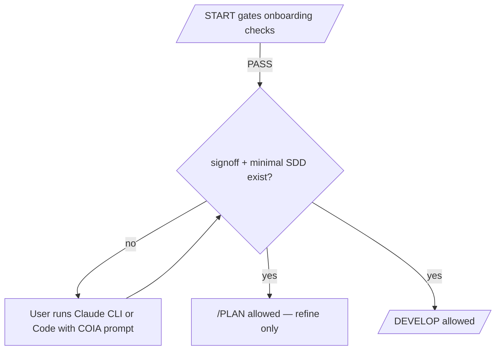

# Claude CLI + Claude Code handoff + planning hard lock

## Context

- Onboarding today: [`README.md`](README.md) steps 1–5 through [`/START gates`](.cursor/commands/start.md); planning is [`/PLAN`](.cursor/commands/plan.md) inside Cursor.
- Existing prompt surface: [`docs/workspace/templates/PROMPT_DOCUMENT.template.md`](docs/workspace/templates/PROMPT_DOCUMENT.template.md) → `docs/core/required/PROJECT_PROMPT.md`, not tailored to **Claude CLI** or **Claude Code**.
- No root [`CLAUDE.md`](CLAUDE.md) today; optional via `/CREATE`.

## Product decision (confirmed)

- **Claude plans first** — until Claude-driven planning finishes, the workflow stays locked.
- After sign-off exists, **Cursor `/PLAN` is allowed** for refinement (optional), not a substitute for the initial Claude planning gate.

## Planning lock — definition

**Sentinel file (required):** `docs/core/required/sdd/CLAUDE_PLANNING_SIGNOFF.md`

- Produced **last** by the Claude CLI/Code mission (instructions embedded in generated prompts).
- **YAML frontmatter** (machine-frugal): e.g. `status: complete`, `tool: cli | code`, `completed_at` ISO timestamp.
- Body: short checklist confirming reads + writes (links to paths).

**Minimal artifact set (required)** — enforced alongside sentinel so “done” is substantive, not an empty stamp:

- `docs/core/required/sdd/SEO_RESEARCH.md`
- `docs/core/required/sdd/ROADMAP.md`
- `docs/core/required/sdd/PHASES.md`

(Aligned with [`plan-full`](.cursor/skills/plan-full/SKILL.md) entry outputs; Claude prompt text instructs creating/updating these.)

## Hard-lock enforcement points

1. **[`.cursor/commands/plan.md`](.cursor/commands/plan.md)** — extend **Required preflight**: after current onboarding file checks, **hard-block** unless sentinel exists **and** minimal artifact paths exist. Recovery path: run Claude handoff → rerun when files exist. Clarify in prose: first planning cycle is **Claude-owned**; Cursor `/PLAN` afterward is refinement.

2. **[`.cursor/commands/develop.md`](.cursor/commands/develop.md)** — add **same preflight** at top of command behavior for any substantive `/DEVELOP` work (all subcommands that imply implementation, not `help`). Refuse with remediation pointing at Claude prompts + sign-off path.

3. **[`.cursor/commands/start.md`](.cursor/commands/start.md)** — **`gates`** (and **`all`** when evaluating completion): **tiered report**
   - `PASS | Onboarding` vs `FAIL | …` (unchanged checks).
   - **Planning lock**: `FAIL | Claude planning lock` until sentinel + minimal SDD exist; print exact remediation (paths + `/CREATE claude-*`).
   - Optional: overall summary line “Planning unlocked” only when both tiers pass.

4. **[`scripts/checks/check-onboarding-readiness.sh`](scripts/checks/check-onboarding-readiness.sh)** — extend to fail CI unless onboarding artifacts **and** planning lock criteria pass (sentinel + three SDD files). Update failure message to mention Claude CLI/Code step order.

5. **[`.github/workflows/ci.yml`](.github/workflows/ci.yml)** — confirm still invokes readiness script; adjust job name/comments if misleading (“planning readiness” vs “onboarding only”).

6. **Escape hatch (document only unless you want env support):** e.g. `COIA_SKIP_PLANNING_LOCK=1` for legacy repos — implement only if you want zero churn for existing consumers; default **strict**.

## Handoff artifacts (prompts)

- **`docs/core/required/CLAUDE_CLI_PLAN.md`** — paste prompt: mission, read PRD + PROJECT_PROMPT + context docs, execute SDD order, **write sign-off last**, create minimal SDD set.
- **`docs/core/required/CLAUDE_CODE_HANDOFF.md`** — same mission, Claude Code-specific framing (`CLAUDE.md` optional).
- **`docs/workspace/templates/CLAUDE_CLI_PLAN_PROMPT.template.md`**, **`docs/workspace/templates/CLAUDE_MD_AGENT.template.md`**, **`docs/workspace/templates/CLAUDE_PLANNING_SIGNOFF.template.md`** — `/CREATE` sources.

## `/CREATE` extensions

Extend [`.cursor/commands/create.md`](.cursor/commands/create.md):

- `claude-cli-prompt` → `docs/core/required/CLAUDE_CLI_PLAN.md`
- `claude-code-handoff` → `docs/core/required/CLAUDE_CODE_HANDOFF.md`
- `claude-md` → root `CLAUDE.md` (non-clobber unless `force`)
- `claude-plan-signoff` → optional scaffold empty sign-off **stub** is risky (would bypass lock) — **do not** scaffold completed sign-off via `/CREATE`; only document that Claude fills it. Template lives under `docs/workspace/templates/` for Claude to copy if needed, not auto-installed as “complete”.

## Docs & README

- [`README.md`](README.md) — after `/START gates`, sequence: generate Claude prompts → **must** complete Claude planning → `/START gates` shows planning unlocked → then `/PLAN` refine / `/DEVELOP`.
- New [`docs/workspace/context/CONTEXT.md`](docs/workspace/context/CONTEXT.md) — CLI vs Code, lock semantics, sign-off path.
- Optional one-line link from [`docs/workspace/context/CONTEXT.md`](docs/workspace/context/CONTEXT.md).

## Verification

- `/START gates` with onboarding-only: onboarding PASS, planning FAIL until files exist.
- With sentinel + SDD files present: both PASS.
- `/PLAN seo` (or any subcommand) refuses until unlock.
- `/DEVELOP feature` refuses until unlock.
- `bash scripts/checks/check-onboarding-readiness.sh` matches command semantics.

## Implementation note

Use **Context7** when implementing to confirm **Claude CLI** invocation patterns; keep paste-prompt stable and link official CLI docs for flags.
