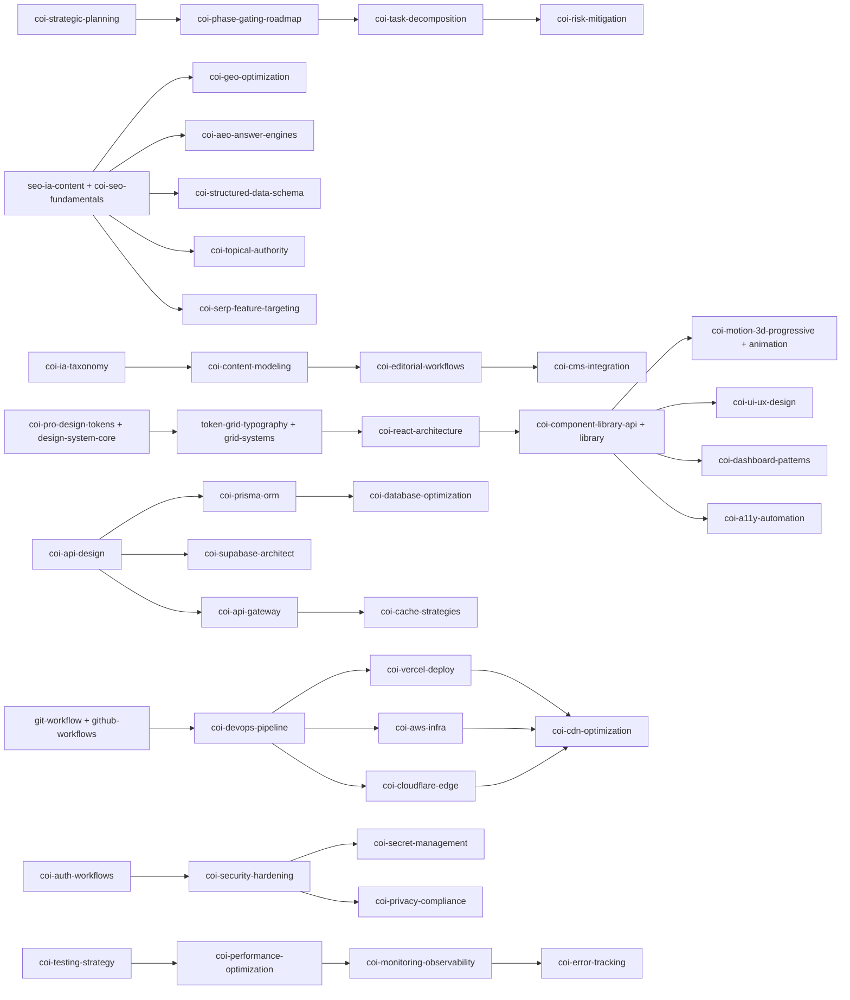

# COIA Skill Suite Expansion

## Overview

Deliver a 42-skill suite covering Planning, SEO/AEO/GEO, Content/IA, Frontend/Design, Backend/Data/APIs, Cloud/DevOps, Security, and Testing/Observability under `.cursor/skills/`. Per user direction:

- **Collision policy:** Merge new content into the 6 existing overlapping skill files in-place (no new dirs for them). Create 36 brand-new skill directories for the rest.
- **Delivery:** All 42 in a single pass / single commit.
- **Rules naming:** Reference current rules only — `workspace-orchestration.mdc`, `sdd-design.mdc`, `design-dev-gates.mdc`, `coia-design-gates-pro.mdc`.

## Mandatory `SKILL.md` Format (every file)

YAML frontmatter:

```markdown
---
name: <coi-skill-name>
description: <one-line load-when-and-what-it-produces>
---
```

Body sections, in order:

1. `# Purpose` — single-responsibility statement aligned to an official standard.
2. `# Inputs` — required specs, `docs/DESIGN.md` sections, env vars, schema drafts, security requirements.
3. `# Step-by-Step Workflow` — deterministic, file-safe steps with explicit CLI/API commands.
4. `# Validation & Metrics` — lint, type, perf budgets, a11y scores, coverage, security scans.
5. `# Output Format` — concrete artifact list (config, stubs, SQL, CI yml, OpenAPI, token JSON).
6. `# Integration Hooks` — `/PLAN`, `/DEVELOP`, `/SCAN`, `/SAVE`, `/DEPLOY` triggers and `@skill` cross-refs.
7. `# Anti-Patterns` — concrete failure modes (hardcoded secrets, layout shift, jank, deprecated APIs, cache stampedes).
8. `# External Reference` — closest match on `https://skills.sh/official` or canonical vendor doc, with version lock.

Every skill must reference applicable rules from [.cursor/rules/workspace-orchestration.mdc](.cursor/rules/workspace-orchestration.mdc), [.cursor/rules/sdd-design.mdc](.cursor/rules/sdd-design.mdc), [.cursor/rules/design-dev-gates.mdc](.cursor/rules/design-dev-gates.mdc), and [.cursor/rules/coia-design-gates-pro.mdc](.cursor/rules/coia-design-gates-pro.mdc).

## Files to Create (36 new directories)

### Planning & Project Execution (4)

- `.cursor/skills/coi-strategic-planning/SKILL.md`
- `.cursor/skills/coi-phase-gating-roadmap/SKILL.md`
- `.cursor/skills/coi-task-decomposition/SKILL.md`
- `.cursor/skills/coi-risk-mitigation/SKILL.md`

### SEO/GEO/AEO (5; `coi-seo-fundamentals` merged into existing `seo-ia-content`)

- `.cursor/skills/coi-geo-optimization/SKILL.md`
- `.cursor/skills/coi-aeo-answer-engines/SKILL.md`
- `.cursor/skills/coi-structured-data-schema/SKILL.md`
- `.cursor/skills/coi-topical-authority/SKILL.md`
- `.cursor/skills/coi-serp-feature-targeting/SKILL.md`

### Content & Information Architecture (4)

- `.cursor/skills/coi-ia-taxonomy/SKILL.md`
- `.cursor/skills/coi-content-modeling/SKILL.md`
- `.cursor/skills/coi-editorial-workflows/SKILL.md`
- `.cursor/skills/coi-cms-integration/SKILL.md`

### Frontend, UI/UX, Design Systems (4 new; 4 merged into existing)

New:

- `.cursor/skills/coi-react-architecture/SKILL.md`
- `.cursor/skills/coi-ui-ux-design/SKILL.md`
- `.cursor/skills/coi-dashboard-patterns/SKILL.md`
- `.cursor/skills/coi-a11y-automation/SKILL.md`

### Backend, Data & APIs (6)

- `.cursor/skills/coi-api-design/SKILL.md`
- `.cursor/skills/coi-api-gateway/SKILL.md`
- `.cursor/skills/coi-supabase-architect/SKILL.md`
- `.cursor/skills/coi-prisma-orm/SKILL.md`
- `.cursor/skills/coi-database-optimization/SKILL.md`
- `.cursor/skills/coi-cache-strategies/SKILL.md`

### Cloud, DevOps & Infrastructure (5 new; `coi-github-workflows` merged into existing `git-workflow`)

- `.cursor/skills/coi-vercel-deploy/SKILL.md`
- `.cursor/skills/coi-aws-infra/SKILL.md`
- `.cursor/skills/coi-cloudflare-edge/SKILL.md`
- `.cursor/skills/coi-devops-pipeline/SKILL.md`
- `.cursor/skills/coi-cdn-optimization/SKILL.md`

### Security, Auth & Compliance (4)

- `.cursor/skills/coi-auth-workflows/SKILL.md`
- `.cursor/skills/coi-security-hardening/SKILL.md`
- `.cursor/skills/coi-secret-management/SKILL.md`
- `.cursor/skills/coi-privacy-compliance/SKILL.md`

### Testing, Quality & Observability (4)

- `.cursor/skills/coi-testing-strategy/SKILL.md`
- `.cursor/skills/coi-performance-optimization/SKILL.md`
- `.cursor/skills/coi-monitoring-observability/SKILL.md`
- `.cursor/skills/coi-error-tracking/SKILL.md`

## Files to Merge In-Place (6 existing files updated)

These existing skills get expanded to absorb the proposed concepts and adopt the full mandatory 8-section format. No new directories are created for these names.

- [.cursor/skills/seo-ia-content/SKILL.md](.cursor/skills/seo-ia-content/SKILL.md) — absorbs `coi-seo-fundamentals` (keyword clustering, meta optimization, canonicalization, crawl budget). Adds full 8-section structure; cross-links to new `coi-geo-optimization`, `coi-aeo-answer-engines`, `coi-structured-data-schema`, `coi-topical-authority`, `coi-serp-feature-targeting`.
- [.cursor/skills/coi-component-library-api/SKILL.md](.cursor/skills/coi-component-library-api/SKILL.md) — absorbs `coi-component-library` (Storybook, variant APIs, `forwardRef`, tree-shaking, a11y defaults). Adds `# Anti-Patterns` and `# External Reference` sections.
- [.cursor/skills/coi-pro-design-tokens/SKILL.md](.cursor/skills/coi-pro-design-tokens/SKILL.md) — absorbs `coi-design-system-core` (W3C tokens, theme switching, typography scales, spacing matrices). Adds `# Anti-Patterns` and `# External Reference`.
- [.cursor/skills/coi-motion-3d-progressive/SKILL.md](.cursor/skills/coi-motion-3d-progressive/SKILL.md) — absorbs `coi-motion-animation` (Framer Motion/GSAP, GPU compositing, `prefers-reduced-motion`, R3F fallbacks). Adds missing sections.
- [.cursor/skills/token-grid-typography/SKILL.md](.cursor/skills/token-grid-typography/SKILL.md) — absorbs `coi-grid-systems` (CSS Grid/Flex, container queries, `clamp()` scaling, breakpoint matrices). Reformats to mandatory structure.
- [.cursor/skills/git-workflow/SKILL.md](.cursor/skills/git-workflow/SKILL.md) — absorbs `coi-github-workflows` (Conventional commits, PR checks, branch protection, Dependabot). Reformats to mandatory structure.

## Cross-Skill Dependency Map

Each skill's `# Integration Hooks` will declare upstream and downstream `@skill` references. Key chains:




## Index & Documentation Updates

- Update [docs/workspace/context/WORKSPACE_INDEX.md](docs/workspace/context/WORKSPACE_INDEX.md) — append a new "COIA expanded skill suite" subsection under "Cursor skills" listing all 42 entries grouped by category, each as a markdown link.
- No changes to slash commands; the new skills are referenceable via `@.cursor/skills/<name>/SKILL.md` and via `/PLAN`, `/DEVELOP`, `/SCAN`, `/SAVE`, `/DEPLOY` integration hooks declared inside each skill.

## Constraints (carried from prompt)

- Path discipline: only under `.cursor/skills/<name>/SKILL.md`.
- Diff-only on the 6 existing files; never overwrite the rest of the workspace.
- No app code generated — only skill scaffolding and procedural workflows.
- Version-lock in `# External Reference` where applicable: OpenAPI 3.1, OAuth 2.1, OIDC, schema.org current, React 19, Next.js 15, Prisma 6, Supabase Postgres 15+, Vercel CLI current, AWS CDK v2, Cloudflare Workers (current), WCAG 2.2, Playwright current.
- All version-locked references must reflect today's documentation; flag any deprecated patterns inside `# Anti-Patterns`.

## Acceptance Criteria

- 36 new `SKILL.md` files exist under their named directories.
- 6 existing `SKILL.md` files updated in place to the mandatory 8-section format with merged content.
- Every file has the YAML frontmatter (`name`, `description`) and all 8 sections in order.
- Every file's `# Integration Hooks` cites at least one `/COMMAND` and one `@skill` cross-reference.
- Every file's `# External Reference` cites a current canonical source (vendor doc URL or `https://skills.sh/official` entry) with a version lock note.
- `WORKSPACE_INDEX.md` lists every new and merged skill under a new subsection, alphabetized within each category.
- No app code, no implementation files, no changes to `.cursor/commands/`, `.cursor/rules/`, or any non-skill, non-index file.

