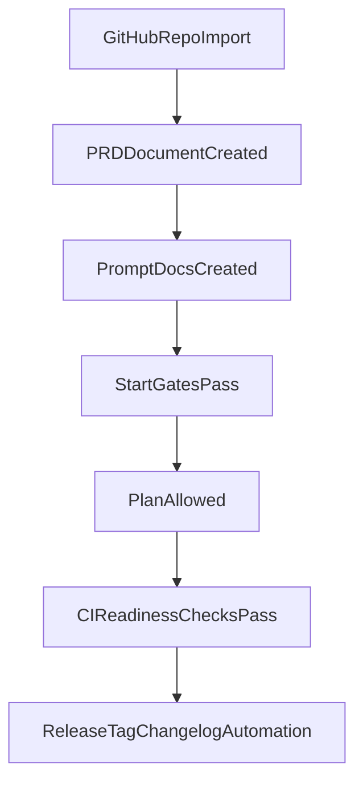

# GitHub Automation + Onboarding Gate Plan

## Goals

- Strengthen GitHub-related command automation for release flow and CI checks.
- Enforce onboarding order as a hard prerequisite for planning:
  1. GitHub repo import/attach
  2. PRD created
  3. Prompt docs created
  4. planning allowed

## Scope

- Update command definitions and workflow automation so behavior is both documented and enforced.
- Add hard-block checks in command preflight and GitHub CI.

## Planned Changes

### 1) Enforce hard onboarding gates in command layer

- Update `[/Users/Dorgham/Documents/Work/Devleopment/COIA/.cursor/commands/start.md](/Users/Dorgham/Documents/Work/Devleopment/COIA/.cursor/commands/start.md)`:
  - Make `/START gates` explicitly fail unless all of the following are true:
    - repo import/attach is confirmed (Git remote configured)
    - `docs/specs/prd/PRD.md` exists
    - `docs/prompts/PROJECT_PROMPT.md` exists
  - Keep gate output actionable with exact remediation commands.
- Update `[/Users/Dorgham/Documents/Work/Devleopment/COIA/.cursor/commands/plan.md](/Users/Dorgham/Documents/Work/Devleopment/COIA/.cursor/commands/plan.md)`:
  - Add hard preflight: refuse `/PLAN` execution when onboarding gate conditions are missing.
  - Point users to `/START gates` and `/CREATE prd` / `/CREATE prompt` as recovery path.

### 2) Tighten PRD/prompt dependency messaging

- Update `[/Users/Dorgham/Documents/Work/Devleopment/COIA/.cursor/commands/create.md](/Users/Dorgham/Documents/Work/Devleopment/COIA/.cursor/commands/create.md)`:
  - Clarify creation order and dependency (PRD first, prompt second, then planning).
- Update `[/Users/Dorgham/Documents/Work/Devleopment/COIA/README.md](/Users/Dorgham/Documents/Work/Devleopment/COIA/README.md)`:
  - Mirror strict onboarding sequence and planning block behavior.

### 3) Add GitHub CI enforcement for planning readiness

- Expand `[/Users/Dorgham/Documents/Work/Devleopment/COIA/.github/workflows/ci.yml](/Users/Dorgham/Documents/Work/Devleopment/COIA/.github/workflows/ci.yml)`:
  - Add a dedicated validation job that fails PR/push checks if required onboarding artifacts are missing:
    - `docs/specs/prd/PRD.md`
    - `docs/prompts/PROJECT_PROMPT.md`
  - Add checks that repository context is valid for GitHub workflow execution (e.g., remote present in checkout context when applicable).
- Add a lightweight script for reusable validation logic (new file under `scripts/`) and call it from CI + local command guidance.

### 4) Enhance GitHub release automation

- Add/extend GitHub workflow(s) under `[/Users/Dorgham/Documents/Work/Devleopment/COIA/.github/workflows/](/Users/Dorgham/Documents/Work/Devleopment/COIA/.github/workflows/)`:
  - Automated release flow (manual `workflow_dispatch` and/or release-branch trigger).
  - Tag/release-note generation aligned with existing semver planning guidance.
- Align behavior docs with automation:
  - Update `[/Users/Dorgham/Documents/Work/Devleopment/COIA/.cursor/commands/deploy.md](/Users/Dorgham/Documents/Work/Devleopment/COIA/.cursor/commands/deploy.md)`
  - Update `[/Users/Dorgham/Documents/Work/Devleopment/COIA/.cursor/commands/save.md](/Users/Dorgham/Documents/Work/Devleopment/COIA/.cursor/commands/save.md)`
  - Update `[/Users/Dorgham/Documents/Work/Devleopment/COIA/.cursor/skills/git-workflow/SKILL.md](/Users/Dorgham/Documents/Work/Devleopment/COIA/.cursor/skills/git-workflow/SKILL.md)`

## Validation Plan

- Command-level validation:
  - Verify `/START gates` fails when any prerequisite is missing and passes when all exist.
  - Verify `/PLAN` hard-block behavior when prerequisites are unmet.
- CI validation:
  - Open a PR missing one prerequisite file and confirm failure.
  - Add missing file(s) and confirm CI passes.
- Release automation validation:
  - Dry-run/manual trigger path confirms workflow wiring, artifacts, and release metadata generation.

## Implementation Order

1. Hard gates in `/START` and `/PLAN`
2. PRD/prompt dependency docs in `/CREATE` + `README`
3. CI readiness checks
4. Release/tag/changelog automation and command doc alignment
5. End-to-end verification

