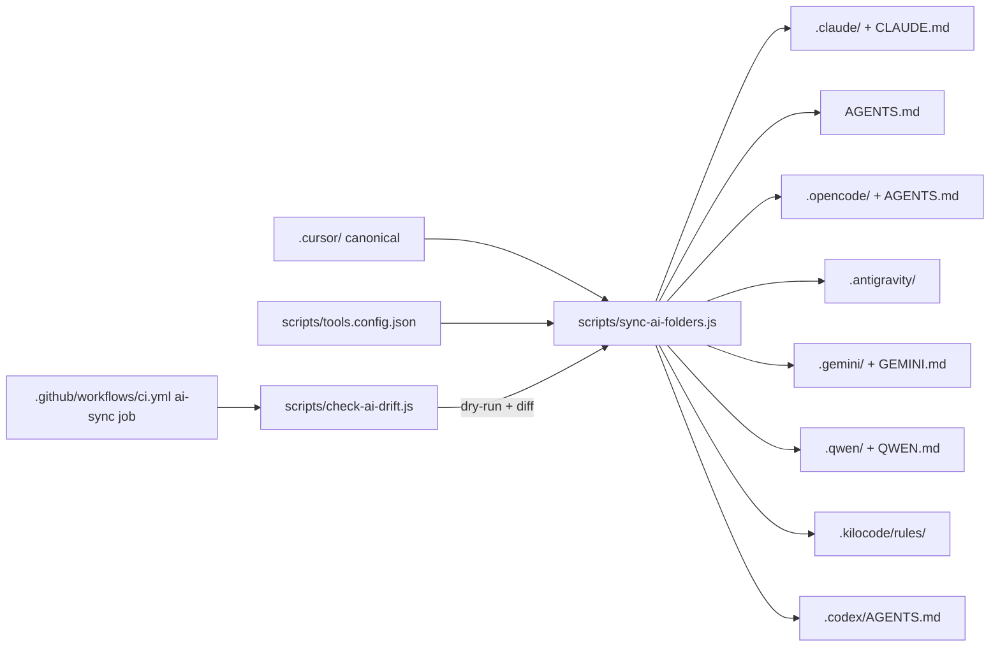

# Multi-tool AI client support

## Goal

Extend the existing `[.cursor/](/.cursor/)` orchestration kit (10 commands, 26 agents, 61 skills, 5 rules, hooks, plans) so the same governance works in:

- **Cursor IDE** (already supported)
- **Antigravity IDE**
- **Claude Code** + **Claude CLI**
- **Gemini CLI**
- **Qwen CLI**
- **Copilot CLI**
- **Opencode CLI**
- **Kilo Code CLI**
- **Codex app** + **Codex CLI**

## Strategy (defaults applied, change in plan if needed)

- **Single source of truth:** `.cursor/` stays canonical. No content forks.
- **Generator approach:** `scripts/sync-ai-folders.js` (Node 20, no deps) emits per-tool folders from `.cursor/` plus a `tools.config.json` mapping. `scripts/check-ai-drift.js` re-runs generator in dry-run and compares disk; CI fails on drift.
- **Tier-1 fully implemented now** (Cursor + Claude Code/CLI + Codex CLI/app + Copilot CLI + Opencode CLI). **Tier-2 scaffolded** with folders, mappings, and `TODO` markers (Antigravity, Gemini CLI, Qwen CLI, Kilo Code CLI) — full transformer logic delivered, content fidelity to be tightened in follow-up.

## Target layout (per tool)

- **Cursor IDE** — `[.cursor/commands/](/.cursor/commands/)`, `[.cursor/agents/](/.cursor/agents/)`, `[.cursor/skills/](/.cursor/skills/)`, `[.cursor/rules/](/.cursor/rules/)` (canonical, untouched).
- **Claude Code / Claude CLI** — `CLAUDE.md` (root) + `.claude/commands/*.md` (slash), `.claude/agents/*.md` (subagent YAML), `.claude/skills/<slug>/SKILL.md`. Rules folded into `CLAUDE.md`.
- **Codex CLI / Codex app / Copilot CLI** — root `AGENTS.md` only (these clients consume `AGENTS.md` as memory). Optional `.codex/AGENTS.md` mirror.
- **Opencode CLI** — root `AGENTS.md` + `.opencode/command/*.md` + `.opencode/agent/*.md`.
- **Antigravity IDE** — `.antigravity/commands/*.md`, `.antigravity/agents/*.md`, `.antigravity/skills/<slug>/SKILL.md`, `.antigravity/rules/*.md`. Reuses existing `[docs/rules/guide-response-style.mdc](docs/rules/guide-response-style.mdc)` and `[guide-handoff-footer.mdc](docs/rules/guide-handoff-footer.mdc)` referenced by `[workspace-orchestration.mdc](.cursor/rules/workspace-orchestration.mdc)`.
- **Gemini CLI** — `GEMINI.md` (root) + `.gemini/commands/*.toml` (transformed from `.cursor/commands/*.md`).
- **Qwen CLI** — `QWEN.md` (root) + `.qwen/commands/*.toml`.
- **Kilo Code CLI** — `.kilocode/rules/*.md` (rules-only surface).

## Generator architecture

### Transformers (one per surface kind)

- **commands → markdown copy** (Claude, Antigravity, Opencode): preserve YAML frontmatter; rewrite intra-repo links so they keep working from the new folder root; strip Cursor-only banner text where harmless.
- **commands → TOML** (Gemini, Qwen): each `.cursor/commands/<name>.md` becomes `.toml` with `name`, `description` (from frontmatter), `prompt` (body, escaped). Per Gemini/Qwen TOML command spec.
- **agents → markdown copy** (Claude, Antigravity, Opencode): rewrite frontmatter to client-specific keys (Claude expects `name`, `description`, optional `tools`/`model`).
- **skills → folder copy** (Claude, Antigravity): mirror `<slug>/SKILL.md` plus assets.
- **rules → memory injection**: synthesize `.cursor/rules/*.mdc` into a single section embedded in each root memory file (`AGENTS.md`, `CLAUDE.md`, `GEMINI.md`, `QWEN.md`); also write standalone copies under `.antigravity/rules/` and `.kilocode/rules/`.
- **memory headers**: each root memory file gets a generated banner `<!-- generated by scripts/sync-ai-folders.js — do not edit; edit .cursor/ and run pnpm ai:sync -->` and a stable section order: pipeline → SDD hardlock → memory layers → recommendation footer → command index → agent index → skill index.

### Files to add

- `scripts/sync-ai-folders.js` (generator, ~300 lines, no deps)
- `scripts/check-ai-drift.js` (drift checker, calls generator with `--dry-run --diff`)
- `scripts/tools.config.json` (per-tool surface map; tier flag; transformer choice)
- `docs/workspace/templates/AGENTS.md.template.md` (header used by generator for Codex/Copilot/Opencode)
- `docs/workspace/templates/CLAUDE.md.template.md` (already partially exists at `[docs/workspace/templates/CLAUDE_MD_AGENT.template.md](docs/workspace/templates/CLAUDE_MD_AGENT.template.md)` — repurpose; rename if needed)
- `docs/workspace/templates/GEMINI.md.template.md`, `docs/workspace/templates/QWEN.md.template.md`
- `.cursor/commands/sync.md` — new `/SYNC` command (`/SYNC ai`, `/SYNC check`, `/SYNC help`) wrapping the generator
- `docs/workspace/context/MULTI_TOOL_INDEX.md` — index of all 11 tools, per-tool path map, what is canonical, when to use which tool

### Files to update

- `[package.json](package.json)` — add `"ai:sync": "node scripts/sync-ai-folders.js"`, `"ai:check": "node scripts/check-ai-drift.js"`. Keep root lean (only these two scripts on root, per your existing pref).
- `[.github/workflows/ci.yml](.github/workflows/ci.yml)` — new `ai-sync-drift` job (`pnpm ai:check` or `node scripts/check-ai-drift.js`); add to `policy-gate` `needs:` list.
- `[.cursor/commands/create.md](.cursor/commands/create.md)` — extend subcommand list with `agents-md`, `gemini-md`, `qwen-md`, `antigravity-init`, `opencode-init`, `kilo-init`, `codex-init`, plus a single `tools` subcommand that runs the generator.
- `[.cursor/commands/start.md](.cursor/commands/start.md)` — `/START gates` adds an `AI client sync` tier (PASS/FAIL based on drift check).
- `[.cursor/commands/guide.md](.cursor/commands/guide.md)` — guide already references Claude CLI/Code; add brief mention of multi-tool surface and link to `docs/workspace/context/MULTI_TOOL_INDEX.md`.
- `[.cursor/ORCHESTRATION_ALIASES.md](.cursor/ORCHESTRATION_ALIASES.md)` — add a "Per-tool surface" section linking `.claude/`, `.antigravity/`, `.gemini/`, `.qwen/`, `.codex/`, `.opencode/`, `.kilocode/`, `AGENTS.md`, `CLAUDE.md`, `GEMINI.md`, `QWEN.md` to their canonical `.cursor/` source.
- `[.cursor/rules/workspace-orchestration.mdc](.cursor/rules/workspace-orchestration.mdc)` — add a short "Cross-client governance precedence" subsection: tool-specific files are *generated artifacts*; do not hand-edit; edit `.cursor/` and re-run `pnpm ai:sync`.
- `[README.md](README.md)` — new "Supported AI clients" section (one-liner per tool + table) linking `docs/workspace/context/MULTI_TOOL_INDEX.md`.
- `[.gitignore](.gitignore)` — leave generated folders **tracked** (they are governance artifacts that need PR review), but ignore tool-local cache subpaths if any (e.g. `.codex/cache/`).

### Recommendation footer compatibility (Antigravity)

`workspace-orchestration.mdc` already calls out the conflict between the single-Recommendation footer and Antigravity's `### What to do next` shell. The Antigravity output for `.antigravity/rules/` will use the Antigravity-shell variants (sourced from `[docs/rules/guide-response-style.mdc](docs/rules/guide-response-style.mdc)` + `[guide-handoff-footer.mdc](docs/rules/guide-handoff-footer.mdc)`); all other tools use the Recommendation footer. Generator picks per-target.

### Hardlock semantics preserved

The SDD hardlock prerequisites in `[workspace-orchestration.mdc](.cursor/rules/workspace-orchestration.mdc)` and `[design-dev-gates.mdc](.cursor/rules/design-dev-gates.mdc)` are embedded into every root memory file (`AGENTS.md`, `CLAUDE.md`, `GEMINI.md`, `QWEN.md`) so a coding agent in any of the 11 tools sees the same gates: `docs/core/required/prd/PRD.md`, `docs/core/required/PROJECT_PROMPT.md`, `docs/DESIGN.md`, `docs/workspace/plans/gates/GITHUB_GATE_MATRIX.json`, per-subphase `prompt.json` + `PROMPT.md`.

## Verification

1. `node scripts/sync-ai-folders.js --write` — generates all surfaces; tracked files appear under each tool folder.
2. `node scripts/check-ai-drift.js` — exits 0 on a fresh sync; exits 1 + diff after editing any generated file.
3. `pnpm ai:sync && pnpm ai:check` round-trip clean.
4. `git status` after sync shows only intended new/changed paths (review with `git diff --stat`).
5. CI: PR with intentional drift fails the new `ai-sync-drift` job.
6. Spot-check by tool:
   - Open repo in Cursor — `.cursor/` unchanged.
   - `claude` (Claude Code) reads `CLAUDE.md` + `.claude/agents/`.
   - `codex` / `gh copilot` see `AGENTS.md`.
   - `gemini` reads `GEMINI.md` + `.gemini/commands/*.toml`.
   - `qwen` reads `QWEN.md` + `.qwen/commands/*.toml`.

## Out of scope (call out)

- Rewriting any of the 26 agents / 61 skills / 5 rules content. Generator only mirrors and transforms.
- Per-tool MCP server provisioning (each tool already has its own MCP layer; not unified here).
- Tier-2 content fidelity polish (Antigravity/Gemini/Qwen/Kilo command transformers ship working but may need follow-up tuning per real-world testing).