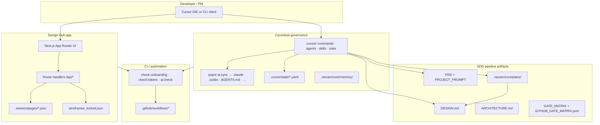

# ARCHITECTURE — NEZAM Workspace Kit

| Field | Value |
|---|---|
| Document | Architecture v1.0 |
| Status | Active |
| Owner | `lead-solution-architect` |
| Last updated | 2026-05-28 |
| PRD | `.nezam/core/prd/PRD.md` |
| Design contract | `DESIGN.md` (root) |
| ADRs | `.nezam/core/architecture/decisions/` |

---

## 1. System purpose

NEZAM is a **workspace governance layer** for AI-native software delivery. It is not a single consumer product binary; it is the contract, pipeline, memory, and tooling that keeps planning → design → development traceable across Cursor and mirrored AI clients.

Primary runtime surface in this repository:

| Surface | Role | Location |
|---|---|---|
| **Governance kit** | Commands, agents, skills, rules, gates, scripts | `.cursor/` (canonical), mirrored via `pnpm ai:sync` |
| **Design Hub** | Human-in-the-loop design decisions (architecture, wireframes, tokens, preview) | `.nezam/design-hub/` (Next.js 15, port 4000) |
| **SDD artifacts** | PRD, plans, specs, reports | `.nezam/core/`, `docs/` |
| **Session contracts** | Wireframe lock, agent bus, onboarding state | `.session/`, `.cursor/state/` |

---

## 2. Logical architecture



---

## 3. Technology stack

### 3.1 Workspace kit (repository root)

| Layer | Choice | Notes |
|---|---|---|
| Package manager | pnpm 9 | `packageManager` in root `package.json` |
| Node | 20+ (CI: ubuntu-latest) | Scripts under `.nezam/core/scripts/` |
| Sync | `sync-ai-folders.js` | `.cursor/` → Tier-1/Tier-2 mirrors; `pnpm ai:check` in CI |
| Release | semantic-release (optional) | `release.yml`; Conventional Commits per `.nezam/core/specs/VERSIONING.md` |
| Root app (optional) | Next.js + React | Thin shell at repo root when present; not the primary product |

### 3.2 Design Hub (`.nezam/design-hub/`)

| Layer | Choice | Notes |
|---|---|---|
| Framework | Next.js 15 App Router | `app/page.tsx`, `app/layout.tsx` |
| UI | React 19, Radix, Tailwind | Semantic `app-*` tokens; theme on `document.documentElement` |
| State | Zustand + Immer | Architecture tree, wireframe sessions, token editors |
| DnD | `@dnd-kit/*` | Wireframe block ordering |
| AI | Vercel AI SDK 6 + AI Gateway | `app/api/ai/*`; provider strings via gateway |
| Storage | Vercel Blob (when configured) | Asset uploads; local `.session/` for wireframe drafts |
| Tests | Vitest | `pnpm test` in design-hub package |
| Dev server | `pnpm design-hub` | Default port **4000** (`NEZAM_DESIGN_PORT`) |

### 3.3 Integrations (planned / ADR-backed)

| Domain | Direction | Record |
|---|---|---|
| Auth (product apps) | Auth0 default | `decisions/ADR-0001-auth-provider-auth0.md` (Proposed) |
| Identity for Design Hub | Session-local / future IdP | TBD per product fork |
| Analytics | PostHog (workspace plugin) | Optional; not required for kit CI |
| Git | GitHub Actions | Gate enforcement on PR |

---

## 4. Repository layout (governed paths)

```
NEZAM/
├── .cursor/                    # Canonical agents, commands, skills, rules
├── .nezam/
│   ├── core/
│   │   ├── architecture/       # This file + ADRs + diagrams
│   │   ├── gates/              # GATE_MATRIX.md, GITHUB_GATE_MATRIX.json
│   │   ├── prd/                # Locked PRD
│   │   ├── plans/              # Phase plans, MASTER_TASKS, specs
│   │   ├── memory/             # MEMORY.md, MCP_REGISTRY, handoffs
│   │   └── scripts/            # sync, checks, changelog, scaffold
│   └── design-hub/             # Next.js Design Hub application
├── .session/                   # Per-page wireframe sessions (arch page id keys)
├── DESIGN.md                   # Active design contract (required for /plan, /develop)
├── CHANGELOG.md                # Product/workspace release log (SemVer)
├── wireframes_locked.json      # Optional root lock export (develop hardlock)
└── docs/reports/               # Generated audits only (policy)
```

Path resolution for tools: read `.nezam/workspace.paths.yaml` or `.nezam/core/gates/workspace.paths.yaml` at session start (no hardcoded paths in new automation).

---

## 5. Design Hub — application architecture

### 5.1 Sections (product UI)

| Section | Responsibility |
|---|---|
| **Architecture** | App / menu / page / service tree; developer services catalog; integration guides |
| **Wireframes** | Per architecture page sessions (`.session/pages/{archPageId}.json`); block palette; lock export |
| **Preview** | Pages + sections preview aligned to architecture nodes |
| **Components** | `shadcn-component-registry.json` browser (not a Preview sub-tab) |
| **Tokens** | Theme + design-system panels; maps to `DESIGN.md` / profile tokens |

Architecture page IDs are the **source of truth** for wireframe binding (not index-only `PAGE-xxx` keys alone).

### 5.2 API surface (current)

| Route | Method | Purpose |
|---|---|---|
| `/api/pages/[pageId]` | CRUD | Page metadata tied to architecture nodes |
| `/api/ai/generate` | POST | AI-assisted generation (tokens / copy) |
| `/api/context` | POST | Context compression for prompts |
| `/api/lock` | POST | Lock / export wireframe contract |

Legacy v1 routes live under `.nezam/design-hub/_archive/v1/app/api/` for reference only.

### 5.3 Wireframe lock contract

Human-in-the-loop flow (SDD hardlock):

1. Agent or user completes architecture + design in Design Hub.
2. User saves per-page sessions under `.session/pages/`.
3. Lock exports `wireframes_locked.json` (repo root or `.session/`) with `arch_page_id` mapping.
4. `/DEVELOP` requires lock file before scaffold/build (see `GATE_MATRIX.md`).

---

## 6. Multi-client sync architecture

| Tier | Clients | Method |
|---|---|---|
| 1 | Cursor, Claude, Codex, Antigravity | Full mirror + root `CLAUDE.md` / `AGENTS.md` |
| 2 | Gemini, Qwen, Kilo, OpenCode, Windsurf, … | Best-effort mirror |

**Rule:** Never edit generated mirrors as source of truth. Edit `.cursor/` then `pnpm ai:sync`.

Pre-commit hook (local): runs sync when `.cursor/` is staged (see `.nezam/core/scripts/hooks/`).

---

## 7. Memory and orchestration

Four layers (see PRD §7):

| Layer | Store | Durability |
|---|---|---|
| 0 | Chat / open buffers | Ephemeral |
| 1 | `.nezam/core/memory/`, plans, specs | Git-tracked |
| 2 | `.cursor/agents/`, rules | Git-tracked contracts |
| 3 | `AGENTS.md`, `CLAUDE.md` | Generated index + behavior |

Agent routing: `swarm-leader` → `subagent-controller` → domain leads; lazy-load per `agent-lazy-load.mdc`.

Handoffs: `.cursor/state/agent-bus.yaml` (`type: handoff` required for MODE B/C assignments).

---

## 8. Data model (conceptual)

No single application database ships with the kit. Persistent **files** are the system of record:

| Entity | Storage | Key fields |
|---|---|---|
| PRD / prompt | Markdown | Requirements, personas, ACs |
| Plan phase | Markdown + YAML state | `plan_progress.yaml` flags |
| Design profile | `DESIGN.md` + `.nezam/design-hub/design/*` | Tokens, typography, components |
| Architecture tree | Design Hub UI + export JSON | `application`, `menu`, `page`, `service` nodes |
| Wireframe session | `.session/pages/{id}.json` | Blocks, layout shell, `arch_page_id` |
| Feature spec | `docs/plan/**/SPEC.md` or `F-*.md` | AC-IDs, status, spec_version |
| Gate evidence | `docs/reports/**` | Audits, Lighthouse, security |

---

## 9. Security and compliance boundaries

| Area | Policy |
|---|---|
| Secrets | Never commit; env via Vercel / local only |
| Reports | `docs/reports/<category>/` only (see `docs-reports-policy.mdc`) |
| Auth | ADR-0001: Auth0 for product surfaces; kit itself is local-first |
| MENA / RTL | `target_market` in onboarding; Arabic agents + RTL design gates when `mena` or `ar` |
| AI ethics | `lead-ai-ethics-officer` veto on GATE-007-class concerns |

Design Hub: sanitize SVG uploads; reject hardcoded px/hex outside token contract in governed UI code paths.

---

## 10. Non-functional targets

| Metric | Target | Verification |
|---|---|---|
| `pnpm ai:check` | 0 drift | CI on every PR |
| Onboarding readiness | Pass | `pnpm run check:onboarding` |
| Design tokens | No raw primitives in governed CSS | `pnpm run check:tokens` |
| Design Hub build | Clean | `cd .nezam/design-hub && pnpm build` |
| Design Hub tests | Pass | `cd .nezam/design-hub && pnpm test` |
| Lighthouse (when app pages ship) | LCP &lt; 2.5s, CLS &lt; 0.1, INP &lt; 200ms | `.lighthouserc.json` |

---

## 11. Phase dependencies (SDD)

```
/START → PRD + DESIGN lock
   → /PLAN (seo → ia → content → design → arch → scaffold)
   → wireframes_locked.json (Design Hub)
   → /DEVELOP (feature slices per SPEC)
   → /SCAN → /DEPLOY
```

Architecture doc must stay aligned with `DESIGN.md` and locked wireframes before implementation-facing `/DEVELOP`.

---

## 12. Open decisions

| ID | Topic | Status |
|---|---|---|
| OQ-01 | Expand `GITHUB_GATE_MATRIX.json` to full CI schema (stages, taxonomy) | Done — see `GATE_MATRIX.md` §6 |
| OQ-02 | Canvas server-side persistence for Design Hub | Out of scope v1 |
| OQ-03 | Auth0 activation for Design Hub login | Follow ADR-0001 when product auth ships |
| OQ-04 | Monorepo split (`apps/` vs kit-only repo) | Per fork; template stays kit-first |

---

## Decision amendments

| Date | Field | Previous | New | Reason | Approved by |
|---|---|---|---|---|---|
| 2026-05-28 | Canonical path | (none) | `.nezam/core/architecture/ARCHITECTURE.md` | `/PLAN architecture` output location | PM-01 |

---

*Sources: PRD v2.0.0 · `DESIGN.md` · `.nezam/design-hub/package.json` · `plan_progress.yaml` · archive design-server stub*
