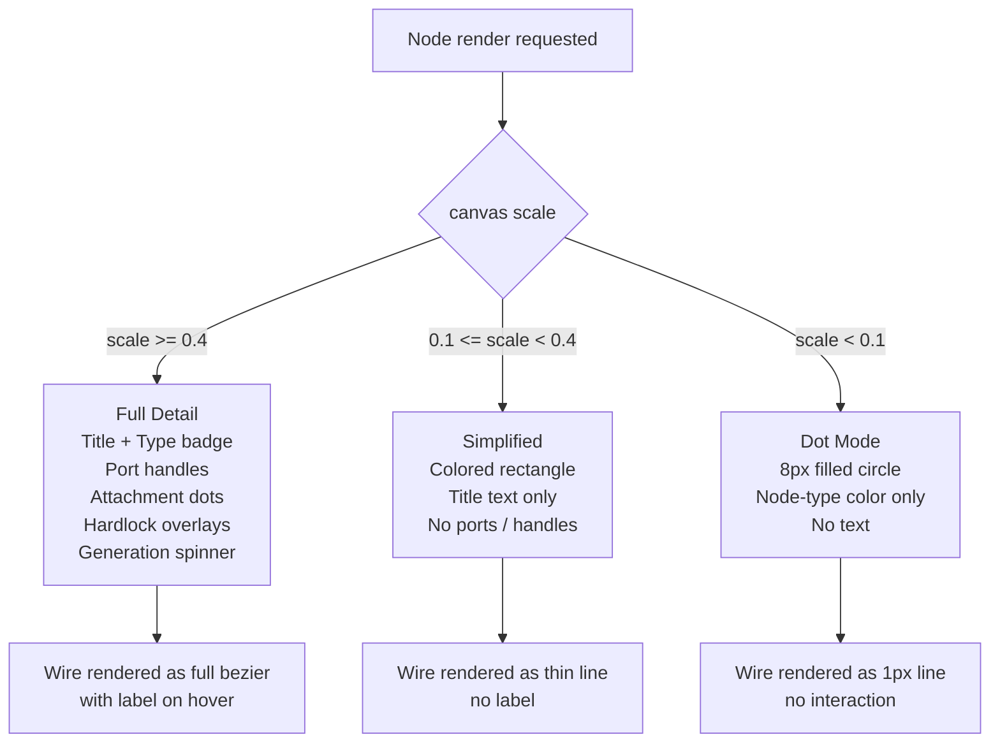
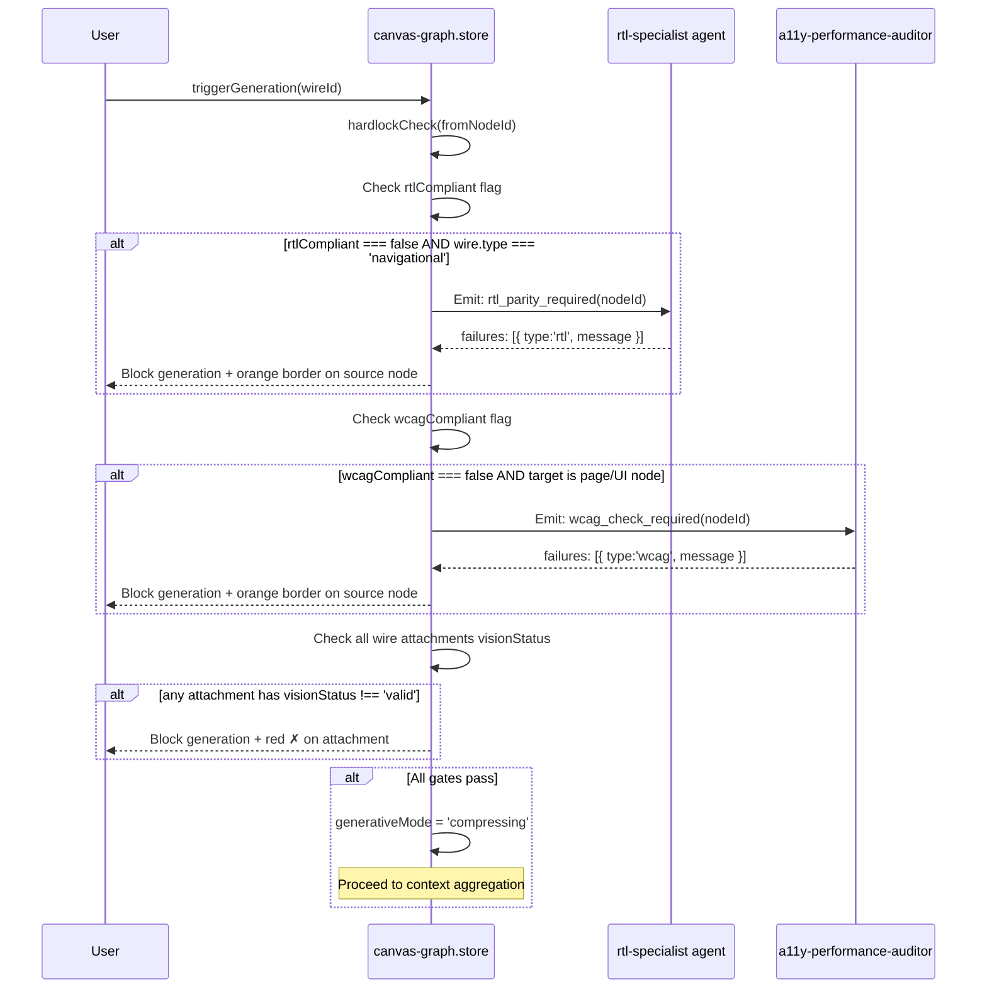
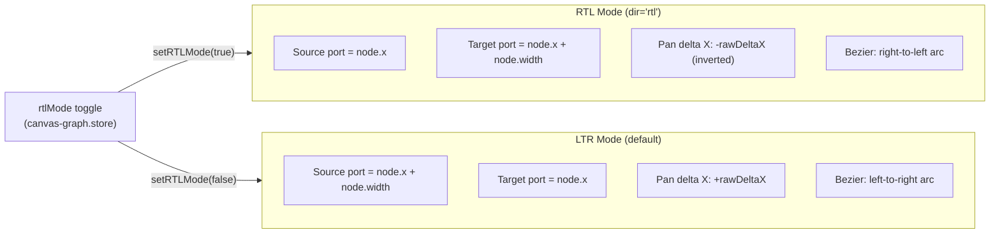
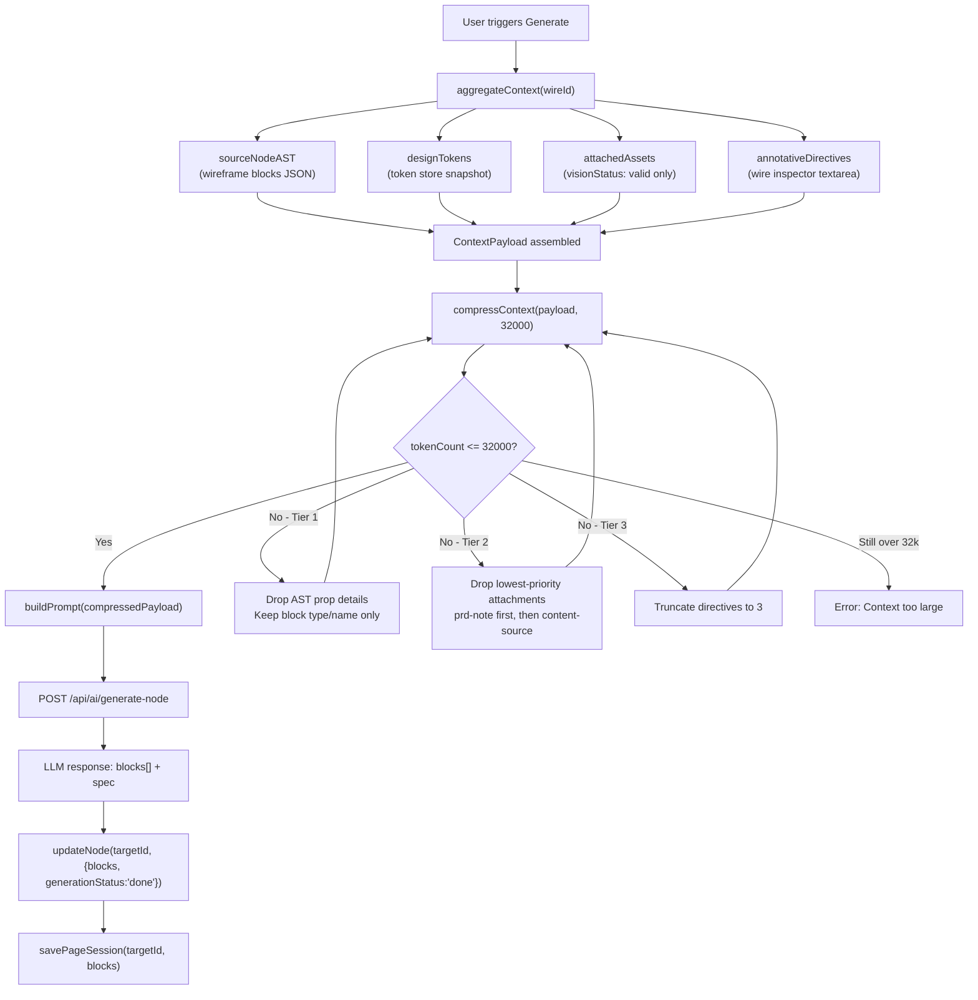

# GENERATIVE_PROPAGATION_FLOW — Context-Aware Infinity Canvas

> Architecture document for SPEC-DS-CANVAS-001.
> Describes the full data flow from wire creation to AI-generated target node.

---

## 1. Primary Flow: Wire → Asset Attachment → Validate → Generate

```mermaid
sequenceDiagram
    participant U as User
    participant CV as Canvas UI<br/>(CanvasWorkspace)
    participant ST as canvas-graph.store<br/>(Zustand + Zod)
    participant VG as Vision Gate<br/>(/api/ai/vision-gate)
    participant CW as context-window-manager<br/>(compressContext)
    participant PE as prompt-engineer<br/>(buildPrompt)
    participant LLM as claude-haiku-4-5<br/>(/api/ai/generate-node)
    participant FS as File System<br/>(.session/)

    %% ── Wire Creation ─────────────────────────────────────────────
    U->>CV: Activates Wiring Mode (W key)
    CV-->>U: Cursor changes to crosshair; node ports appear

    U->>CV: Drags wire from [Page A] port → [Page B] port
    CV->>ST: addWire({ fromNodeId, toNodeId, type: 'navigational', attachments: [] })
    CV-->>U: Wire Inspector panel opens (right sidebar)

    %% ── Asset Attachment ───────────────────────────────────────────
    U->>CV: Drops Stripe screenshot image onto Wire Inspector drop zone
    CV->>ST: attachAsset(wireId, 'wire', { type:'image', visionStatus:'pending', role:'style-reference' })
    CV-->>U: Asset card renders with grey spinner "Scanning…"

    CV->>VG: POST /api/ai/vision-gate { image: base64, mimeType: 'image/png' }
    Note over VG: claude-haiku inspects for<br/>embedded text (Zero-Text Policy)

    alt Asset is compliant (no text detected)
        VG-->>ST: updateAssetVisionStatus(assetId, 'valid')
        ST-->>CV: Asset card shows green ✓
        CV-->>U: Generate button becomes active
    else Asset rejected (text detected)
        VG-->>ST: updateAssetVisionStatus(assetId, 'rejected')
        ST-->>CV: generativeMode = 'error', red ✗ on asset
        CV-->>U: "Non-compliant: text detected. Replace asset to generate."
        Note over U: Flow terminates until user replaces asset
    end

    U->>CV: Types directive: "Replicate Stripe data-density card grid"
    CV->>ST: updateWire(wireId, { annotativeDirectives: ['Replicate Stripe...'] })

    %% ── Hardlock Gate Check ────────────────────────────────────────
    U->>CV: Clicks "Generate [Page B]"
    CV->>ST: triggerGeneration(wireId)
    ST->>ST: generativeMode = 'validating'
    ST->>ST: hardlockCheck(fromNodeId)

    alt Source node fails RTL parity gate
        ST-->>CV: failures = [{ type: 'rtl', message: 'RTL parity not verified' }]
        ST->>ST: generativeMode = 'error'
        CV-->>U: Page A renders orange border + "⚠ RTL Parity Required" badge
        CV-->>U: Generate blocked — "Fix 1 RTL issue on [Dashboard] first"
        Note over U: Flow terminates until rtlCompliant: true on source node
    else Source node fails WCAG AA gate
        ST-->>CV: failures = [{ type: 'wcag', message: 'WCAG AA not verified' }]
        ST->>ST: generativeMode = 'error'
        CV-->>U: Page A renders orange border + "⚠ WCAG AA Required" badge
        Note over U: Flow terminates until wcagCompliant: true on source node
    else All gates pass
        ST->>ST: generativeMode = 'compressing'
    end

    %% ── Context Aggregation & Compression ─────────────────────────
    ST->>ST: aggregateContext(wireId)
    Note over ST: Builds ContextPayload:<br/>• sourceNodeAST (wireframe blocks JSON)<br/>• designTokens (snapshot from tokens.store)<br/>• attachedAssets (visionStatus: 'valid' only)<br/>• annotativeDirectives

    ST->>CW: compressContext(payload, maxTokens=32000)
    Note over CW: Tiered reduction if over budget:<br/>T1: Drop block prop details (keep types only)<br/>T2: Drop low-priority attachments<br/>T3: Truncate directives to 3

    alt Token count still exceeds 32,000 after all tiers
        CW-->>ST: { error: 'Context too large' }
        ST->>ST: generativeMode = 'error'
        CV-->>U: "Context too large — remove attachments or simplify source"
        Note over U: Flow terminates
    else Compression successful
        CW-->>ST: { compressedPayload, tokenCount }
        ST->>ST: generativeMode = 'generating'
        CV-->>U: Status bar: "Generating… (12,847 / 32,000 tokens)"
    end

    %% ── LLM Generation ─────────────────────────────────────────────
    ST->>PE: buildPrompt(compressedPayload)
    Note over PE: Constructs system + user prompt:<br/>• System: NEZAM block registry types<br/>• User: AST summary + tokens + assets + directives

    PE->>LLM: POST /api/ai/generate-node { system, messages }
    Note over LLM: claude-haiku-4-5 generates:<br/>• wireframe blocks JSON array<br/>• COMPONENT_SPEC.md content

    alt LLM API error (5xx or timeout)
        LLM-->>PE: Error response
        PE-->>ST: generativeMode = 'error'
        CV-->>U: "Generation failed — retry or check API key"
        Note over U: Flow terminates; user can retry
    else LLM success
        LLM-->>PE: { blocks: [...], spec: '...' }
        PE-->>ST: updateNode(targetNodeId, { generationStatus: 'done', blocks })
        ST->>ST: generativeMode = 'done'
    end

    %% ── Persistence & Render ───────────────────────────────────────
    ST->>FS: writeFile(.session/pages/[targetId].json, blocks)
    ST->>FS: writeFile(.session/specs/[targetId]-spec.md, spec)
    ST-->>CV: Target node [Page B] re-renders: spinner → green ✓ "Generated"
    CV-->>U: Toast: "Page B generated ✓ — click to open in Wireframe Editor"
    U->>CV: Clicks Page B node → opens wireframe tab
```

---

## 2. LOD Rendering Decision Tree



---

## 3. Hardlock Gate Sequence



---

## 4. Coordinate System & RTL Mirroring



---

## 5. Context Payload Schema Flow



---

## 6. Related Files

| File | Role |
|------|------|
| `docs/plans/05-design-uiux/SPEC-DS-CANVAS-001.md` | Full SDD — source of truth for this architecture |
| `.nezam/design-server/src/store/canvas-graph.store.ts` | Zustand + Zod implementation of all schemas in §3–5 |
| `.nezam/design-server/components/canvas/CanvasWorkspace.tsx` | React canvas component — consumes canvas-graph.store |
| `.nezam/design-server/app/api/ai/vision-gate/route.ts` | Vision Gate API endpoint (Phase 2 implementation) |
| `.nezam/design-server/app/api/ai/generate-node/route.ts` | Node generation API endpoint (Phase 2 implementation) |
| `.cursor/state/plan_progress.yaml` | Gates tracking — `canvas_graph_spec: true` |
| `.cursor/state/HANDOFF_QUEUE.yaml` | Handoff to `frontend-lead` for Phase 2 integration |
