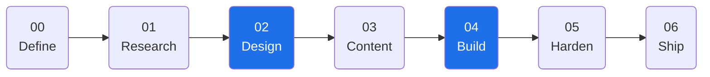
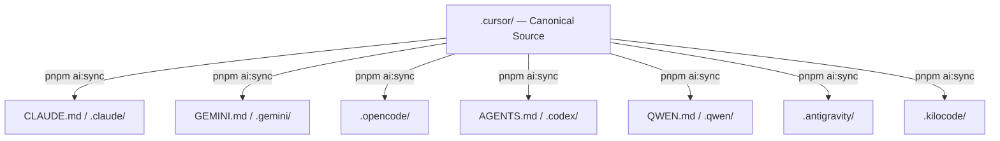
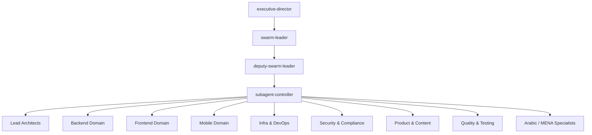

# Plan: Rewrite README.md — Clean, Modern, Professional GitHub Style

## Context

The current README.md is solid but has room to shine. The goal is a glistening, well-organised GitHub README that:
- Opens with a punchy hook that instantly communicates value
- Uses clean section hierarchy with good visual rhythm
- Replaces the ASCII art pipeline with a proper Mermaid diagram
- Adds a second Mermaid diagram for the swarm/architecture
- Simplifies language where it's verbose
- Keeps all substance — nothing gets dropped, only polished

## File to Modify

**`/Users/Dorgham/Documents/Work/Devleopment/NEZAM/README.md`**

---

## Proposed Structure

```
<div align="center">
  ASCII banner (keep — it's a nice identity touch)
  Tagline (punchy, one-liner)
  Badge row 1: CI · Design Gates · Version · SDD · Conventional Commits · pnpm · Node
  Badge row 2: AI client badges (Cursor · Claude · Gemini · OpenCode · Codex · Qwen · Antigravity · Kilocode)
  Badge row 3: License · PRs Welcome
  Nav links: Docs · PRD · Quick Start · Commands · Agents
</div>

---

## What is NEZAM?  ← hook paragraph (2–3 sentences, punchy)
  + problem/solution table (keep, tighten wording)

---

## How It Works  ← NEW Mermaid flowchart: SDD 7-phase pipeline

---

## Quick Start  ← keep, maybe tighten slightly

---

## Architecture  ← NEW Mermaid graph: canonical source → AI client sync

---

## Agent Swarm  ← collapsible, NEW Mermaid graph TD for hierarchy

---

## Slash Commands  ← clean table (was mixed into SDD section)

---

## Multi-Client Sync  ← keep table, add the sync command block

---

## Memory System  ← collapsible, keep 4-layer table

---

## Design System  ← collapsible, keep token list

---

## CI/CD Gates  ← keep table

---

## MENA / Arabic Stack  ← keep (unique differentiator)

---

## Documentation  ← keep resource table

---

## Key Scripts  ← keep table

---

## Troubleshooting  ← collapsible, keep all 4 entries

---

## Versioning · License  ← short, keep
```

---

## Mermaid Diagrams

### Diagram 1 — SDD Pipeline (replaces ASCII art)



Annotate the two gated phases (Design + Build) with lock icons in the label.

### Diagram 2 — Multi-Client Sync Architecture (replaces text block)



### Diagram 3 — Agent Swarm Hierarchy (inside collapsible)



---

## Hook Paragraph (draft)

> **NEZAM is the operating system for AI-native software development.**
> It gives every AI assistant — Cursor, Claude, Gemini, Codex, and more — a shared contract: a strict, spec-driven delivery spine that goes from idea to production without drift, hallucination, or re-explaining context every session.
> One canonical source. Eight clients synced. Zero guesswork.

---

## Language Improvements

- Replace "hardlock system" references with clearer phrasing on first mention, then use as shorthand
- Move "SDD Pipeline" and "Phase Commands" into one section titled "How It Works"
- Merge the scripts table after Multi-Client Sync (they're related)
- Badge rows: consolidate into two compact lines (workflow badges + client badges)

---

## Verification

- Render README locally: `gh markdown-preview README.md` or paste into GitHub's preview
- Verify all relative links still resolve (`.nezam/`, `docs/`, `.cursor/`)
- Confirm all three Mermaid diagrams render on GitHub (flowchart LR, graph TD)
- Check no section was accidentally dropped (compare against original ~422 lines)
