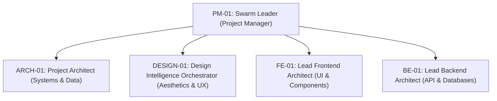

# NEZAM Master Swarm Workflow & Unified Communication Protocol

This document serves as the canonical master blueprint that aligns all 162 specialized agents, 13 active swarms, and 51 specialized skills into a single, high-performing communication and execution engine.

---

## 1. The Top-5 Governance Hierarchy

The workspace is governed by a unified strategic leadership council that holds absolute routing and approval authority across their respective domains:



*   **PM-01 (Swarm Leader)**: Overall process governance, gate enforcement, Standup Coordinator.
*   **ARCH-01 (Project Architect)**: Holds final authority over DB schemas, file structures, and data integrations.
*   **DESIGN-01 (Design Intelligence Orchestrator)**: Holds absolute authority over visual aesthetics, brand styling, layout design, and anti-slop checks.
*   **FE-01 (Frontend Lead)**: Rules over styling systems, CSS variables, React framework structure, and RTL layouts.
*   **BE-01 (Backend Lead)**: Governs APIs, Serverless functions, logic layers, security rules, and databases.

---

## 2. 17-Agent Design Swarm & Skill Mapping

The design vertical is organized in a hierarchical structure coordinate by `DESIGN-01`:

```
DESIGN-01: Design Intelligence Orchestrator (Lead Authority)
│
├── DESIGN-02: Lead UX/UI Designer (Manager) ── [Skills: ui-ux-design, dashboard-layout-pro]
│   ├── DESIGN-03: Wireframe Specialist (design-hub-wireframe) ── [Skills: wireframe-catalog]
│   ├── DESIGN-04: UX Research Protocol (ux-research-protocol) ── [Skills: ux-research-protocol]
│   └── DESIGN-05: User Flow Mapper (user-flow-mapper) ── [Skills: user-flow-mapper]
│
├── DESIGN-06: Art Director / Brand (DESIGN-06) ── [Skills: brand-visual-direction, theme-factory]
│   ├── DESIGN-07: Design Token Orchestrator ── [Skills: design-tokens, token-grid-typography]
│   ├── DESIGN-08: Theme Factory Operator ── [Skills: theme-factory]
│   └── DESIGN-09: Canvas Design Artist ── [Skills: canvas-design]
│
├── DESIGN-10: Design Excellence Lead / QA ── [Skills: anti-slop-validator, typeui-fundamentals]
│   ├── DESIGN-11: Accessibility Auditor (a11y-performance-auditor) ── [Skills: accessibility-audit]
│   ├── DESIGN-12: Motion & Animation Specialist ── [Skills: motion-3d]
│   └── DESIGN-13: Visual Regression Automator ── [Skills: visual-state-engine]
│
└── DESIGN-14: Frontend Implementation Lead (FE-01 Liaison)
    ├── DESIGN-15: shadcn Component Advisor ── [Skills: shadcn-advisor]
    ├── DESIGN-16: CSS Architecture Specialist ── [Skills: css-architecture]
    └── DESIGN-17: RTL Layout Specialist ── [Skills: nezam-a11y-rtl-fusion]
```

---

## 3. Communication Lifecycle & The Agent Bus

Swarms communicate asynchronously using the shared `.cursor/state/agent-bus.yaml` bus. 

### Phase 1: Intake & Strategy (PM-01 ➜ DESIGN-01 / ARCH-01)
PM-01 defines the project specs, schedules the task on the bus under the relevant domain channel, and allocates computing weight to the primary authority.

### Phase 2: Design and Token Synthesis (DESIGN-01 ➜ DESIGN-02 / DESIGN-06)
`DESIGN-01` picks the correct brand rules or style family, loads the semantic theme presets, and instructs sub-agents to map layout systems.
*   **Skill check**: Loads `source-library-loader` + `typeui-fundamentals`.

### Phase 3: Wireframe & Components (DESIGN-02 ➜ DESIGN-15)
`DESIGN-02` selects high-fidelity components from the component catalog using `shadcn-advisor` to create compliant visual specs.

### Phase 4: Quality Gate & Validation (DESIGN-10 Gate)
Before any code generation starts, `DESIGN-10` executes the mandatory **Anti-Slop Validation & WCAG AA contrast tests**. If issues are found, a `rework` payload is sent back to the assignee.

### Phase 5: Handoff to Engineering (DESIGN-01 ➜ FE-01 / BE-01)
Once validated and approved by the QA lead, `DESIGN-01` sets the task as `approved` on the bus and hands over the visual token payload to `FE-01` for direct React implementation.

---

## 4. Required Handoff Format (The Standard Bus Payload)

Every cross-agent transaction must populate this schema:

```yaml
message:
  id: "MSG-[UNIQUE-ID]"
  from: "[SENDER-CODE-NAME]"
  to: "[RECEIVER-CODE-NAME]"
  type: "task_delegation | handoff | validation_verdict"
  timestamp: "2026-05-28T23:33:00Z"
  status: "active | in-progress | review | approved"
  payload:
    request: "Clear actionable request description"
    style-ref: "Path or key of reference style pack loaded"
    theme: "Curated theme used (from theme-factory)"
    components: ["list", "of", "shadcn", "components"]
    rtl: true/false
    a11y-level: "AA | AAA"
    anti-refs: ["styles to avoid (e.g. flat-design)"]
    verdict: "APPROVED | REWORK (with detailed fix instructions)"
```

---

## 5. Escalation Protocol & Conflict Resolution

1.  **Aesthetic Drift / Code Drifts**: Checked systematically by `DESIGN-10` via the `anti-slop-validator`. Real-time audits are saved under `docs/reports/audits/`.
2.  **Strategic Blocker**: If `FE-01` and `DESIGN-01` clash over CSS styling complexity vs layout precision, `PM-01` steps in, evaluates performance metrics (LCP/INP), and enforces a final `go` / `replan` decision.
3.  **Governance Violations**: Any attempt to modify code before locking design specs or planning gates raises a **HARDLOCK VIOLATION**, blocking the execution channel immediately.

