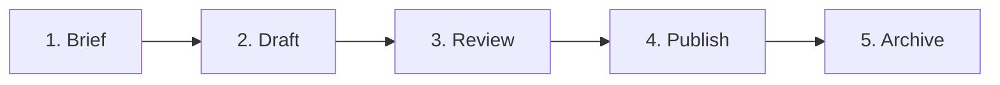

# Content Operations Workflow

This document details the Content Operations (Content Ops) lifecycle for the NEZAM platform, from initial brief drafting to final publishing and archiving.

---

## Content Lifecycle

---

## 1. Brief Phase
- **Owner:** Content Strategist / Product Owner
- **Goal:** Align on goals, target audience, and key messaging before drafting.
- **Templates:** Use [landing-page.md](file:///Users/Dorgham/Documents/Work/Devleopment/NEZAM/docs/content/templates/landing-page.md) to outline new campaigns or landing pages.
- **Actions:** Define target audience, SEO description, primary call to action (CTA), and metrics.

## 2. Draft Phase
- **Owner:** Writer / Content Creator
- **Goal:** Create draft content using established templates.
- **Templates:**
  - Blog article: Use [blog-post.md](file:///Users/Dorgham/Documents/Work/Devleopment/NEZAM/docs/content/templates/blog-post.md).
  - Release announcement: Use [release-notes.md](file:///Users/Dorgham/Documents/Work/Devleopment/NEZAM/docs/content/templates/release-notes.md).
  - Email notification: Use [onboarding-email.md](file:///Users/Dorgham/Documents/Work/Devleopment/NEZAM/docs/content/templates/onboarding-email.md).
- **Guidelines:** Do not include raw HTML formatting inside Markdown text. Write clearly and concisely.

## 3. Review Phase
- **Owner:** Editor / Product Manager / SEO Specialist
- **Goal:** Verify SEO compliance, copy accuracy, and design system alignment.
- **Actions:**
  - Audit heading structure (ensure a single `H1` tag per page).
  - Verify meta descriptions (length 150-160 characters).
  - Run RTL/direction compatibility checks.

## 4. Publish Phase
- **Owner:** DevOps / Content Publisher
- **Goal:** Deploy content to production safely.
- **Actions:** Commit the final approved file, merge pull request, and verify rendering on production routes.

## 5. Archive Phase
- **Owner:** Content Administrator
- **Goal:** Maintain resource cleanliness by archiving stale, outdated content.
- **Actions:** Move old articles to the `_archive/` directory and add appropriate 301 redirects if routes change.
