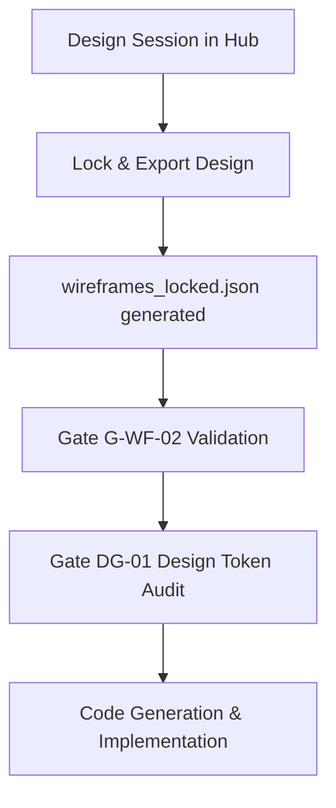

# Design-to-Code Workflow Guide

This document outlines the transition path from human-in-the-loop wireframe design sessions in the Design Hub to developer implementation and automated quality gates in NEZAM.

## Workflow Pipeline



---

## 1. Design Session & Lock Phase

When designing or refining the user interface:
1. Start the Design Hub using the command:
   ```bash
   pnpm design-hub
   ```
2. Open the browser to the local port and configure page sitemaps, templates, components, and layout blocks.
3. Once the layout is approved, click the **Lock & Export** action in the Design Hub.
4. This action generates the canonical **`wireframes_locked.json`** contract file at the workspace root.

---

## 2. Gate G-WF-02: Schema Verification

Before any UI development begins, the wireframe contract must pass schema validation.
- **Gate ID:** `G-WF-02`
- **Checker Script:** `node .nezam/core/scripts/checks/check-wireframe-schema-v2.js`
- **Validation Criteria:**
  - Presence of root `$schemaVersion: "2.0.0"` or higher.
  - A valid ISO 8601 validation timestamp (`meta.validated_at`).
  - Presence of `arch_page_id` cross-references on all pages and sitemaps.
  - Non-empty approved pages array and sections.

To run the check manually:
```bash
node .nezam/core/scripts/checks/check-wireframe-schema-v2.js
```

---

## 3. Gate DG-01: Design Token Audit

To ensure the styling remains maintainable, consistent, and strictly aligned with the chosen design system, the design token audit checks that no raw hexadecimal or pixel values are used outside governed design token sources.
- **Gate ID:** `DG-01`
- **Checker Script:** `bash .nezam/core/scripts/checks/check-design-tokens.sh`
- **Execution Command:**
  ```bash
  pnpm check:tokens
  ```

---

## 4. Implementation Phase

Once both validation gates pass successfully:
1. Scaffold layout and components conforming to the ordered sections list in the locked wireframe file.
2. Ensure components are reusable and consume variables from the design token system (`DESIGN.md`).
3. Commit the changes and proceed to integration testing.
