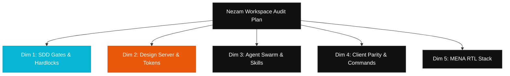

# Nezam Workspace Audit Plan — Ultimate UI Suite

> **Auditor**: Antigravity (Strategic Architect & Swarm Director)  
> **Status**: APPROVED for Execution  
> **Scope**: Monorepo Architecture & `.nezam/design-hub/` Base  
> **Target Environment**: Egyptian & Global Web Ecosystem  

---

## Executive Summary

The purpose of this audit is to verify that the **NEZAM Monorepo Workspace** and the **Nezam Design Server UI Suite** strictly adhere to the Specification-Driven Development (SDD) pipeline, design token constraints, swarm agent structures, and bilingual localization requirements defined in the product contracts. 

This Audit Plan provides a rigorous, 5-dimensional framework to evaluate repository health, root out styling and context drift, check for synchronization gaps, and ensure a premium, production-ready AI-native workspace.

---

## 5-Dimension Audit Blueprint



---

## Dimension 1: SDD Phase Gates & Hardlock Validation

### 1.1 Phase Plan Structure Audit
- **Objective**: Ensure all 7 SDD phases are structurally sound and enforce prerequisites.
- **Auditing Locations**: `.nezam/core/plans/` and `.nezam/workspace/plans/`.
- **Checkpoint Criteria**:
  - `.nezam/core/plans/INDEX.md` is populated and correctly maps all phase statuses.
  - Every active subphase folder (e.g. `.nezam/core/plans/00-define/01-product/`) contains:
    - `prompt.json` (Structured metadata for client context injection).
    - `PROMPT.md` (Detailed phase-specific LLM instructions).
    - `TASKS.md` (Checklist following formatting rules).
  - Verify that no duplicate or legacy phase plans remain under `.nezam/core/plans/legacy/` that could cause AI confusion.

### 1.2 Gate Matrix & Hardlock Enforcement
- **Objective**: Verify that phase transitions are blocked when upstream conditions are unmet.
- **Auditing Locations**: `.nezam/gates/GITHUB_GATE_MATRIX.json` and `.nezam/gates/hardlock-paths.json`.
- **Checkpoint Criteria**:
  - Valid schema versions (`$schemaVersion: "1.0.0"`).
  - `hardlock-paths.json` contains complete entries for `intake`, `planning`, `design`, `architecture`, and `subphasePrompts` (especially verifying the recently added `"taskFileGlob": "**/*/*/TASKS.md"` parameter).
  - Check that git hooks automatically trigger onboarding check scripts upon commit or PR events.

---

## Dimension 2: Design Server Codebase & Design Token Audit

### 2.1 Design Hub Token Completeness
- **Objective**: Verify that the design token system is robust enough to prevent code generation drift.
- **Auditing Locations**: `.nezam/design-hub/lib/store/tokens.store.ts` and `DESIGN.md`.
- **Checkpoint Criteria**:
  - The token store interface must not be anemic. It should govern:
    - **Colors**: Core brand palette plus a semantic layer (interactive, success, info, warning, destructive).
    - **Typography**: Complete type scales including named roles (sizeXs through size4xl), font families, and responsive line-heights.
    - **Spacing**: Base 4px scaling grid `[0, 4, 8, 12, 16, 24, 32, 48, 64, 96]`.
    - **Radii, Elevation & Z-Indices**: Clean token mappings preventing raw visual primitives.
    - **Motion**: Durations and easing functions (spring, bezier) that fall back to `0ms` when `prefers-reduced-motion` is active.

### 2.2 Purging of Hardcoded Primitives (Gate 1 Compliance)
- **Objective**: Eliminate raw styling strings inside Design Hub component UI.
- **Auditing Locations**: `.nezam/design-hub/components/` and `.nezam/design-hub/app/`.
- **Checkpoint Criteria**:
  - Zero raw hex values (e.g., `#FF5701`, `#8a8f98`) in TSX/JSX classes.
  - Zero hardcoded margins and paddings using directional keywords (`ml-4`, `pr-2`); must map to Tailwind token variables (`margin-inline-start`, `padding-block`).
  - Correct binding of sitemap page wireframes to `wireframes_locked.json` to prevent draft configurations from bypassing development gates.

---

## Dimension 3: Agent Swarm & Skill Pack Integrity

### 3.1 Swarm Orchestration Parity
- **Objective**: Ensure that task delegation across 150+ specialists has complete coverage and clean boundary interfaces.
- **Auditing Locations**: `.cursor/agents/` and `.cursor/rules/agent-lazy-load.mdc`.
- **Checkpoint Criteria**:
  - `agent-lazy-load.mdc` contains up-to-date regex patterns matching the correct role names.
  - Check `swarm-leader.md` and `subagent-controller.md` to ensure they have the proper executive guidance to distribute tasks securely.
  - Verify that agent logs and decision outputs are logged in `.nezam/core/memory/SWARM_DECISION_LOG.md`.

### 3.2 Skill Pack Frontmatter & Normalization
- **Objective**: Confirm that reusable skills registries contain accurate descriptions and IDs.
- **Auditing Locations**: `.agents/skills/` and `pnpm run skills:registry`.
- **Checkpoint Criteria**:
  - Verify that every `SKILL.md` contains valid YAML frontmatter specifying name and description.
  - Run skill normalization checks `pnpm run skills:normalize` to confirm that no duplicated skill IDs exist.

---

## Dimension 4: Multi-Client Synced Diffs & Command Parity

### 4.1 Sync Drift & Parity Checks
- **Objective**: Ensure zero differences between canonical IDE files and mirrored targets.
- **Auditing Locations**: `.claude/`, `.gemini/`, `.opencode/`, `.codex/`, `.qwen/`, `.antigravity/`, `.kilocode/`.
- **Checkpoint Criteria**:
  - Running `pnpm ai:check` must result in a clean exits (Code 0).
  - Sync hooks must automatically trigger on file writes to ensure that updates inside `.cursor/` instantly update `GEMINI.md`, `CLAUDE.md`, and `AGENTS.md`.

### 4.2 Terminal Command Consistency
- **Objective**: Confirm that slash command configurations resolve correctly across different terminal interpreters.
- **Auditing Locations**: `.cursor/commands/` and `.gemini/commands/`.
- **Checkpoint Criteria**:
  - Commands (`develop.md`, `scan.md`, `check.md`) have identical semantic outcomes.
  - All script references are configured with portable node/bash parameters to avoid OS-specific failures.

---

## Dimension 5: Egyptian Masri & RTL Localization Parity

### 5.1 Language Stack & Regional Alignment
- **Objective**: Ensure Egyptian Arabic (Masri) remains the default localization format for Middle East contexts.
- **Auditing Locations**: `.cursor/agents/arabic-content-master.md` and `.cursor/agents/masri-content-specialist.md`.
- **Checkpoint Criteria**:
  - Tone guides and dictionaries default to Egyptian Masri phrasing rather than formal MSA when regional contexts are checked.
  - No Arabic text is hardcoded inside README files (system structural guides utilize Mermaid or diagrams).

### 5.2 RTL Mirroring & Logical Layout Enforcement
- **Objective**: Prevent RTL layout breakages across visual viewports.
- **Checkpoint Criteria**:
  - Automated scanning logic rejects hardcoded directional positioning flags (`left`, `right`, `ml-`, `pr-`).
  - Typography preview margins automatically adjust to a 1.4×–1.6× expanded line-height grid when Egyptian / Arabic font families are rendered.
  - Spatial canvas coordinates swap seamlessly in RTL modes to maintain intuitive wire drawing.

---

## Audit Roadmap & Checklists

To conduct this audit systematically, the following tasks are scheduled:

```
[ ] Phase A: Pre-requisites & Local Builds
  [ ] Run onboarding readiness check: pnpm run check:onboarding
  [ ] Run full monorepo sanity checks: pnpm run check:all
  [ ] Verify Design Hub dependencies build: pnpm design-hub:install

[ ] Phase B: Core Codebase Inspection
  [ ] Scan Design Server codebase for hardcoded CSS primitives and hex arrays
  [ ] Audit agent profiles in .cursor/agents/ for metadata alignment
  [ ] Validate plans index and gate files structure

[ ] Phase C: Sync & CLI Parity Checks
  [ ] Run client sync tests: pnpm ai:sync --write
  [ ] Validate status output: pnpm ai:status
  [ ] Confirm zero drift: pnpm ai:check

[ ] Phase D: Final Remediation & Handoff
  [ ] Generate formal Nezam Workspace Audit Report
  [ ] Outline follow-up design-token enhancements
```
