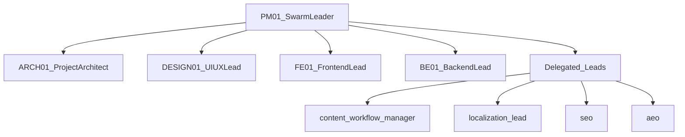
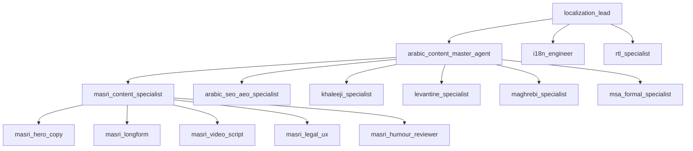
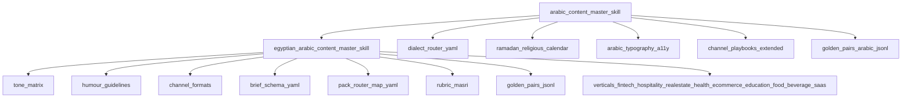
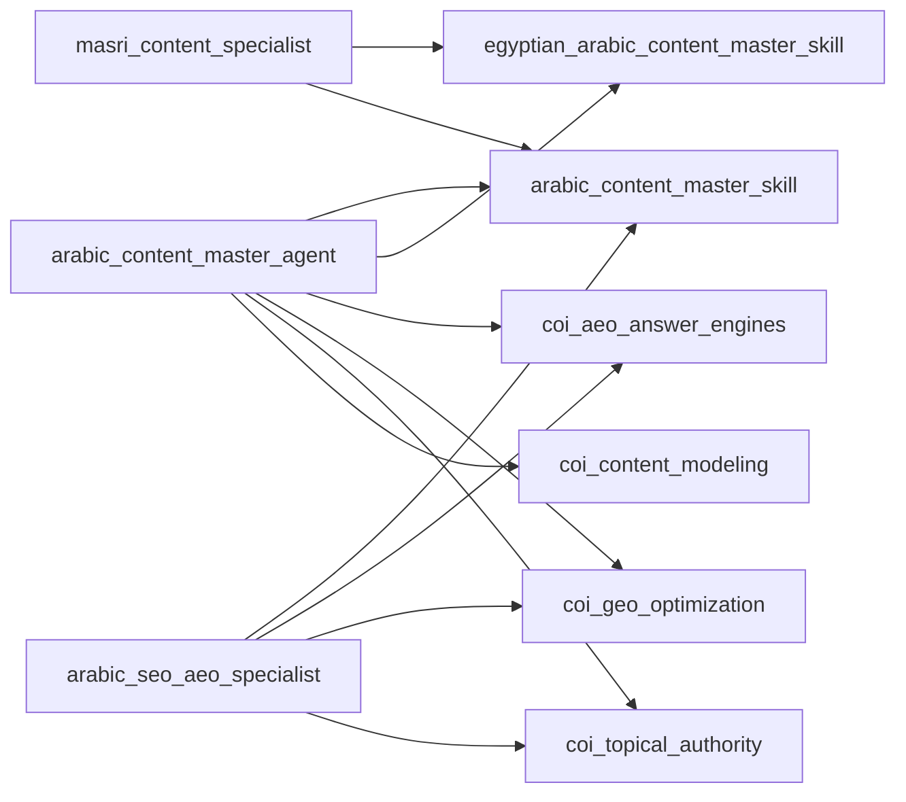

# Arabic Content Swarm and Skills

## Swarm Teams (Top-5 + Delegated)

## Arabic Content Pod (Agents + Subagents)

## Skill Architecture (Parent + Egyptian Module)

## Agent-to-Skill Binding Map

