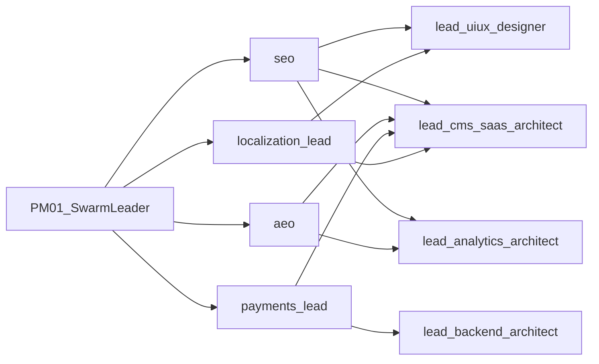

# Swarm Teams Full Hierarchy

```mermaid
flowchart TD
    CPO[cpo]
    Deputy[deputy_orchestrator]

    CPO --> Deputy

    Deputy --> PM01[PM01_SwarmLeader]
    Deputy --> ARCH01[ARCH01_ProjectArchitect]
    Deputy --> DESIGN01[DESIGN01_UIUXLead]
    Deputy --> FE01[FE01_FrontendLead]
    Deputy --> BE01[BE01_BackendLead]

    Deputy --> DailySync[daily_sync_agent]
    Deputy --> KnowledgeShare[knowledge_sharing_agent]
    Deputy --> CodeGenSupervisor[code_generation_supervisor]
    Deputy --> ConflictResolution[conflict_resolution_agent]

    PM01 --> Swarm1Lead[lead_solution_architect]
    PM01 --> Swarm2Lead[lead_uiux_designer]
    PM01 --> Swarm3Lead[lead_frontend_architect]
    PM01 --> Swarm4Lead[lead_backend_architect]
    PM01 --> Swarm5Lead[lead_database_architect]
    PM01 --> Swarm6Lead[lead_mobile_architect]
    PM01 --> Swarm7Lead[lead_cms_saas_architect]
    PM01 --> Swarm8Lead[lead_analytics_architect]
    PM01 --> Swarm9Lead[lead_security_officer]
    PM01 --> Swarm10Lead[lead_devops_performance]
    PM01 --> Swarm11Lead[lead_qa_architect]
    PM01 --> Swarm12Lead[lead_maintenance_agent]
    PM01 --> Swarm13Lead[lead_ai_ethics_officer]

    Swarm1Lead --> ReqMgr[requirements_analysis_manager]
    Swarm1Lead --> SolutionMgr[solution_design_manager]
    Swarm1Lead --> IntegrationMgr[integration_architecture_manager]
    ReqMgr --> BA[business_analyst]
    ReqMgr --> TechFeasibility[technical_feasibility_analyst]
    SolutionMgr --> Scalability[scalability_resilience_architect]
    SolutionMgr --> TechnologyEval[technology_evaluator]
    IntegrationMgr --> IntegrationSpecialist[integration_specialist]
    IntegrationMgr --> CostOptimization[cost_optimization_analyst]
    IntegrationMgr --> RiskAssessment[risk_assessment_specialist]
    IntegrationMgr --> PMAgent[pm]
    IntegrationMgr --> CEOLens[ceo]

    Swarm2Lead --> UxResearchMgr[ux_research_strategy_manager]
    Swarm2Lead --> VisualDesignMgr[visual_design_manager]
    Swarm2Lead --> ProtoDesignMgr[prototyping_design_system_manager]
    UxResearchMgr --> ArtDirector[art_director_brand]
    VisualDesignMgr --> DesignTokenArchitect[design_systems_token_architect]
    VisualDesignMgr --> Motion3D[motion_3d_choreographer]
    ProtoDesignMgr --> A11yPerfAuditor[a11y_performance_auditor]

    Swarm3Lead --> FrontendFrameworkMgr[frontend_framework_manager]
    Swarm3Lead --> UiComponentMgr[ui_component_manager]
    Swarm3Lead --> FrontendPerfMgr[frontend_performance_manager]
    UiComponentMgr --> ReactComponentLead[react_component_lead]

    Swarm4Lead --> ApiLogicMgr[api_logic_manager]
    Swarm4Lead --> ServicesMgr[services_microservices_manager]
    Swarm4Lead --> AuthSecurityMgr[auth_security_manager]
    ServicesMgr --> PaymentsLead[payments_lead]
    ServicesMgr --> PaymentsIntegration[payments_integration]
    ServicesMgr --> PaymentsMenaRouting[payments_mena_routing]
    ServicesMgr --> BillingPlatform[billing_platform]

    Swarm5Lead --> DatabaseDesignMgr[database_design_manager]
    Swarm5Lead --> DataPipelineMgr[data_pipeline_manager]
    Swarm5Lead --> SearchCacheMgr[search_cache_manager]
    DatabaseDesignMgr --> SqlExpert[sql_expert]
    DatabaseDesignMgr --> NosqlExpert[nosql_expert]
    DataPipelineMgr --> TimeSeries[time_series_specialist]
    DataPipelineMgr --> VectorStore[vector_store_specialist]
    DataPipelineMgr --> DataEngineer[data_engineer]
    DataPipelineMgr --> AnalyticsEngineer[analytics_engineer]

    Swarm6Lead --> IosMgr[ios_manager]
    Swarm6Lead --> AndroidMgr[android_manager]
    Swarm6Lead --> CrossPlatformMgr[cross_platform_manager]
    IosMgr --> MobileIOS[mobile_ios]
    AndroidMgr --> MobileAndroid[mobile_android]
    CrossPlatformMgr --> MobileCrossPlatform[mobile_cross_platform]
    CrossPlatformMgr --> FlutterSpecialist[flutter_specialist]
    CrossPlatformMgr --> MobileOfflineSync[mobile_offline_sync_specialist]
    CrossPlatformMgr --> MobilePush[mobile_push_notifications_specialist]

    Swarm7Lead --> CmsMgr[cms_manager]
    Swarm7Lead --> SaasMgr[saas_platform_manager]
    Swarm7Lead --> ContentWorkflowMgr[content_workflow_manager]
    CmsMgr --> HeadlessCms[headless_cms_specialist]
    SaasMgr --> MultiTenancy[multi_tenancy_architect]
    SaasMgr --> FeatureFlags[feature_flags_specialist]
    SaasMgr --> WhiteLabel[white_label_theming_specialist]
    ContentWorkflowMgr --> ContentWriter[content]
    ContentWorkflowMgr --> LocalizationLead[localization_lead]
    LocalizationLead --> I18nEngineer[i18n_engineer]
    LocalizationLead --> RtlSpecialist[rtl_specialist]
    LocalizationLead --> ArabicContentMaster[arabic_content_master]
    ArabicContentMaster --> MasriContent[masri_content_specialist]
    ArabicContentMaster --> ArabicSeoAeo[arabic_seo_aeo_specialist]
    ArabicContentMaster --> Khaleeji[khaleeji_specialist]
    ArabicContentMaster --> Levantine[levantine_specialist]
    ArabicContentMaster --> Maghrebi[maghrebi_specialist]
    ArabicContentMaster --> MsaFormal[msa_formal_specialist]

    Swarm8Lead --> DashboardMgr[dashboard_manager]
    Swarm8Lead --> KpiMgr[kpi_reporting_manager]
    Swarm8Lead --> DataVizMgr[data_visualization_manager]
    DataVizMgr --> DataVizSpecialist[data_visualization_specialist]
    DataVizMgr --> RealtimeStreaming[real_time_streaming_specialist]
    KpiMgr --> ExperimentationLead[experimentation_lead]

    Swarm9Lead --> AppSecurityMgr[app_security_manager]
    Swarm9Lead --> InfraSecurityMgr[infra_security_manager]
    Swarm9Lead --> ComplianceMgr[compliance_manager]
    AppSecurityMgr --> EncryptionPrivacy[encryption_privacy_specialist]
    AppSecurityMgr --> ThreatModeling[threat_modeling_specialist]
    InfraSecurityMgr --> AgentSecurityAuditor[agent_security_auditor]

    Swarm10Lead --> PerformanceMgr[performance_manager]
    Swarm10Lead --> InfrastructureMgr[infrastructure_manager]
    Swarm10Lead --> DevopsMgr[devops_manager]
    InfrastructureMgr --> DockerK8s[docker_k8s_specialist]
    DevopsMgr --> Observability[observability_specialist]
    DevopsMgr --> SreIncident[sre_incident_specialist]
    DevopsMgr --> Gitops[gitops]
    DevopsMgr --> AgentCiAutomation[agent_ci_automation]

    Swarm11Lead --> TestingMgr[testing_manager]
    Swarm11Lead --> AutomationMgr[automation_manager]
    Swarm11Lead --> PerfLoadMgr[performance_load_manager]
    TestingMgr --> AgentQaLead[agent_qa_test_lead]

    Swarm12Lead --> BugTriageMgr[bug_triage_manager]
    Swarm12Lead --> TechDebtMgr[tech_debt_manager]
    Swarm12Lead --> KnowledgeUpdateMgr[knowledge_update_manager]
    BugTriageMgr --> CodeReviewSpecialist[code_review_specialist]
    TechDebtMgr --> RefactoringSpecialist[refactoring_specialist]
    TechDebtMgr --> DependencyUpdate[dependency_update_specialist]
    KnowledgeUpdateMgr --> AgentDocsHygiene[agent_docs_hygiene]

    Swarm13Lead --> BiasFairness[bias_fairness_specialist]
    Swarm13Lead --> PrivacyEthics[privacy_data_ethics_specialist]
    Swarm13Lead --> TransparencyExplain[transparency_explainability_specialist]
    Swarm13Lead --> AiSafety[ai_safety_misuse_specialist]
    Swarm13Lead --> IpCopyright[ip_copyright_ethics_specialist]
    Swarm13Lead --> AiSustainability[ai_sustainability_specialist]
```

```mermaid
flowchart LR
    SeoLead[seo]
    AeoLead[aeo]
    PaymentsLead[payments_lead]
    LocalizationLead[localization_lead]
    PM01[PM01_SwarmLeader]
    Swarm2Lead[lead_uiux_designer]
    Swarm4Lead[lead_backend_architect]
    Swarm7Lead[lead_cms_saas_architect]
    Swarm8Lead[lead_analytics_architect]

    PM01 --> SeoLead
    PM01 --> AeoLead
    PM01 --> PaymentsLead
    PM01 --> LocalizationLead

    SeoLead --> Swarm2Lead
    SeoLead --> Swarm7Lead
    SeoLead --> Swarm8Lead

    AeoLead --> Swarm7Lead
    AeoLead --> Swarm8Lead

    PaymentsLead --> Swarm4Lead
    PaymentsLead --> Swarm7Lead

    LocalizationLead --> Swarm2Lead
    LocalizationLead --> Swarm7Lead
```
