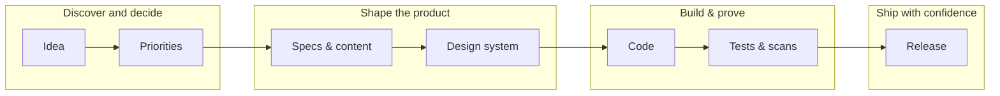
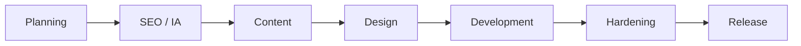
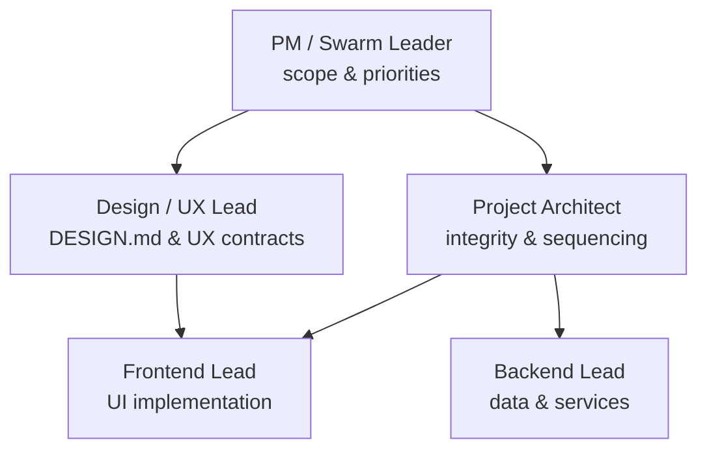
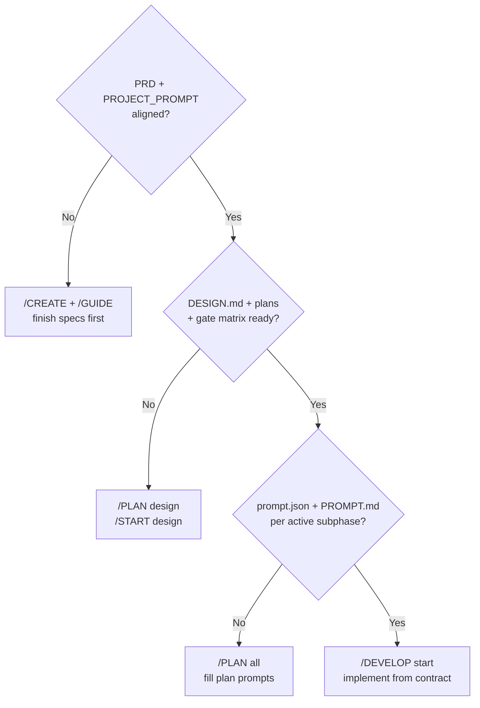

<div align="center">

# NEZAM

**Turn AI from a chat toy into a repeatable delivery system — built for solo founders and tiny teams.**

> **`/command` do everything.**

[](https://github.com/iDorgham/Nezam/actions?query=workflow%3Aci)
[](https://github.com/iDorgham/Nezam/actions?query=workflow%3A%22Design+Gates%22)
[](https://github.com/iDorgham/Nezam#specification-driven-development-sdd)
[](https://github.com/iDorgham/Nezam#for-indie-developers-and-small-teams)
[](https://pnpm.io/)
[](https://cursor.com/)
[](https://github.com/iDorgham/Nezam/blob/main/docs/workspace/context/MULTI_TOOL_INDEX.md)

[Documentation hub](docs/README.md) · [Start guide](docs/START.md) · [Gate matrix](docs/workspace/plans/gates/GITHUB_GATE_MATRIX.json)

</div>

---

## Table of contents

- [In plain English (for everyone)](#in-plain-english-for-everyone)
- [For indie developers and small teams](#for-indie-developers-and-small-teams)
- [What NEZAM gives you](#what-nezam-gives-you)
- [How delivery works (visual)](#how-delivery-works-visual)
- [Specification-Driven Development (SDD)](#specification-driven-development-sdd)
- [Swarm teams (who does what)](#swarm-teams-who-does-what)
- [Am I ready to build with AI?](#am-i-ready-to-build-with-ai)
- [Deterministic GitHub automation](#deterministic-github-automation)
- [Command surface](#command-surface)
- [Most important pnpm commands](#most-important-pnpm-commands)
- [Quick start](#quick-start)
- [Prompt artifacts and gate contracts](#prompt-artifacts-and-gate-contracts)
- [Supported AI clients](#supported-ai-clients)
- [Context, memory, and reporting](#context-memory-and-reporting)
- [Directory map](#directory-map)
- [Daily operating loops](#daily-operating-loops)
- [Troubleshooting](#troubleshooting)
- [References](#references)

---

## In plain English (for everyone)

**NEZAM is a workspace playbook** for building software with AI assistants (like Cursor, Claude, or others). It does not replace your judgment — it **organizes** how ideas become shipped product.

Think of it like a **flight checklist** for a product:

- You agree **what** you are building (product intent and requirements).
- You agree **how it should look and behave** (design contract) before heavy coding.
- You use **slash commands** so every step has a name, a template, and a clear “done” definition.
- **Automation on GitHub** checks the same things every time, so surprises show up early — not on launch night.

If you are **not** a developer: you can still read the “story” of the project from the docs this repo expects (`PRD`, `DESIGN.md`, plans). Your builder (or future hire) uses NEZAM so work stays **traceable** and **reviewable**.

---

## For indie developers and small teams

Indie life often means **you are the PM, the designer, and the engineer** — sometimes on the same day. NEZAM helps by:

- Giving you a **single delivery spine** so AI does not “skip to code” and paint you into a corner.
- Providing **role-based agents** (“swarm”) so you can ask for architecture, UI, or QA points of view without inventing a process from scratch.
- Keeping **cross-tool parity**: edit canonical rules in `.cursor/`, then sync to other AI clients so everyone reads the same contract.
- Making **quality gates explicit** (tokens, typography, motion, accessibility, CI) so “ship fast” does not mean “ship blind”.

You do **not** need a big company process. You need **lightweight discipline** that survives busy weeks. NEZAM is that layer.

---

## What NEZAM gives you

| You want… | NEZAM provides… |
| --- | --- |
| A clear path from idea to release | Specification-Driven Development (SDD) sequencing + commands |
| Design that matches implementation | Root `DESIGN.md` contract + design gate checks |
| Repeatable AI collaboration | Slash commands with deterministic contracts (`/PLAN`, `/DEVELOP`, …) |
| Less drift between tools | `pnpm ai:sync` / `pnpm ai:check` from canonical `.cursor/` |
| Audit-friendly delivery | Plans under `docs/workspace/plans/`, gate matrix, CI workflows |

---

## How delivery works (visual)

### The journey (non-technical view)



### The SDD spine (technical view)

This is the **order** NEZAM enforces so implementation stays aligned with intent:



### Swarm leadership (who owns which concerns)

Specialists are **bounded roles** — useful when you prompt AI with “act as architect” vs “act as design lead”:



### “Should we let AI write code yet?”



---

## Specification-Driven Development (SDD)

NEZAM enforces **Specification-Driven Development**: plan and scope work, complete SEO/IA/content and design artifacts, run design gates, then implement. That single spine keeps decisions **auditable** and outcomes **reproducible**.

**Hardlock prerequisites for development** (implementation stays locked until these exist):

1. `docs/core/required/prd/PRD.md`
2. `docs/core/required/PROJECT_PROMPT.md`
3. **`DESIGN.md` at repository root** — from the chosen catalog profile: `.cursor/design/<brand>/design.md` (see [`.cursor/design/README.md`](.cursor/design/README.md)). Use `/START design` or `pnpm run design:apply -- <brand>`.
4. `docs/workspace/plans/gates/GITHUB_GATE_MATRIX.json`
5. Every active `docs/workspace/plans/<phase>/<subphase>/` includes both `prompt.json` and `PROMPT.md`

Repository note: PRD may also appear under `docs/reference/prd/PRD.md` during migration; treat `/GUIDE` and gate checks as the source of truth for readiness.

**Design-quality defaults** include token-first styling, fluid typography, responsive grids, accessibility and reduced-motion considerations, component API contracts before implementation, and measurable gates before merge/release.

---

## Swarm teams (who does what)

NEZAM supports a **swarm** pattern: specialized agents collaborate through **explicit handoffs** instead of vague “help me with everything” prompts.

**Primary leadership roles**

- `PM-01-Swarm-Leader` — scope governance, prioritization, orchestration  
- `ARCH-01-Project-Architect` — architecture integrity and sequencing  
- `DESIGN-01-UIUX-Lead` — design-system and UX contract ownership  
- `FE-01-Frontend-Lead` — frontend implementation strategy and quality  
- `BE-01-Backend-Lead` — backend services and data contract ownership  

**Why it works**

- Responsibilities are explicit → less duplicate or contradictory work  
- Each phase has an owner and acceptance criteria  
- Handoff artifacts (`prompt.json`, `PROMPT.md`, gate checklists) make transitions predictable  
- Parallel tracks stay governable  

---

## Deterministic GitHub automation

Automation is treated as a **deterministic system**: same inputs → same checks, with visible policy and guardrails.

**Key assets**

- `.github/workflows/ci.yml` — continuous integration and policy checks  
- `.github/workflows/design-gates.yml` — token, motion, accessibility, and related design gates  
- `.github/workflows/release.yml` — release choreography (as configured in this repo)  
- `scripts/checks/check-onboarding-readiness.sh` — readiness validation  
- `docs/workspace/plans/gates/GITHUB_GATE_MATRIX.json` — gate policy source of truth  

**Typical themes**

- Branch and commit hygiene  
- Onboarding and readiness validation  
- Plan artifacts and prompt contract checks  
- Gate matrix validation  
- Scheduled automation self-checks where enabled  

---

## Command surface

> **`/command` do everything** — meaningful workspace actions are slash commands with deterministic contracts (in Cursor; mirrored clients consume synced copies).

| Command | Purpose (plain language) |
| --- | --- |
| `/START` | Onboard the repo, initialize docs, verify readiness |
| `/PLAN` | Shape roadmap, phases, and specs in SDD order |
| `/DEVELOP` | Implement only from approved specs and `DESIGN.md` |
| `/GUIDE` | Explain what is blocked and the next unblock steps |
| `/CREATE` | Generate required docs from templates |
| `/SCAN` | Run quality, security, performance, or accessibility scans |
| `/FIX` | Triage and fix issues in a structured loop |
| `/SAVE` | Save progress: commits, reports, version hygiene |
| `/DEPLOY` | Release choreography and verification |

**Aliases:** `/st` `/pl` `/dv` `/gd` `/cr` `/sc` `/fx` `/sv` `/dp` (see command docs under `.cursor/commands/`).

---

## Most important pnpm commands

**Bootstrap and validate**

```sh
pnpm install
pnpm run check:onboarding
pnpm ai:check
```

**Keep AI surfaces in sync (after editing `.cursor/`)**

```sh
pnpm ai:sync
pnpm ai:check
```

**Optional workspace helpers** (if present in your fork)

```sh
pnpm run welcome
pnpm run tools:list
pnpm run tools:check
```

**Practical rhythm**

- After editing canonical `.cursor/` commands, agents, skills, or rules → `pnpm ai:sync` then `pnpm ai:check`  
- When hardlock status is unclear → `pnpm run check:onboarding`  

---

## Quick start

1. Open the repository in **Cursor** (primary orchestration surface).  
2. Onboard: `/START repo` and `/START docs`.  
3. Create core specs: `/CREATE prd`, `/CREATE prompt` (follow workspace templates).  
4. Ensure the gate manifest exists: `docs/workspace/plans/gates/GITHUB_GATE_MATRIX.json`.  
5. Plan in SDD order: `/PLAN all`.  
6. For each active subphase, ensure `prompt.json` and `PROMPT.md` exist.  
7. When prerequisites pass: `/DEVELOP start`.  

Deep links: [`docs/README.md`](docs/README.md) · [`docs/START.md`](docs/START.md)

---

## Prompt artifacts and gate contracts

Template root: `docs/workspace/templates/plan/README.md`

Examples of template families (names may vary slightly by version):

- `PROMPT_SCHEMA.template.json`  
- `SPEC_PROMPT.template.md`  
- `SUBPHASE_PROMPT.template.md`  
- `GITHUB_GATE_MATRIX_SCHEMA.template.json`  
- `GITHUB_START_GATE.template.md` / `GITHUB_END_GATE.template.md`  
- `PRE_MERGE_GATE_CHECKLIST.template.md` / `POST_MERGE_GATE_CHECKLIST.template.md`  
- `NIGHTLY_AUTOMATION_SELF_TEST.template.md`  
- `SILENT_AUTOMATION_FAILURE_TAXONOMY.template.md` / `SILENT_AUTOMATION_FIX_MAPPING.template.md`  

---

## Supported AI clients

NEZAM keeps **`.cursor/` as canonical** and syncs generated surfaces for other tools.

| Client group | Typical entry files |
| --- | --- |
| Cursor IDE | `.cursor/**` |
| Claude Code / Claude CLI | `CLAUDE.md`, `.claude/**` |
| Codex / Copilot CLI | `AGENTS.md`, `.codex/AGENTS.md` |
| Opencode CLI | `AGENTS.md`, `.opencode/**` |
| Antigravity IDE | `.antigravity/**` |
| Gemini CLI | `GEMINI.md`, `.gemini/commands/*.toml` |
| Qwen CLI | `QWEN.md`, `.qwen/commands/*.toml` |
| Kilo Code CLI | `.kilocode/rules/**` |

Full map: [`docs/workspace/context/MULTI_TOOL_INDEX.md`](docs/workspace/context/MULTI_TOOL_INDEX.md)

---

## Context, memory, and reporting

**Core context**

- `docs/workspace/context/CONTEXT.md`  
- `docs/workspace/context/MEMORY.md`  
- `docs/workspace/context/WORKSPACE_INDEX.md`  
- `docs/reports/progress/PROGRESS_REPORT.latest.md`  

**Optional local helpers**

```sh
bash scripts/context/install-context-hooks.sh
python3 scripts/context/update-context-docs.py
```

**Reports policy:** write generated outputs under `docs/reports/<category>/` — not the repo root or unstructured `docs/` paths. See workspace rules and each category’s `README.md` under `docs/reports/`.

---

## Directory map

```text
.cursor/
  commands/          # Slash command contracts
  rules/             # Always-on governance gates
  skills/            # Reusable procedures
  agents/            # Role / persona definitions
docs/
  README.md          # Documentation hub
  assets/            # Images for specs and docs
  core/              # Required docs, architecture, versioning
  workspace/         # Plans, context, templates, governance
  reports/           # Generated reports by category
.github/workflows/ # CI, design gates, release automation
scripts/             # Checks, context updates, tooling
```

---

## Daily operating loops

**Planning loop**

1. `/GUIDE status`  
2. `/START gates`  
3. `/PLAN all`  
4. Fill missing `prompt.json` + `PROMPT.md` per active subphase  

**Development loop**

1. `/GUIDE next`  
2. `/DEVELOP start`  
3. `/DEVELOP slice` or `/DEVELOP feature <id>`  
4. `/DEVELOP test`  
5. `/SAVE commit` and `/SAVE report`  

**Hardening / release loop**

1. `/SCAN all`  
2. `/FIX triage` and `/FIX patch`  
3. `/DEPLOY rc`  
4. `/DEPLOY verify`  

---

## Troubleshooting

| Symptom | What to do |
| --- | --- |
| Hardlock: “cannot develop yet” | `/GUIDE status` — complete missing artifacts in SDD order |
| Onboarding / readiness failures | `pnpm run check:onboarding` and fix listed paths |
| Drift between Cursor and other AI clients | `pnpm ai:sync` then `pnpm ai:check` |
| Automation feels “silent” or unclear | Use taxonomy + fix-mapping templates under `docs/workspace/templates/plan/` |

---

## References

- Role map: [`.cursor/agents/README.md`](.cursor/agents/README.md)  
- Memory architecture: [`docs/workspace/context/MEMORY_ARCHITECTURE.md`](docs/workspace/context/MEMORY_ARCHITECTURE.md)  
- Companion briefing: [`docs/workspace/context/CONTEXT.md`](docs/workspace/context/CONTEXT.md)  
- Plan index: [`docs/workspace/plans/INDEX.md`](docs/workspace/plans/INDEX.md)  

---

<div align="center">

**Built for people who ship — with AI, not by accident.**

[`/command` do everything.](#nezam)

</div>
