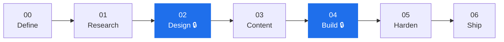
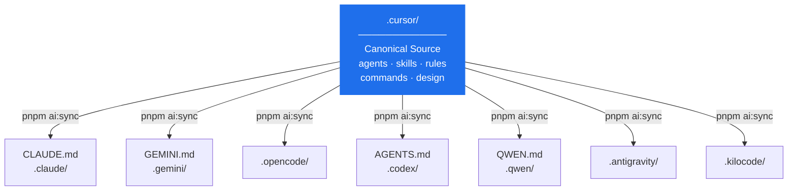
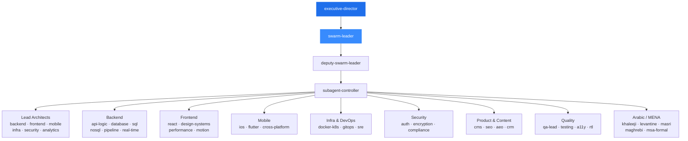

<div align="center">

<br/>

```
███╗   ██╗███████╗███████╗ █████╗ ███╗   ███╗
████╗  ██║██╔════╝╚══███╔╝██╔══██╗████╗ ████║
██╔██╗ ██║█████╗    ███╔╝ ███████║██╔████╔██║
██║╚██╗██║██╔══╝   ███╔╝  ██╔══██║██║╚██╔╝██║
██║ ╚████║███████╗███████╗██║  ██║██║ ╚═╝ ██║
╚═╝  ╚═══╝╚══════╝╚══════╝╚═╝  ╚═╝╚═╝     ╚═╝
```

**The operating system for AI-native software development.**

*One canonical source. Eight clients synced. Zero guesswork.*

<br/>

[](https://github.com/iDorgham/Nezam/actions/workflows/ci.yml)
[](https://github.com/iDorgham/Nezam/actions/workflows/design-gates.yml)
[](docs/core/VERSIONING.md)
[](.nezam/workspace/prd/PRD.md)
[](https://www.conventionalcommits.org/)
[](https://pnpm.io/)
[](package.json)

<br/>

[](https://cursor.com/)
[](CLAUDE.md)
[](GEMINI.md)
[](.opencode/)
[](AGENTS.md)
[](QWEN.md)
[](.antigravity/)
[](.kilocode/)

<br/>

[](LICENSE)
[](http://makeapullrequest.com)

<br/>

[**Docs**](docs/README.md) · [**PRD**](.nezam/workspace/prd/PRD.md) · [**Quick Start**](#quick-start) · [**Commands**](docs/wiki/Commands.md) · [**Agents**](docs/wiki/Agent-Map.md) · [**Wiki**](https://github.com/iDorgham/Nezam/wiki)

</div>

---

## What is NEZAM?

NEZAM is a workspace orchestration kit that gives every AI assistant a shared contract — a strict, specification-driven delivery spine that carries your project from idea to production without drift, hallucination, or lost context between sessions.

Every phase is gated. Every decision is persisted. Every AI client reads from the same source of truth.

| Without NEZAM | With NEZAM |
|---|---|
| AI skips planning and jumps straight to code | Phase gates block implementation until spec and design are approved |
| Context vanishes on session reset | 4-layer memory system persists all decisions to git |
| Different AI tools disagree and drift | Single canonical source (`.cursor/`) synced to 8 clients via `pnpm ai:sync` |
| No traceability from spec to production | SDD pipeline with phase IDs, task gates, and CI enforcement |
| Swarm agents have no coordination layer | `swarm-leader` → `subagent-controller` → 100+ specialized agents |
| Design changes silently break layout | Token-first design contracts with CI gate enforcement |

---

## How It Works

NEZAM enforces a seven-phase **Specification-Driven Development (SDD)** pipeline. Phases are hardlocked — implementation cannot begin until upstream gates pass. This prevents AI agents from hallucinating scope or skipping foundational decisions.



> **🔒 Gated phases** require automated checks to pass before the next phase unlocks.  
> Design (02) requires `DESIGN.md` approval + `check-design-tokens.sh`.  
> Build (04) requires approved feature specs + CI green.

### Slash Commands

Every phase has a command. Type it in any synced AI client to orient the agent and load the correct context.

| Command | Phase | What it does |
|---|---|---|
| `/START` | Initialize | Load workspace state, check prerequisites, orient the AI |
| `/PLAN` | Plan | Build phase plans, populate `TASKS.md` files |
| `/START design` | Design | Apply a design profile to `DESIGN.md` |
| `/DEVELOP` | Build | Start a gated feature slice |
| `/CHECK` | Any | Run all workspace readiness checks |
| `/FIX` | Any | Diagnose and repair workspace issues |
| `/SCAN` | Any | Full workspace health report |
| `/GIT` | Any | Conventional commit + PR workflow |
| `/DEPLOY` | Ship | Trigger the release pipeline |

---

## Quick Start

```bash
# 1. Clone
git clone https://github.com/iDorgham/Nezam.git && cd Nezam

# 2. Install
pnpm install

# 3. Verify setup
pnpm run check:onboarding
pnpm ai:check

# 4. Open in Cursor and start
/START
```

`/START` reads your workspace state and tells you exactly what to do next — no manual orientation required.

---

## Architecture



> **Rule:** Never edit synced folders directly. Always edit `.cursor/` and run `pnpm ai:sync` to propagate with zero drift.

**Directory overview:**

```
.cursor/            ← Canonical source (agents, commands, skills, rules, design)
.nezam/             ← Workspace state (memory, specs, scripts, evals, gates)
docs/               ← Reports, plans, architecture, wiki pages
scripts/            ← Automation (sync, checks, design, release, changelog)
.github/workflows/  ← CI/CD gate enforcement
```

---

## Agent Swarm

100+ specialized agents organized in a lazy-loaded hierarchy. The orchestration layer routes tasks to the right specialist automatically — no manual agent selection required.

<details>
<summary><strong>View swarm hierarchy</strong></summary>



Agents are lazy-loaded via `agent-lazy-load.mdc`. Full details in the [Agent Map](docs/wiki/Agent-Map.md).

</details>

---

## Multi-Client Sync

All 8 AI clients derive their configuration from `.cursor/`. One sync command, no drift.

```bash
pnpm ai:sync   # Propagate .cursor/ changes to all clients
pnpm ai:check  # Verify no drift between clients
```

| Client | Entry Point | Sync Folder |
|---|---|---|
| **Cursor** | `.cursor/` | — (canonical, never synced) |
| **Claude** | `CLAUDE.md` | `.claude/` |
| **Gemini** | `GEMINI.md` | `.gemini/` |
| **OpenCode** | — | `.opencode/` |
| **Codex** | `AGENTS.md` | `.codex/` |
| **Qwen** | `QWEN.md` | `.qwen/` |
| **Antigravity** | — | `.antigravity/` |
| **Kilocode** | — | `.kilocode/` |

---

## Memory System

Decisions survive session resets through a four-layer persistence architecture.

<details>
<summary><strong>View memory layers</strong></summary>

| Layer | Scope | Location |
|---|---|---|
| **0 — Session** | Ephemeral chat context | Active AI window |
| **1 — Project** | Durable decisions + plans | `.nezam/memory/` |
| **2 — Team** | Agent + rule contracts | `.cursor/agents/`, `.cursor/rules/` |
| **3 — Workspace** | Root governance | `CLAUDE.md`, `AGENTS.md`, `GEMINI.md` |

**Key memory files:**

| File | Purpose |
|---|---|
| `.nezam/memory/MEMORY.md` | Stack decisions, ADRs, design locks, scorecards |
| `docs/memory/CONTEXT.md` | Current phase, priorities, blockers |
| `docs/memory/PHASE_HANDOFF.md` | Briefing for the next agent or session |
| `docs/memory/DECISIONS.md` | Plain-language decision log |
| `docs/memory/MCP_REGISTRY.md` | MCP tool registry |
| `docs/memory/MULTI_TOOL_INDEX.md` | Cross-tool capability map |

</details>

---

## Design System

Token-first governance. Design gates block development until tokens are approved and validated.

<details>
<summary><strong>View design governance</strong></summary>

```bash
# Apply a design profile
pnpm run design:apply -- minimal
pnpm run design:apply -- brand

# Validate tokens
pnpm run check:tokens
```

**What gets locked and enforced:**

- Color primitives + semantic tokens
- Typography scale (family, size, weight, line-height)
- Spacing grid (base unit + scale)
- Border radius + shadow system
- Motion and animation tokens
- Dark mode parity (required for all tokens)
- RTL layout support

Design profiles live in `.cursor/design/<brand>/design.md`.

</details>

---

## CI/CD Gates

| Workflow | Trigger | Checks |
|---|---|---|
| `ci.yml` | Push / PR | Onboarding, AI sync drift, design tokens, tests |
| `design-gates.yml` | Design file changes | Token validity, dark mode parity, RTL coverage |
| `release.yml` | Push to `main` | Semantic release, CHANGELOG, GitHub Release |

Gate matrix: [`docs/plans/gates/GITHUB_GATE_MATRIX.json`](docs/plans/gates/GITHUB_GATE_MATRIX.json)

---

## MENA / Arabic Stack

NEZAM ships with dedicated Arabic language and MENA-region support built into the agent layer.

- **Content agents:** `arabic-content-master`, `arabic-seo-aeo-specialist`
- **Dialect specialists:** Khaleeji, Levantine (Shami), Egyptian (Masri), Maghrebi, MSA Formal
- **RTL design tokens** and layout rules in all design profiles
- **Localization pipeline** via `i18n-engineer` + `localization-lead`
- **MENA payments:** dedicated `mena-payments-specialist` agent

---

## Documentation

| Resource | Path | Description |
|---|---|---|
| Docs Hub | [`docs/README.md`](docs/README.md) | Master documentation index |
| PRD | [`.nezam/workspace/prd/PRD.md`](.nezam/workspace/prd/PRD.md) | Full product requirements |
| Wiki | [`docs/wiki/Home.md`](docs/wiki/Home.md) | Architecture, agents, design, CI |
| Memory | [`.nezam/memory/`](.nezam/memory/) | All durable memory files |
| Plans | [`docs/plans/`](docs/plans/) | Phase execution plans |
| Architecture | [`.nezam/workspace/architecture/`](.nezam/workspace/architecture/) | ADRs + system diagrams |
| Templates | [`.nezam/templates/`](.nezam/templates/) | Reusable doc templates |
| Reports | [`docs/reports/`](docs/reports/) | CI-generated reports |

---

## Key Scripts

| Script | Purpose |
|---|---|
| `pnpm ai:sync` | Sync `.cursor/` to all AI client folders |
| `pnpm ai:check` | Verify no drift between clients |
| `pnpm run check:onboarding` | Validate workspace setup |
| `pnpm run check:tokens` | Validate design tokens |
| `pnpm run check:all` | Run every check in sequence |
| `pnpm run design:apply -- <brand>` | Apply a design profile |
| `pnpm run prd:roadmap` | Refresh release roadmap from JSON |
| `pnpm continual-learning:on` | Enable continual-learning mode |

---

## Troubleshooting

<details>
<summary><strong>AI check fails after editing <code>.cursor/</code></strong></summary>

```bash
pnpm ai:sync    # Re-sync all clients
pnpm ai:check   # Verify no drift remains
```
</details>

<details>
<summary><strong>Design gate fails in CI</strong></summary>

```bash
pnpm run design:apply -- minimal   # Re-apply the profile
pnpm run check:tokens              # Validate tokens locally
```
</details>

<details>
<summary><strong>Onboarding check fails</strong></summary>

Check which required file is missing:

- `.nezam/workspace/prd/PRD.md`
- `docs/memory/CONTEXT.md`
- `docs/plans/INDEX.md`
- `.cursor/agents/swarm-leader.md`

Create missing files from templates in `.nezam/templates/`.
</details>

<details>
<summary><strong>Agent not responding or behaving incorrectly</strong></summary>

```
/FIX agents
```

Or review `docs/memory/AGENT_COMM_PROTOCOL.md` for inter-agent communication standards.
</details>

---

## Versioning

NEZAM follows [Semantic Versioning](https://semver.org/) with [Conventional Commits](https://www.conventionalcommits.org/).  
Current: `v0.1.0` — Workspace Kit baseline.

Roadmap is maintained in [`.nezam/workspace/prd/release-roadmap.json`](.nezam/workspace/prd/release-roadmap.json) — edit milestones there, then run `pnpm prd:roadmap` to refresh the rendered table in the PRD.

---

## License

MIT — see [LICENSE](LICENSE), or fork freely as a template.

---

<div align="center">

Built with discipline. Governed with intent. Shipped with confidence.

**[Start building →](.cursor/commands/start.md)**

</div>
