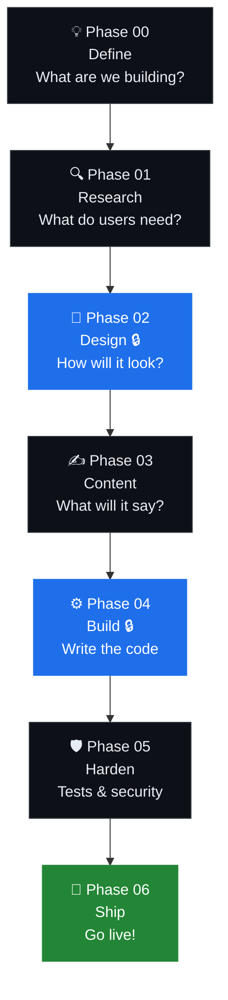
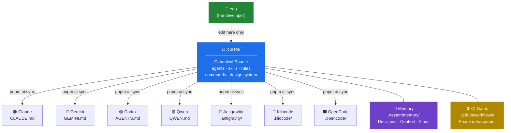
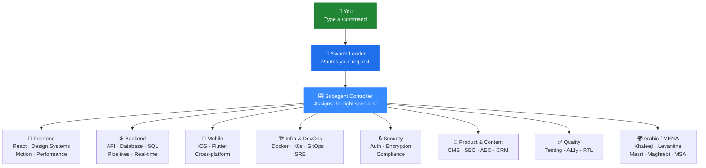
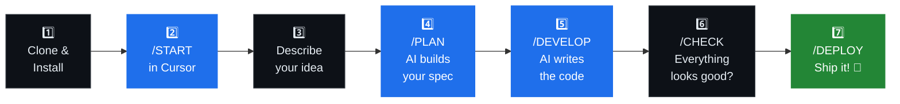
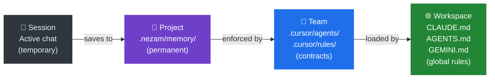

<div align="center">

<br/>

```
███╗   ██╗███████╗███████╗ █████╗ ███╗   ███╗
████╗  ██║██╔════╝╚══███╔╝██╔══██╗████╗ ████║
██╔██╗ ██║█████╗    ███╔╝ ███████║██╔████╔██║
██║╚██╗██║██╔══╝   ███╔╝  ██╔══██║██║╚██╔╝██║
██║ ╚████║███████╗███████╗██║  ██║██║ ╚═╝ ██║
╚═╝  ╚═══╝╚══════╝╚══════╝╚═╝  ╚═╝╚═╝     ╚═╝
```

### **Stop fighting your AI. Start shipping.**

*NEZAM is an open-source workspace kit that gives every AI assistant a shared brain — so it remembers your decisions, follows your rules, and never skips the important steps.*

<br/>

[](https://github.com/iDorgham/Nezam/actions/workflows/ci.yml)
[](https://github.com/iDorgham/Nezam/actions/workflows/design-gates.yml)
[](docs/core/VERSIONING.md)
[](LICENSE)
[](http://makeapullrequest.com)
[](https://pnpm.io/)

<br/>

**Works with your favourite AI tools — all synced, zero drift.**

[](https://cursor.com/)
[](CLAUDE.md)
[](GEMINI.md)
[](AGENTS.md)
[](QWEN.md)
[](.antigravity/)
[](.kilocode/)
[](.opencode/)

<br/>

[**Quick Start (5 min)**](#-quick-start) · [**How It Works**](#-how-it-works) · [**Commands**](#-commands-cheat-sheet) · [**For Beginners**](#-i-just-want-to-build-my-idea) · [**Docs**](docs/README.md)

</div>

---

## 🤔 Why does this exist?

Have you ever:

- Started a project with an AI, then **lost all context** the next day when you opened a new chat?
- Asked AI to *"just build it"* and ended up with code that **ignored your design** or **skipped the whole plan**?
- Used **Cursor** in the morning and **Claude** at night, and they gave you **completely different answers**?
- Felt like your AI was making things up instead of following **your** rules?

**NEZAM fixes all of that.**

It gives every AI assistant a shared workspace contract — a set of rules, memory files, and step-by-step gates that keep your project on track from the first idea all the way to shipping.

> **In plain English:** NEZAM is like hiring a project manager for your AI. It makes sure nothing gets built until it's been planned, nothing gets shipped until it's been checked, and your AI never forgets what you decided yesterday.

---

## ✨ What you get

| Before NEZAM | After NEZAM |
|---|---|
| 😓 AI starts coding before understanding the idea | ✅ Planning gates must pass before any code is written |
| 😓 Context vanishes every new chat session | ✅ Decisions are saved to files that every AI reads on startup |
| 😓 Cursor and Claude give you conflicting advice | ✅ One canonical source, 8 AI clients synced automatically |
| 😓 No trail from idea → design → code → ship | ✅ Full traceability through every phase of your project |
| 😓 You have to re-explain your project every session | ✅ `/START` loads your full context in seconds |
| 😓 AI skips your design system and invents its own | ✅ Design tokens are gated and enforced before build starts |

---

## 🗺️ How it works

NEZAM enforces a **7-phase pipeline**. Think of it like a recipe — you can't start baking before you've gathered ingredients. Each phase unlocks the next only when it's done right.



> 🔒 **Blue phases are gated.** NEZAM automatically checks that the required files and approvals exist before your AI is allowed to move to the next phase. No more skipping steps!

---

## 🏗️ The architecture (for the curious)

Everything flows from one canonical source. You edit `.cursor/`, and one command syncs the rules to every AI tool you use.



> **Rule:** Never edit the synced folders directly (`.claude/`, `.gemini/`, etc.). Always edit `.cursor/` and run `pnpm ai:sync`. This keeps all your AI tools perfectly aligned.

---

## 🤖 The AI agent team

NEZAM comes with **100+ specialized AI agents** organized in a clear hierarchy. You never have to pick which agent to use — the system routes your request automatically.



Agents are only loaded when needed (lazy-loading), so your workspace stays fast.

---

## ⚡ Quick Start

> **Time to first `/START`:** about 5 minutes.  
> **Prerequisites:** [Node.js 20+](https://nodejs.org/) and [pnpm](https://pnpm.io/installation).

### Step 1 — Clone the repo

```bash
git clone https://github.com/iDorgham/Nezam.git
cd Nezam
```

### Step 2 — Install dependencies

```bash
pnpm install
```

### Step 3 — Verify your setup

```bash
pnpm run check:onboarding   # checks required workspace files
pnpm ai:check               # checks all AI clients are in sync
```

You should see all green ✅. If anything is red, see [Troubleshooting](#-troubleshooting).

### Step 4 — Open in your AI editor and start

Open the `Nezam/` folder in **Cursor** (or your preferred AI editor), then type in the chat:

```
/START
```

That's it. `/START` reads your workspace state and tells you exactly what to do next — no manual orientation needed.

---

## 🌱 I just want to build my idea

**You're a beginner. You have an idea. Here's your path:**



Each `/command` tells the AI exactly what mode it's in and what to do. You don't need to re-explain your project every time.

---

## 📖 Commands cheat sheet

Type any of these in your AI editor chat:

| Command | When to use it | What it does |
|---|---|---|
| `/START` | First thing, every session | Loads your project context, tells AI where you are |
| `/PLAN` | After describing your idea | AI builds a detailed spec + task list for your project |
| `/START design` | Before building UI | AI creates and locks your visual design system |
| `/DEVELOP` | When ready to code | AI writes code phase by phase, gated by your spec |
| `/CHECK` | Any time | Runs all quality checks and reports what's passing / failing |
| `/FIX` | Something's broken | AI diagnoses and repairs workspace or code issues |
| `/SCAN` | Feeling unsure | Full health report of your entire workspace |
| `/GIT` | Saving your work | Creates a proper commit + pull request automatically |
| `/DEPLOY` | Going live | Triggers your release pipeline |

---

## 🧠 Your project's memory

NEZAM never forgets. Every important decision is saved to a file that every AI reads when it starts up.



| File | What it remembers |
|---|---|
| `.nezam/memory/MEMORY.md` | All your key decisions and design choices |
| `docs/memory/CONTEXT.md` | Current phase, priorities, blockers |
| `docs/memory/DECISIONS.md` | Plain-English log of every decision made |
| `docs/memory/PHASE_HANDOFF.md` | Briefing note for next AI session |

---

## 🗂️ Project structure

```
Nezam/
├── .cursor/              ← 🔵 Edit here. Canonical source for everything.
│   ├── agents/           ←    100+ specialized AI agents
│   ├── commands/         ←    /START /PLAN /DEVELOP /CHECK etc.
│   ├── skills/           ←    Reusable capabilities (gate-orchestrator, etc.)
│   ├── rules/            ←    Hardlock enforcement rules
│   └── design/           ←    Design profiles (minimal, brand, etc.)
│
├── .nezam/               ← 🟣 Workspace state (auto-managed)
│   ├── memory/           ←    Project memory files
│   ├── workspace/        ←    PRD, architecture, gates
│   └── templates/        ←    File templates for new projects
│
├── docs/                 ← 📄 Your project's documentation
│   ├── plans/            ←    Phase execution plans
│   ├── reports/          ←    CI-generated quality reports
│   └── wiki/             ←    Architecture & agent reference
│
└── .github/workflows/    ← ⚙️  CI gates (automated phase enforcement)
```

> **Remember:** Only edit files inside `.cursor/`. Everything else is generated or auto-managed by NEZAM.

---

## 🔧 Useful scripts

```bash
pnpm ai:sync                    # Sync .cursor/ → all AI clients (run after any change)
pnpm ai:check                   # Verify all clients are in sync, no drift
pnpm run check:onboarding       # Check required workspace files exist
pnpm run check:tokens           # Validate design tokens
pnpm run check:all              # Run every check in one go
pnpm run design:apply -- minimal  # Apply a design profile
```

---

## 🌍 Built-in Arabic & MENA support

NEZAM ships with full Arabic language and MENA-region capabilities out of the box:

- 🇸🇦 **Dialect agents:** Khaleeji, Levantine (Shami), Egyptian (Masri), Maghrebi, MSA Formal
- 📝 **Content agents:** `arabic-content-master`, `arabic-seo-aeo-specialist`
- ↔️ **RTL design tokens** baked into every design profile
- 🌐 **Localization pipeline** via `i18n-engineer` + `localization-lead`
- 💳 **MENA payments** specialist agent

---

## 🛠️ Troubleshooting

<details>
<summary><strong>❓ pnpm ai:check fails after I edited something</strong></summary>

You edited a synced file directly instead of editing `.cursor/` first. Run:

```bash
pnpm ai:sync    # Regenerate all client files from .cursor/
pnpm ai:check   # Verify no drift remains
```

</details>

<details>
<summary><strong>❓ Design gate fails in CI</strong></summary>

Your design tokens are missing or invalid:

```bash
pnpm run design:apply -- minimal   # Re-apply a clean design profile
pnpm run check:tokens              # Validate tokens pass all rules
```

</details>

<details>
<summary><strong>❓ Onboarding check fails</strong></summary>

A required workspace file is missing. Check for these:

- `.nezam/workspace/prd/PRD.md`
- `docs/plans/INDEX.md`
- `.cursor/agents/swarm-leader.md`

Create missing files from the templates in `.nezam/templates/`, then re-run `/START`.

</details>

<details>
<summary><strong>❓ AI agent is not doing what I expect</strong></summary>

Type this in your AI editor chat:

```
/FIX agents
```

Or review `docs/memory/AGENT_COMM_PROTOCOL.md` for the inter-agent communication protocol.

</details>

<details>
<summary><strong>❓ I'm brand new — where do I actually start?</strong></summary>

1. Clone the repo and run `pnpm install`
2. Open the folder in [Cursor](https://cursor.com/)
3. Type `/START` in the Cursor chat
4. Follow the prompts — NEZAM will guide you step by step

That's genuinely all you need to do.

</details>

---

## 🤝 Contributing

Pull requests are welcome! Please check [CONTRIBUTING.md](CONTRIBUTING.md) (or open an issue first for big changes).

```bash
git checkout -b feat/your-feature
# make changes in .cursor/ only
pnpm ai:sync
pnpm ai:check
pnpm run check:all
git commit -m "feat: describe your change"
```

---

## 📚 Further reading

| Resource | Description |
|---|---|
| [Docs Hub](docs/README.md) | Full documentation index |
| [Agent Map](docs/wiki/Agent-Map.md) | All 100+ agents and what they do |
| [Commands Reference](docs/wiki/Commands.md) | Deep dive on every `/command` |
| [Design System Guide](docs/wiki/Design.md) | Token-first design governance |
| [PRD](.nezam/workspace/prd/PRD.md) | Full product requirements document |

---

## 📦 Versioning

NEZAM follows [Semantic Versioning](https://semver.org/) with [Conventional Commits](https://www.conventionalcommits.org/).  
Current: **`v0.2.0`**

---

## 📄 License

MIT — free to use, fork, and build on. See [LICENSE](LICENSE).

---

<div align="center">

**Built with discipline. Governed with intent. Shipped with confidence.**

*Have an idea? NEZAM will help you build it right.*

**[Get started in 5 minutes →](#-quick-start)**

</div>
