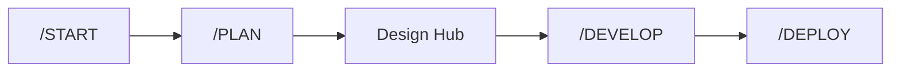

<div align="center">

# NEZAM

**Specification-Driven Development for AI-native teams**

Slash commands, swarm agents, and a visual Design Hub — one workspace contract across Cursor, Claude, Codex, Gemini, and more.

[](LICENSE)
[](package.json)
[](package.json)
[](.nezam/core/prd/PRD.md)
[](.nezam/design-hub/)

[Quick start](#-quick-start) · [Commands](#-slash-commands) · [Design Hub](#-design-hub) · [PRD](.nezam/core/prd/PRD.md) · [Contributing](#-contributing)

</div>

---

## Table of contents

- [What is NEZAM?](#what-is-nezam)
- [Quick start](#-quick-start)
- [Slash commands](#-slash-commands)
- [Design Hub](#-design-hub)
- [Repository layout](#-repository-layout)
- [SDD pipeline](#-sdd-pipeline)
- [Multi-tool sync](#-multi-tool-sync)
- [Swarms & skills](#-swarms--skills)
- [Scripts](#-scripts)
- [Troubleshooting](#-troubleshooting)
- [Contributing](#-contributing)

---

## What is NEZAM?

NEZAM is an **open-source workspace framework** for building software with AI agents under **Specification-Driven Development (SDD)**:

| Pillar | What you get |
|--------|----------------|
| **Specs first** | PRD → plans → `DESIGN.md` → locked wireframes → feature specs → code |
| **Governed agents** | 150+ agents, lazy-loaded by swarm; handoffs via `agent-bus.yaml` |
| **Design Hub** | Visual architecture, wireframes, tokens, and export — before `/DEVELOP` |
| **Multi-client** | Edit `.cursor/` only; `pnpm ai:sync` mirrors to Claude, Gemini, Codex, etc. |
| **Hardlocks** | `/plan` and `/develop` blocked until prerequisites pass (no silent skips) |


```mermaid
flowchart LR
  START["/START"] --> PLAN["/PLAN"]
  PLAN --> DH["Design Hub"]
  DH --> DEV["/DEVELOP"]
  DEV --> SHIP["/DEPLOY"]
```

---

## Quick start

### Prerequisites

- **Node.js** ≥ 20 · **pnpm** ≥ 9 · **Git**

### 1. Clone and install

```bash
git clone https://github.com/iDorgham/Nezam.git
cd Nezam
pnpm install
```

### 2. Onboard the workspace

In **Cursor** (or any synced client), run:

```
/START all
```

Or from the terminal:

```bash
pnpm run check:onboarding
```

### 3. Lock your design profile

```bash
pnpm run design:apply -- nezam-v3   # or: minimal, saas, dashboard, …
```

Catalog: `.nezam/design-hub/design/<brand>/design.md` → root **`DESIGN.md`**.

### 4. Open Design Hub (wireframes)

```bash
pnpm design-hub
```

Open **http://localhost:4000** → Architecture → Wireframes → approve → export **`wireframes_locked.json`**.

### 5. Plan and build

```
/PLAN all
/DEVELOP start
```

**Develop hardlock:** `wireframes_locked.json` at repo root (or `.session/`) must exist before UI implementation.

### 6. Keep AI mirrors in sync

`.cursor/` is the **only canonical source**. Mirrors (`.claude/`, `.gemini/`, `AGENTS.md`, etc.) are write-output, not write-input — never edit them directly.

After editing `.cursor/commands`, `.cursor/agents`, `.cursor/skills`, `.cursor/rules`, or `.cursor/state`:

```bash
pnpm ai:sync   # regenerate all mirrors
pnpm ai:check  # validate drift, swarm integrity, skill frontmatter
```

#### Pre-commit guard

`.husky/pre-commit` runs `pnpm ai:check` automatically and **blocks** the commit if the committed mirrors are out of sync with `.cursor/`. To enable it once:

```bash
pnpm install   # husky installs hooks via the `prepare` script
```

If the hook blocks your commit, fix is always:

```bash
pnpm ai:sync && git add -A && git commit
```

#### CI gate

[`.github/workflows/sync-and-drift-check.yml`](.github/workflows/sync-and-drift-check.yml) runs the same verification on every PR touching `.cursor/`, mirror folders, or sync scripts. The workflow is **verify-only**: it regenerates mirrors in the runner and fails if anything would change — proving the PR author already committed in-sync mirrors locally.

See [`DESIGN.md` §10.3](DESIGN.md) for the full sync discipline rule.

---

## Slash commands

Canonical definitions: [`.cursor/commands/`](.cursor/commands/)

| Command | Role |
|---------|------|
| `/START` | Onboarding, PRD lock, design profile, tool activation |
| `/PLAN` | SDD planning phases (research → IA → design → scaffold) |
| `/WIREFRAME` | Design Hub wireframe workflow |
| `/DESIGN` | Design system and `DESIGN.md` |
| `/DEVELOP` | Gated implementation (spec + wireframes + design) |
| `/CHECK` | Gate and artifact validation |
| `/SCAN` | Audits (a11y, perf, security, tokens) |
| `/FIX` | Targeted remediation |
| `/DEPLOY` | Release and ship checklist |
| `/GUIDE` | Next step and project status |

---

## Design Hub

Package: [`.nezam/design-hub/`](.nezam/design-hub/) · Default port **4000**

| Section | Purpose |
|---------|---------|
| **Architecture** | App tree, services rack, API wiring |
| **Wireframes** | Per-page blocks keyed to arch nodes → lock export |
| **Theme** | Tokens, typography, light/dark |
| **Components** | shadcn registry browse |
| **Export** | Routes, nav, Mermaid, full context (12 formats) |

```bash
pnpm design-hub          # dev server
cd .nezam/design-hub && pnpm test && pnpm build
```

---

## Repository layout

```
NEZAM/
├── .cursor/                 # Canonical commands, agents, skills, rules
├── .nezam/
│   ├── core/prd/            # PRD.md (this product)
│   ├── core/plans/          # SDD phase artifacts
│   ├── core/gates/          # Hardlocks + CI gate matrix
│   ├── design-hub/          # Design Hub app
│   └── design/              # Brand design profiles
├── docs/plan/               # Your project plans (when using NEZAM on a product)
├── docs/reports/            # Generated audits and progress
├── DESIGN.md                # Active design contract
├── wireframes_locked.json   # Approved wireframe contract
├── CLAUDE.md · AGENTS.md    # Generated — run pnpm ai:sync after .cursor/ edits
└── README.md
```

---

## SDD pipeline

Order is **enforced by hardlocks** (see `.nezam/core/gates/hardlock-paths.json`):

```
Planning → SEO/IA → Content → DESIGN.md + wireframes → Scaffold → Build → Harden → Ship
```

| Gate | Requires |
|------|----------|
| `/plan` | `prd_locked` + `design_locked` in `.cursor/state/onboarding.yaml` |
| `/develop` | Planning complete, `DESIGN.md`, `wireframes_locked.json`, scaffold when applicable |

Product-type pipelines (website, webapp, SaaS, mobile): [`.cursor/rules/sdd-pipeline-v2.mdc`](.cursor/rules/sdd-pipeline-v2.mdc)

---

## Multi-tool sync

| Tier | Clients |
|------|---------|
| **1** | Cursor, Claude Code, Codex, Antigravity IDE/CLI |
| **2** | Gemini, Qwen, OpenCode, Kilo, Windsurf, VS Code |

```bash
pnpm ai:sync      # regenerate mirrors
pnpm ai:status    # drift survey
pnpm ai:check     # CI-grade integrity
```

**Rule:** Never hand-edit `CLAUDE.md`, `AGENTS.md`, or `.claude/` as source of truth — edit `.cursor/` only.

Map: [`.nezam/core/memory/MULTI_TOOL_INDEX.md`](.nezam/core/memory/MULTI_TOOL_INDEX.md)

---

## Swarms & skills

| Swarm | Focus |
|-------|--------|
| 1–3 | Architecture, design, frontend |
| 4–7 | Backend, data, mobile, CMS/SaaS |
| 8–14 | Analytics, security, DevOps, QA, design excellence |

Registry: [`.cursor/state/AGENT_REGISTRY.yaml`](.cursor/state/AGENT_REGISTRY.yaml)  
Skills: [`.cursor/skills/`](.cursor/skills/) (require `tier` + `version` in frontmatter for `pnpm ai:check`)

---

## Scripts

| Script | Description |
|--------|-------------|
| `pnpm design-hub` | Design Hub dev server |
| `pnpm run design:apply -- <brand>` | Copy profile → `DESIGN.md` |
| `pnpm ai:sync` | Sync `.cursor/` → all AI clients |
| `pnpm ai:check` | Drift + skill integrity |
| `pnpm run check:onboarding` | Onboarding gate check |
| `pnpm run check:tokens` | Design token gate |
| `pnpm prd:roadmap` | Regenerate roadmap from PRD table |
| `pnpm continual-learning` | Mine transcripts → update AGENTS template |

---

## Troubleshooting

<details>
<summary><strong>pnpm install fails (registry / auth)</strong></summary>

```bash
pnpm config set registry https://registry.npmjs.org/
pnpm install
```

</details>

<details>
<summary><strong><code>/DEVELOP</code> blocked — wireframes</strong></summary>

Run `pnpm design-hub`, complete wireframes, export **`wireframes_locked.json`** to repo root.

</details>

<details>
<summary><strong><code>/PLAN</code> blocked — PRD or design</strong></summary>

```bash
pnpm run check:onboarding
```

Set `prd_locked: true` and `design_locked: true` in `.cursor/state/onboarding.yaml` after `/START` completes.

</details>

<details>
<summary><strong>AI mirror drift</strong></summary>

```bash
pnpm ai:sync && pnpm ai:check
```

</details>

---

## Contributing

1. Fork and branch from `main`
2. Edit **only** under `.cursor/` for commands, agents, skills, rules
3. Run `pnpm ai:sync` and `pnpm ai:check`
4. For Design Hub: `cd .nezam/design-hub && pnpm test && pnpm build`
5. Open a PR with scope and verification steps

See [CONTRIBUTING.md](CONTRIBUTING.md) · [CODE_OF_CONDUCT.md](CODE_OF_CONDUCT.md)

---

<div align="center">

**NEZAM** — specs before code, agents with guardrails, design you can lock.

[PRD v2.1](.nezam/core/prd/PRD.md) · [Report a bug](https://github.com/iDorgham/Nezam/issues) · [Request a feature](https://github.com/iDorgham/Nezam/issues/new)

</div>
