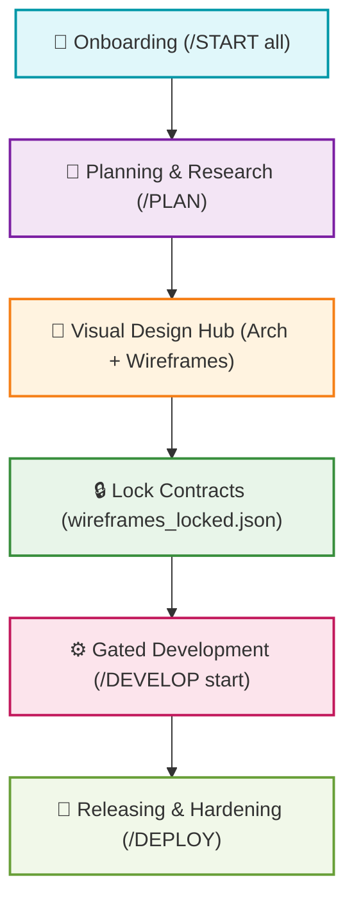
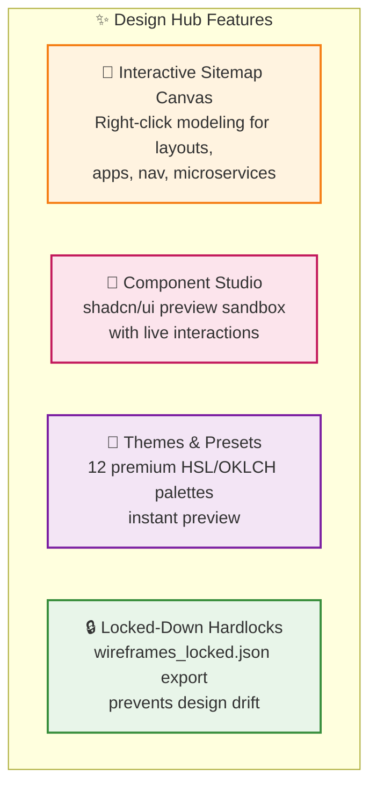
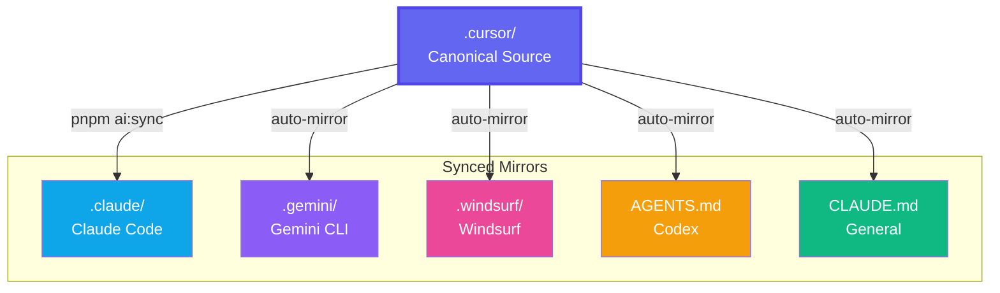
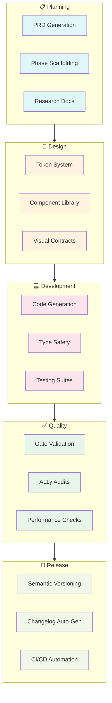

# <div align="center"><br><br>NEZAM</div>

<div align="center">

**Specification-Driven Development (SDD) for High-Velocity AI-Native Teams**

*Slash commands, visual design-to-code, automated swarms, and hardlocked gates—orchestrated as a single unified contract across Cursor, Claude, Codex, Gemini, and Antigravity.*

</div>

<div align="center">


[](LICENSE)

[](.nezam/core/prd/PRD.md)
[](.nezam/design-hub/)
[]()

</div>

</div>

<div align="center">
  <h3>
    <a href="#-what-is-nezam">What is NEZAM?</a> •
    <a href="#-quick-start">Quick Start</a> •
    <a href="#-slash-commands">Slash Commands</a> •
    <a href="#-design-hub-v3">Design Hub v3</a> •
    <a href="#-sdd-pipeline-and-gates">SDD Pipeline</a> •
    <a href="#-multi-client-sync">AI Sync</a>
  </h3>
</div>

---

## ⚡ What is NEZAM?

NEZAM is an **open-source workspace specification and framework** that enables software engineering teams to design, model, and build production-grade web applications in absolute lockstep with AI agents under **Specification-Driven Development (SDD)**.

Instead of writing code blindly, NEZAM enforces an immaculate pipeline: from product requirement documents (PRD) to structured visual wireframes, down to auto-generated typography scale contracts, all before generating a single line of application logic.

### 🏛️ The Five Core Pillars of NEZAM

<div align="center">

| Pillar | Focus | What it Accomplishes |
| :---: | :--- | :--- |
| 📋 **Specs-First Discipline** | PRD ➔ DESIGN.md | Transforms PRDs directly into granular visual and code tokens. |
| 🖥️ **Interactive Design Hub** | Architecture ➔ Code | Visually model layout systems, service structures, and routes in real-time. |
| 🤖 **Governed AI Swarms** | 150+ Specialized Agents | Restricts AI scopes and enforces handoffs through `agent-bus.yaml`. |
| 🛡️ **Hardlocked Development** | Automated Quality Gates | Prevents `/DEVELOP` command execution until wireframes and tokens are verified. |
| 🔄 **Multi-Client Mirroring** | Tier 1 & Tier 2 Syncing | Edit once in `.cursor/`—auto-mirrors settings to Claude, Gemini, Windsurf, etc. |

</div>


```mermaid
flowchart TD
    A["🏁 Onboarding (/START all)"] --> B["📐 Planning & Research (/PLAN)"]
    B --> C["🎨 Visual Design Hub (Arch + Wireframes)"]
    C --> D["🔒 Lock Contracts (wireframes_locked.json)"]
    D --> E["⚙️ Gated Development (/DEVELOP start)"]
    E --> F["🚀 Releasing & Hardening (/DEPLOY)"]
    
    style A fill:#E0F7FA,stroke:#0097A7,stroke-width:2px
    style B fill:#F3E5F5,stroke:#7B1FA2,stroke-width:2px
    style C fill:#FFF3E0,stroke:#F57F17,stroke-width:2px
    style D fill:#E8F5E9,stroke:#388E3C,stroke-width:2px
    style E fill:#FCE4EC,stroke:#C2185B,stroke-width:2px
    style F fill:#F1F8E9,stroke:#689F38,stroke-width:2px
```

---

## 🚀 Quick Start

### Prerequisites
- **Node.js** ≥ 20.0.0
- **pnpm** ≥ 9.0.0
- **Git**

### 1. Clone & Bootstrap
```bash
git clone https://github.com/iDorgham/Nezam.git
cd Nezam
pnpm install
```

### 2. Onboard the AI Workspace
Open the workspace in your IDE (Cursor, VS Code, or Antigravity) and execute the global onboarding shortcut in the chat:
```
/START all
```
*Alternatively, verify onboarding manually via the terminal:*
```bash
pnpm run check:onboarding
```

### 3. Choose and Apply a Design Profile
Lock in a premium design profile template (such as minimal, SaaS, or dashboard) to bind your active `DESIGN.md` contract:
```bash
pnpm run design:apply -- nezam-v3
```
> [!TIP]
> Curated profile templates reside in `.nezam/design-hub/design/<brand>/design.md`.

### 4. Boot Up the Visual Design Hub
Launch the local desktop environment to visually map your pages, wireframes, and architecture services:
```bash
pnpm design-hub
```
Open **[http://localhost:4000](http://localhost:4000)** in your browser, build out your layout, and click **Export** to generate your locked local wireframe contract: `wireframes_locked.json`.

---

## 🎨 Design Hub v3

The **NEZAM Design Hub** is a premium, visual designer and local compiler tool that allows teams and AI models to visually establish layouts, design tokens, sitemaps, and integrations before jumping into code.

```
.nezam/design-hub/
├── Architecture Canvas ➔ Model microservices, app racks, and page hierarchies.
├── Wireframes slot     ➔ Drag-and-drop structural CMS, analytics, & dashboard blocks.
├── Theme Studio        ➔ Fine-tune HSL/OKLCH color scales, dynamic type layers, and curves.
└── Smart Export Engine ➔ Compile designs instantly to 12 formats (Mermaid, routes, JSON, etc.).
```

### Key V3 Features:

<div align="center">


```mermaid
graph TB
    subgraph Features["✨ Design Hub Features"]
        F1["📐 Interactive Sitemap Canvas<br/>Right-click modeling for layouts,<br/>apps, nav, microservices"]
        F2["🧩 Component Studio<br/>shadcn/ui preview sandbox<br/>with live interactions"]
        F3["🎨 Themes & Presets<br/>12 premium HSL/OKLCH palettes<br/>instant preview"]
        F4["🔒 Locked-Down Hardlocks<br/>wireframes_locked.json export<br/>prevents design drift"]
    end
    
    style F1 fill:#FFF3E0,stroke:#F57F17,stroke-width:2px
    style F2 fill:#FCE4EC,stroke:#C2185B,stroke-width:2px
    style F3 fill:#F3E5F5,stroke:#7B1FA2,stroke-width:2px
    style F4 fill:#E8F5E9,stroke:#388E3C,stroke-width:2px
```

</div>

---

## 💬 Slash Commands

NEZAM is governed by descriptive slash shortcuts within your AI IDE chat pane. The canonical files are located under [`.cursor/commands/`](.cursor/commands/).

<div align="center">

| Command | Action | Description |
| :---: | :---: | :--- |
| **`/START`** | 🏁 Onboarding | Runs workspace checks, initializes PRD states, and boots up environment. |
| **`/PLAN`** | 📐 Scaffolding | Breaks down the implementation phases (Research ➔ IA ➔ Content ➔ Design). |
| **`/WIREFRAME`** | 🎨 Design | Launches block palette checks, page configurations, and wireframe updates. |
| **`/DESIGN`** | 🔐 Lock | Syncs active styling profiles to the root `DESIGN.md` contract. |
| **`/DEVELOP`** | ⚙️ Build | Invokes the code generator swarm; strictly gated by PRD and wireframe locks. |
| **`/CHECK`** | ✅ Validate | Validates that required artifacts, specs, and locks exist in the workspace. |
| **`/SCAN`** | 🔍 Audit | Audits styling contrast, Web accessibility (WCAG), token usage, and performance. |
| **`/FIX`** | 🔧 Patch | Resolves specific lint, compiler, type, or styling-drift failures. |
| **`/DEPLOY`** | 🚀 Release | Ensures CI pipelines pass and generates the release changelog and tags. |
| **`/GUIDE`** | 🗺️ Status | Points out missing locks and guides the developer/AI on the next sequential task. |

</div>

---

## 🔒 SDD Pipeline and Gates

NEZAM operates on a **zero-bypass pipeline**. Development `/DEVELOP` is hardlocked until prerequisites are generated:


```mermaid
flowchart LR
    O["⚙️<br/>Onboarding"]
    P["📐<br/>Planning"]
    D["🎨<br/>Design"]
    W["🔒<br/>Wireframes"]
    S["📦<br/>Scaffold"]
    DEV["⚙️<br/>Develop"]
    
    O -->|✓ prd_locked| P
    P -->|✓ specs| D
    D -->|✓ tokens| W
    W -->|✓ wireframes_locked.json| S
    S -->|✓ gates pass| DEV
    
    style O fill:#E0F7FA,stroke:#0097A7,stroke-width:2px
    style P fill:#F3E5F5,stroke:#7B1FA2,stroke-width:2px
    style D fill:#FFF3E0,stroke:#F57F17,stroke-width:2px
    style W fill:#E8F5E9,stroke:#388E3C,stroke-width:2px
    style S fill:#FCE4EC,stroke:#C2185B,stroke-width:2px
    style DEV fill:#F1F8E9,stroke:#689F38,stroke-width:2px
```

### Automated Validation Matrix:

| Gate | Trigger | Requirement |
|:---:|:---|:---|
| 🏁 **Onboarding** | `/START` | Writes `prd_locked: true` to `.cursor/state/onboarding.yaml` |
| 📐 **Planning** | `/PLAN` | Generates `.nezam/core/prd/` phase strategies |
| 🎨 **Design** | `/DESIGN` | Creates `DESIGN.md` with tokens and contracts |
| 🔒 **Wireframe** | `/WIREFRAME` | Exports `wireframes_locked.json` with route schema |
| ✅ **Scaffold** | `/CHECK` | Validates all locks and prerequisites exist |
| 🚀 **Develop** | `/DEVELOP` | All gates pass; development unlocked |
| 🔄 **Drift Guard** | Pre-commit | Runs `pnpm ai:check` to ensure IDE sync |

---

## 🔄 Multi-Client Sync

Edit configurations in **`.cursor/`** only. NEZAM automatically mirrors active commands, agents, custom rules, and specialized skills to all other client environments.


```mermaid
graph TB
    Source[".cursor/<br/>Canonical Source"]
    
    subgraph Mirrors["Synced Mirrors"]
        Claude[".claude/<br/>Claude Code"]
        Gemini[".gemini/<br/>Gemini CLI"]
        Windsurf[".windsurf/<br/>Windsurf"]
        Codex["AGENTS.md<br/>Codex"]
        General["CLAUDE.md<br/>General"]
    end
    
    Source -->|pnpm ai:sync| Claude
    Source -->|auto-mirror| Gemini
    Source -->|auto-mirror| Windsurf
    Source -->|auto-mirror| Codex
    Source -->|auto-mirror| General
    
    style Source fill:#6366F1,color:#fff,stroke:#4F46E5,stroke-width:3px
    style Claude fill:#0EA5E9,color:#fff
    style Gemini fill:#8B5CF6,color:#fff
    style Windsurf fill:#EC4899,color:#fff
    style Codex fill:#F59E0B,color:#fff
    style General fill:#10B981,color:#fff
```

### Sync Commands:

```bash
# Compile all mirrors from .cursor/ source
pnpm ai:sync

# Survey local mirror drift or uncommitted changes
pnpm ai:status

# Strictly validate swarm integrity and skill frontmatter
pnpm ai:check
```

---

## ⚡ Features at a Glance

<div align="center">


```mermaid
graph TB
    subgraph Planning["📋 Planning"]
        P1["PRD Generation"]
        P2["Phase Scaffolding"]
        P3["Research Docs"]
    end
    
    subgraph Design["🎨 Design"]
        D1["Token System"]
        D2["Component Library"]
        D3["Visual Contracts"]
    end
    
    subgraph Development["💻 Development"]
        Dev1["Code Generation"]
        Dev2["Type Safety"]
        Dev3["Testing Suites"]
    end
    
    subgraph Quality["✅ Quality"]
        Q1["Gate Validation"]
        Q2["A11y Audits"]
        Q3["Performance Checks"]
    end
    
    subgraph Release["🚀 Release"]
        R1["Semantic Versioning"]
        R2["Changelog Auto-Gen"]
        R3["CI/CD Automation"]
    end
    
    Planning --> Design
    Design --> Development
    Development --> Quality
    Quality --> Release
    
    style P1 fill:#E0F7FA
    style P2 fill:#E0F7FA
    style P3 fill:#E0F7FA
    style D1 fill:#FFF3E0
    style D2 fill:#FFF3E0
    style D3 fill:#FFF3E0
    style Dev1 fill:#FCE4EC
    style Dev2 fill:#FCE4EC
    style Dev3 fill:#FCE4EC
    style Q1 fill:#E8F5E9
    style Q2 fill:#E8F5E9
    style Q3 fill:#E8F5E9
    style R1 fill:#F1F8E9
    style R2 fill:#F1F8E9
    style R3 fill:#F1F8E9
```

</div>

---

## 📁 Repository Layout

```
NEZAM/
├── .cursor/                 # 📂 Canonical rules, agents, skills, and commands
├── .nezam/
│   ├── core/prd/            # 📂 PRD.md specifications
│   ├── core/plans/          # 📂 SDD phase progress files
│   ├── core/gates/          # 📂 Hardlock configurations & CI validation matrices
│   ├── design-hub/          # 📂 Visual Design Hub (Next.js Application)
│   └── design/              # 📂 Brand token profile files
├── docs/
│   ├── plan/                # 📂 Project implementation milestones
│   └── reports/             # 📂 Accessibility, styling audits, and tests
├── DESIGN.md                # 📄 Active design tokens contract
├── wireframes_locked.json   # 📄 Visual sitemap and layout lock
├── CLAUDE.md · AGENTS.md    # 📄 Auto-generated mirrors
└── README.md                # 📄 Project master dashboard
```

---

## 🛠️ Diagnostics & Troubleshooting

<details>
<summary><strong>🚫 Next.js / pnpm dependency conflicts</strong></summary>
If you run into installation conflicts or npm-auth issues in restricted environments, force the default public registry:

```bash
pnpm config set registry https://registry.npmjs.org/
pnpm install
```
</details>

<details>
<summary><strong>🔒 `/DEVELOP` command is blocked</strong></summary>
The `/DEVELOP` command is hardlocked until wireframe layouts are complete. Run `pnpm design-hub`, model your routes, select pages in the wireframes section, and click **Export** to create the required root contract `wireframes_locked.json`.
</details>

<details>
<summary><strong>⚠️ Git Commit is blocked by pre-commit hook</strong></summary>
If Husky blocks your commit with drift errors, simply run `pnpm ai:sync` to rebuild client configurations, stage the changes, and commit again:

```bash
pnpm ai:sync && git add -A && git commit -m "your commit message"
```
</details>

---

## 📚 Resources & Documentation

<div align="center">

| Resource | Purpose | Link |
|:---:|:---|:---:|
| 📖 PRD Specification | Complete system requirements | [View PRD](.nezam/core/prd/PRD.md) |
| 🎨 Design Profiles | Brand token templates | [Design Hub](.nezam/design-hub/) |
| 🔧 Commands Reference | Slash command definitions | [Commands](.cursor/commands/) |
| 🤖 Agents Library | 150+ specialized agents | [Agents](.cursor/agents/) |
| 🎯 Skills Registry | Skill implementations | [Skills](.cursor/skills/) |
| 📝 Implementation Plans | Phase-by-phase guides | [Plans](.nezam/core/plans/) |

</div>

---

## 🐛 Troubleshooting & Support

For common issues and solutions, see our [Diagnostics & Troubleshooting](#-diagnostics--troubleshooting) section above.

<div align="center">

**Have questions?** [Open an Issue](https://github.com/iDorgham/Nezam/issues) · **Want to contribute?** [See Contributing Guidelines](#contributing) · **Need help?** [Start a Discussion](https://github.com/iDorgham/Nezam/discussions)

</div>

---

<div align="center">

## Built for the Future of Agentic Coding

**Specification-Driven. Visually Modeled. AI-Orchestrated. Deterministic.**


[📖 PRD Specification](.nezam/core/prd/PRD.md) · [🐛 Report Issue](https://github.com/iDorgham/Nezam/issues) · [📄 License](LICENSE)

</div>
