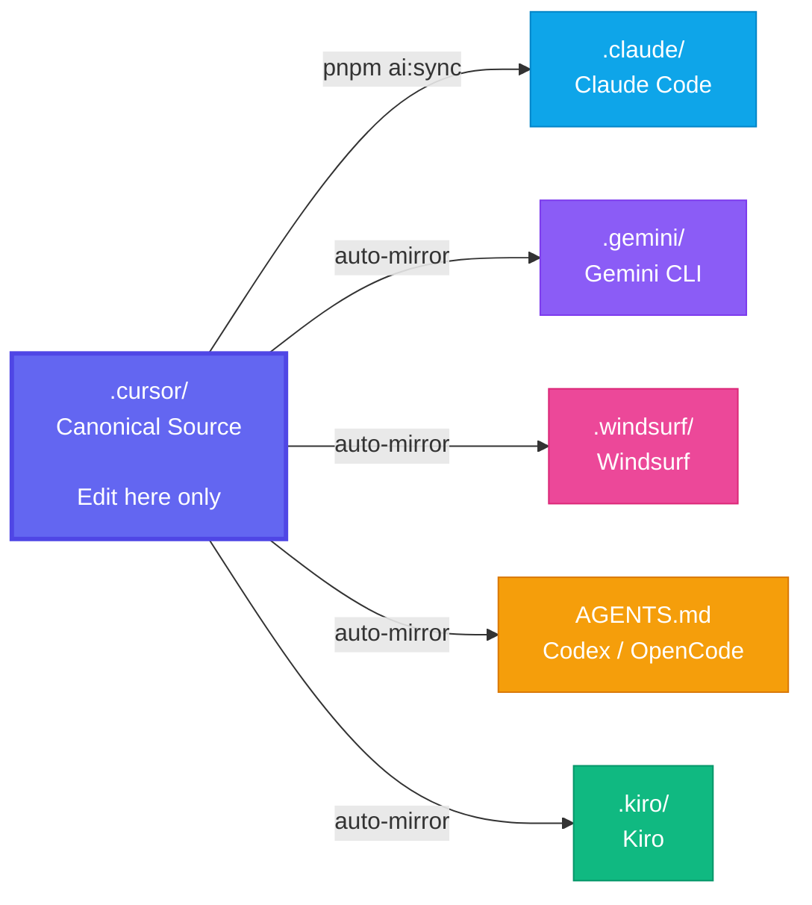

# <div align="center"><br><br>NEZAM</div>

<div align="center">

**Stop fighting your AI. Start shipping with it.**

*NEZAM is an open-source workspace kit that turns AI-assisted coding into a structured, repeatable system — from idea to production.*

</div>

<div align="center">


[](LICENSE)
[]()

</div>

<div align="center">
  <h3>
    <a href="#-the-problem">The Problem</a> •
    <a href="#-quick-start">Quick Start</a> •
    <a href="#-slash-commands">Commands</a> •
    <a href="#-how-it-works">How It Works</a> •
    <a href="#-ai-sync">AI Sync</a> •
    <a href="#-design-hub">Design Hub</a>
  </h3>
</div>

---

## 😤 The Problem

You use Cursor, Claude, or Gemini every day. But at some point you notice:

- The AI forgets context between sessions
- It generates code that breaks something else
- You have no record of why a decision was made
- Different team members get different results from the same prompt
- Design and code slowly drift apart

This is not an AI problem. **It is a missing structure problem.**

NEZAM gives you that structure.

---

## ✅ What NEZAM Does

NEZAM is a set of rules, commands, and agents that sit on top of your existing AI tools. It does not replace Cursor or Claude — it makes them work in a controlled, predictable way.

Here is what you get:

| | Without NEZAM | With NEZAM |
|---|---|---|
| **Starting a project** | Prompt → hope for the best | `/START all` → structured onboarding, PRD locked |
| **Design decisions** | Scattered in chat history | Locked in `DESIGN.md`, always visible |
| **Development** | AI writes whatever it wants | Gated by wireframes and specs — no drift |
| **Multi-tool teams** | Everyone has different settings | One source in `.cursor/`, synced to all tools |
| **Releases** | Manual changelog, easy to miss things | `/DEPLOY` generates everything automatically |

---

## 🚀 Quick Start

**You need:** Node.js ≥ 20, pnpm ≥ 9, Git

```bash
# 1. Clone
git clone https://github.com/iDorgham/Nezam.git
cd Nezam

# 2. Install
pnpm install

# 3. Start inside Cursor, Claude Code, or VS Code
# Type this in the AI chat:
/START all
```

That is it. NEZAM will walk you through the rest.

> **Already have a project?** You can copy the `.cursor/`, `.nezam/`, and `.claude/` folders into your existing repo and run `pnpm install`.

---

## 💬 Slash Commands

Type these commands directly in your AI chat (Cursor, Claude Code, Gemini CLI).

<div align="center">

| Command | What It Does |
|:---:|:---|
| `/START` | Set up the workspace. Lock your PRD and design profile. |
| `/PLAN` | Break your project into phases: research → design → build → ship. |
| `/WIREFRAME` | Set your page layouts. Locks the structure before any code is written. |
| `/DESIGN` | Apply a design profile. Generates your color, type, and spacing tokens. |
| `/DEVELOP` | Build. Only unlocks after wireframes and design are confirmed. |
| `/CHECK` | Validate that all required files and locks exist. |
| `/SCAN` | Check accessibility, performance, and styling issues. |
| `/FIX` | Fix lint, type errors, or styling drift automatically. |
| `/DEPLOY` | Run CI, generate changelog, create release tag. |
| `/GUIDE` | See where you are in the pipeline and what to do next. |

</div>

> Not sure which command to use? Run `/GUIDE` — it always tells you the next step.

---

## 🔄 How It Works

NEZAM enforces a strict order. You cannot run `/DEVELOP` until the design is locked. You cannot lock the design until the wireframes are done. This prevents the most common cause of AI-generated mess: building without a plan.


```mermaid
flowchart LR
    A["🏁 /START\nOnboarding"] -->|PRD locked| B["📐 /PLAN\nPhases & Research"]
    B -->|Specs ready| C["🎨 /DESIGN\nTokens & Profile"]
    C -->|DESIGN.md locked| D["🔒 /WIREFRAME\nLayout Contract"]
    D -->|wireframes_locked.json| E["⚙️ /DEVELOP\nGated Build"]
    E -->|All gates pass| F["🚀 /DEPLOY\nRelease"]

    style A fill:#E0F7FA,stroke:#0097A7,stroke-width:2px
    style B fill:#F3E5F5,stroke:#7B1FA2,stroke-width:2px
    style C fill:#FFF3E0,stroke:#F57F17,stroke-width:2px
    style D fill:#E8F5E9,stroke:#388E3C,stroke-width:2px
    style E fill:#FCE4EC,stroke:#C2185B,stroke-width:2px
    style F fill:#F1F8E9,stroke:#689F38,stroke-width:2px
```

Each step creates a file. That file is the proof that the step is done. The next step checks for that file before it starts. No file → no access.

### Gate Reference

| Gate | File It Creates | What Gets Unlocked |
|:---:|:---|:---|
| `/START` | `onboarding.yaml` — `prd_locked: true` | Planning |
| `/PLAN` | Phase specs in `.nezam/core/plans/` | Design |
| `/DESIGN` | `DESIGN.md` with tokens | Wireframes |
| `/WIREFRAME` | `wireframes_locked.json` | Development |
| `/CHECK` | Gate validation report | Deploy |
| `/DEPLOY` | Changelog + release tag | Production |

---

## 🔄 AI Sync

NEZAM keeps all your AI tools in sync automatically. You edit one folder — `.cursor/` — and NEZAM mirrors it to Claude, Gemini, Windsurf, and others.


```mermaid
flowchart LR
    SRC[".cursor/\nCanonical Source\n\nEdit here only"]

    SRC -->|pnpm ai:sync| CL[".claude/\nClaude Code"]
    SRC -->|auto-mirror| GEM[".gemini/\nGemini CLI"]
    SRC -->|auto-mirror| WS[".windsurf/\nWindsurf"]
    SRC -->|auto-mirror| CX["AGENTS.md\nCodex / OpenCode"]
    SRC -->|auto-mirror| KIRO[".kiro/\nKiro"]

    style SRC fill:#6366F1,color:#fff,stroke:#4F46E5,stroke-width:3px
    style CL fill:#0EA5E9,color:#fff,stroke:#0284C7
    style GEM fill:#8B5CF6,color:#fff,stroke:#7C3AED
    style WS fill:#EC4899,color:#fff,stroke:#DB2777
    style CX fill:#F59E0B,color:#fff,stroke:#D97706
    style KIRO fill:#10B981,color:#fff,stroke:#059669
```

```bash
# Sync all mirrors from .cursor/
pnpm ai:sync

# Check for drift
pnpm ai:check

# Check sync status
pnpm ai:status
```

A pre-commit hook runs `ai:sync` automatically on every commit, so your tools never go out of sync.

---

## 🎨 Design Hub

The Design Hub is a local visual tool that runs in your browser. Use it to map your pages, pick colors, and set your layout — before writing any code.

```
pnpm design-hub
→ Open http://localhost:4000
```

Inside you will find:

- **Sitemap Canvas** — drag and drop your pages and routes
- **Wireframe Builder** — design your layouts block by block
- **Theme Studio** — pick colors, type scale, and spacing
- **Export** — click Export to lock everything into `wireframes_locked.json`

Once you export, your wireframes are locked. The AI will follow your layout — not invent a new one.

To apply a ready-made design profile:
```bash
pnpm run design:apply -- nezam-v3
```

Profiles are in `.nezam/design-hub/design/<brand>/design.md`.

---

## 🤖 AI Agents

NEZAM includes 150+ specialized agents. Each agent has one job. They hand off to each other through a controlled bus — no agent goes outside its scope.

A few examples:

| Agent | Job |
|:---|:---|
| `swarm-leader` | Orchestrates all other agents |
| `frontend-lead` | Owns all UI decisions |
| `design-lead` | Enforces the design contract |
| `qa-test-lead` | Writes and validates test coverage |
| `seo-specialist` | Handles SEO and AEO optimization |
| `security-auditor` | Runs security checks and CVE reports |

All agents are in `.cursor/agents/`. You can add, remove, or customize them.

---

## 📁 Repository Structure

```
NEZAM/
├── .cursor/                 # ← Edit here. Source of truth.
│   ├── commands/            # Slash command definitions
│   ├── agents/              # 150+ specialized agents
│   ├── skills/              # Reusable skill modules
│   └── rules/               # Enforcement rules
│
├── .nezam/
│   ├── core/prd/            # Product requirements
│   ├── core/plans/          # Phase progress files
│   ├── core/gates/          # Hardlock configs & CI matrices
│   └── design-hub/          # Visual Design Hub (Next.js app)
│
├── docs/reports/            # Audit reports, security, performance
├── DESIGN.md                # Active design contract (auto-generated)
├── wireframes_locked.json   # Layout lock (auto-generated)
└── CLAUDE.md / AGENTS.md    # AI mirrors (auto-generated — do not edit)
```

---

## 🛠️ Common Issues

<details>
<summary><strong>pnpm install fails with dependency errors</strong></summary>

Force the public npm registry and try again:

```bash
pnpm config set registry https://registry.npmjs.org/
pnpm install
```
</details>

<details>
<summary><strong>/DEVELOP is blocked</strong></summary>

This is expected. `/DEVELOP` only unlocks after you complete the wireframes. Run `pnpm design-hub`, build your layout, and click **Export**. This creates `wireframes_locked.json` and unlocks development.
</details>

<details>
<summary><strong>Git commit is rejected by pre-commit hook</strong></summary>

The Husky hook found sync drift. Fix it in one command:

```bash
pnpm ai:sync && git add -A && git commit -m "your message"
```
</details>

<details>
<summary><strong>Not sure what to do next</strong></summary>

Type `/GUIDE` in your AI chat. It reads your project state and tells you exactly what step to take next.
</details>

---

## 📚 Documentation

<div align="center">

| Document | What Is It |
|:---|:---|
| [PRD Specification](.nezam/core/prd/PRD.md) | Full product requirements |
| [ONBOARDING.md](ONBOARDING.md) | Step-by-step setup guide |
| [DESIGN_TO_CODE.md](docs/design/DESIGN_TO_CODE.md) | How design tokens become code |
| [RUNBOOKS.md](RUNBOOKS.md) | Operations and incident runbooks |
| [TROUBLESHOOTING.md](TROUBLESHOOTING.md) | FAQ and common fixes |
| [Commands Reference](.cursor/commands/) | All slash command definitions |
| [Agents Library](.cursor/agents/) | All 150+ agent definitions |

</div>

---

<div align="center">

## Ready to start?

```bash
git clone https://github.com/iDorgham/Nezam.git && cd Nezam && pnpm install
```

Then open the folder in Cursor or Claude Code and type `/START all`.

---

[Open an Issue](https://github.com/iDorgham/Nezam/issues) · [Start a Discussion](https://github.com/iDorgham/Nezam/discussions) · [MIT License](LICENSE)

</div>
