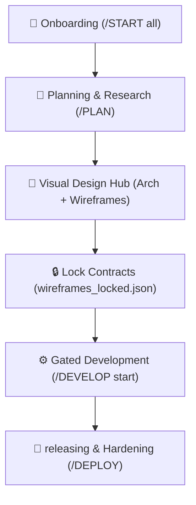

# <div align="center"><br><br>NEZAM</div>

<div align="center">

**Specification-Driven Development (SDD) for High-Velocity AI-Native Teams**

*Slash commands, visual design-to-code, automated swarms, and hardlocked gates—orchestrated as a single unified contract across Cursor, Claude, Codex, Gemini, and Antigravity.*

</div>

<div align="center">

[](LICENSE)
[](package.json)
[](package.json)
[](.nezam/core/prd/PRD.md)
[](.nezam/design-hub/)

</div>

<div align="center">
  <h3>
    <a href="#-what-is-nezam">What is NEZAM?</a> •
    <a href="#-quick-start">Quick Start</a> •
    <a href="#-slash-commands">Slash Commands</a> •
    <a href="#-design-hub-v3">Design Hub v3</a> •
    <a href="#-sdd-pipeline-and-gates">SDD Pipeline</a> •
    <a href="#-multi-client-sync">AI Sync</a>
  </h3>
</div>

---

## ⚡ What is NEZAM?

NEZAM is an **open-source workspace specification and framework** that enables software engineering teams to design, model, and build production-grade web applications in absolute lockstep with AI agents under **Specification-Driven Development (SDD)**.

Instead of writing code blindly, NEZAM enforces an immaculate pipeline: from product requirement documents (PRD) to structured visual wireframes, down to auto-generated typography scale contracts, all before generating a single line of application logic.

### 🏛️ The Five Core Pillars of Nezam

| Pillar | Focus | What it Accomplishes |
| :--- | :--- | :--- |
| 📋 **Specs-First Discipline** | PRD ➔ DESIGN.md | Transforms PRDs directly into granular visual and code tokens. |
| 🖥️ **Interactive Design Hub** | Architecture ➔ Code | Visually model layout systems, service structures, and routes in real-time. |
| 🤖 **Governed AI Swarms** | 150+ Specialized Agents | Restricts AI scopes and enforces handoffs through `agent-bus.yaml`. |
| 🛡️ **Hardlocked Development** | Automated Quality Gates | Prevents `/DEVELOP` command execution until wireframes and tokens are verified. |
| 🔄 **Multi-Client Mirroring** | Tier 1 & Tier 2 Syncing | Edit once in `.cursor/`—auto-mirrors settings to Claude, Gemini, Windsurf, etc. |


```mermaid
flowchart TD
    A["🏁 Onboarding (/START all)"] --> B["📐 Planning & Research (/PLAN)"]
    B --> C["🎨 Visual Design Hub (Arch + Wireframes)"]
    C --> D["🔒 Lock Contracts (wireframes_locked.json)"]
    D --> E["⚙️ Gated Development (/DEVELOP start)"]
    E --> F["🚀 releasing & Hardening (/DEPLOY)"]
```

---

## 🚀 Quick Start

### Prerequisites
- **Node.js** ≥ 20.0.0
- **pnpm** ≥ 9.0.0
- **Git**

### 1. Clone & Bootstrap
```bash
git clone https://github.com/iDorgham/Nezam.git
cd Nezam
pnpm install
```

### 2. Onboard the AI Workspace
Open the workspace in your IDE (Cursor, VS Code, or Antigravity) and execute the global onboarding shortcut in the chat:
```
/START all
```
*Alternatively, verify onboarding manually via the terminal:*
```bash
pnpm run check:onboarding
```

### 3. Choose and Apply a Design Profile
Lock in a premium design profile template (such as minimal, SaaS, or dashboard) to bind your active `DESIGN.md` contract:
```bash
pnpm run design:apply -- nezam-v3
```
> [!TIP]
> Curated profile templates reside in `.nezam/design-hub/design/<brand>/design.md`.

### 4. Boot Up the Visual Design Hub
Launch the local desktop environment to visually map your pages, wireframes, and architecture services:
```bash
pnpm design-hub
```
Open **[http://localhost:4000](http://localhost:4000)** in your browser, build out your layout, and click **Export** to generate your locked local wireframe contract: `wireframes_locked.json`.

---

## 🎨 Design Hub v3

The **NEZAM Design Hub** is a premium, visual designer and local compiler tool that allows teams and AI models to visually establish layouts, design tokens, sitemaps, and integrations before jumping into code.

```
.nezam/design-hub/
├── Architecture Canvas ➔ Model microservices, app racks, and page hierarchies.
├── Wireframes slot     ➔ Drag-and-drop structural CMS, analytics, & dashboard blocks.
├── Theme Studio        ➔ Fine-tune HSL/OKLCH color scales, dynamic type layers, and curves.
└── Smart Export Engine ➔ Compile designs instantly to 12 formats (Mermaid, routes, JSON, etc.).
```

### Key V3 Features:
* **Interactive Sitemap Canvas**: Right-click canvas modeling for layout groups, applications, nav menus, and microservices.
* **Component Studio**: Interactive preview sandbox for the standard `shadcn/ui` components registry.
* **Themes & Presets**: Apply and preview 12 standard premium HSL & OKLCH design palettes instantly.
* **Locked-Down Hardlocks**: Guarantees visual compliance by exporting `wireframes_locked.json` to lock routes and prevent accidental design alterations during dev phases.

---

## 💬 Slash Commands

NEZAM is governed by descriptive slash shortcuts within your AI IDE chat pane. The canonical files are located under [`.cursor/commands/`](.cursor/commands/).

| Command | Action | Description |
| :--- | :--- | :--- |
| **`/START`** | Onboarding & Init | Runs workspace checks, initializes PRD states, and boots up environment. |
| **`/PLAN`** | Phase Scaffolding | Breaks down the implementation phases (Research ➔ IA ➔ Content ➔ Design). |
| **`/WIREFRAME`** | Design Modeling | Launches block palette checks, page configurations, and wireframe updates. |
| **`/DESIGN`** | System Lock | Syncs active styling profiles to the root `DESIGN.md` contract. |
| **`/DEVELOP`** | Gated Building | Invokes the code generator swarm; strictly gated by PRD and wireframe locks. |
| **`/CHECK`** | Quality Gate | Validates that required artifacts, specs, and locks exist in the workspace. |
| **`/SCAN`** | Security & Audits | Audits styling contrast, Web accessibility (WCAG), token usage, and performance. |
| **`/FIX`** | Targeted Patching | Resolves specific lint, compiler, type, or styling-drift failures. |
| **`/DEPLOY`** | Relase Checklist | Ensures CI pipelines pass and generates the release changelog and tags. |
| **`/GUIDE`** | Workspace Status | Points out missing locks and guides the developer/AI on the next sequential task. |

---

## 🔒 SDD Pipeline and Gates

NEZAM operates on a **zero-bypass pipeline**. Development `/DEVELOP` is hardlocked until prerequisites are generated:

```
[Onboarding] ➔ [Planning / Research] ➔ [DESIGN.md + Wireframe Lock] ➔ [Scaffold] ➔ [Gated Dev]
```

### Automated Validation Matrix:
* **Onboarding Guard**: `/START` writes locked flags (`prd_locked: true`) inside `.cursor/state/onboarding.yaml`.
* **Wireframe Guard**: `/DEVELOP` checks for `wireframes_locked.json` at the repository root and compares compiled route schemas to prevent API discrepancies.
* **Drift Guard**: Pre-commit hooks run `pnpm ai:check` to ensure active IDE settings match mirror contracts.

---

## 🔄 Multi-Client Sync

Edit configurations in **`.cursor/`** only. NEZAM automatically mirrors active commands, agents, custom rules, and specialized skills to all other client environments.

```
                     ┌───► .claude/      (Claude Code)
                     ├───► .gemini/      (Gemini CLI)
  .cursor/ (Source)  ├───► .windsurf/    (Windsurf)
                     ├───► AGENTS.md     (Codex)
                     └───► CLAUDE.md     (General mirrors)
```

### Sync Command Surface:
```bash
pnpm ai:sync   # Compiles all mirrors from canonical .cursor/ source files
pnpm ai:status # Surveys local mirror drift or uncommitted changes
pnpm ai:check  # Strictly validates swarm integrity and skill frontmatter
```

---

## 📁 Repository Layout

```
NEZAM/
├── .cursor/                 # 📂 Canonical rules, agents, skills, and commands
├── .nezam/
│   ├── core/prd/            # 📂 PRD.md specifications
│   ├── core/plans/          # 📂 SDD phase progress files
│   ├── core/gates/          # 📂 Hardlock configurations & CI validation matrices
│   ├── design-hub/          # 📂 Visual Design Hub (Next.js Application)
│   └── design/              # 📂 Brand token profile files
├── docs/
│   ├── plan/                # 📂 Project implementation milestones
│   └── reports/             # 📂 Accessibility, styling audits, and tests
├── DESIGN.md                # 📄 Active design tokens contract
├── wireframes_locked.json   # 📄 Visual sitemap and layout lock
├── CLAUDE.md · AGENTS.md    # 📄 Auto-generated mirrors
└── README.md                # 📄 Project master dashboard
```

---

## 🛠️ Diagnostics & Troubleshooting

<details>
<summary><strong>🚫 Next.js / pnpm dependency conflicts</strong></summary>
If you run into installation conflicts or npm-auth issues in restricted environments, force the default public registry:

```bash
pnpm config set registry https://registry.npmjs.org/
pnpm install
```
</details>

<details>
<summary><strong>🔒 `/DEVELOP` command is blocked</strong></summary>
The `/DEVELOP` command is hardlocked until wireframe layouts are complete. Run `pnpm design-hub`, model your routes, select pages in the wireframes section, and click **Export** to create the required root contract `wireframes_locked.json`.
</details>

<details>
<summary><strong>⚠️ Git Commit is blocked by pre-commit hook</strong></summary>
If Husky blocks your commit with drift errors, simply run `pnpm ai:sync` to rebuild client configurations, stage the changes, and commit again:

```bash
pnpm ai:sync && git add -A && git commit -m "your commit message"
```
</details>

---

<div align="center">

**Built for the future of agentic coding. Driven by specs. Gated by design.**

[PRD Specification](.nezam/core/prd/PRD.md) · [Report an Issue](https://github.com/iDorgham/Nezam/issues) · [License](LICENSE)

</div>
