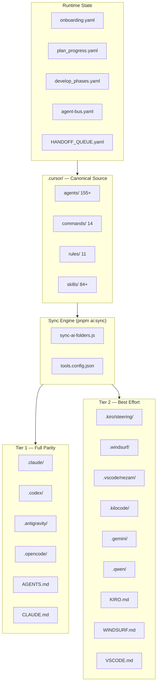
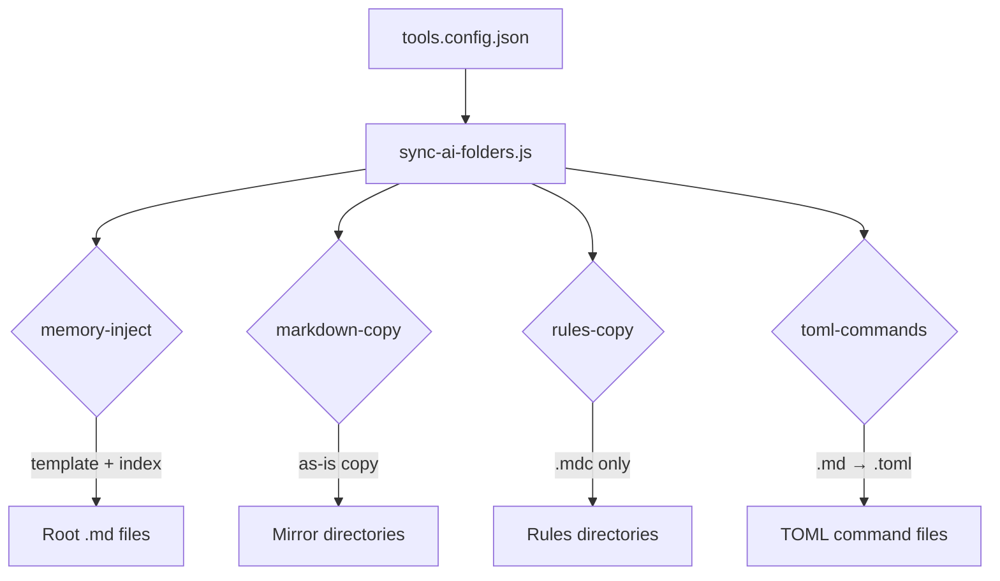
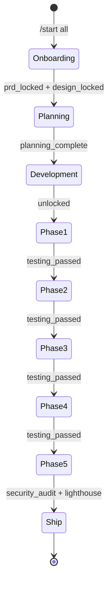
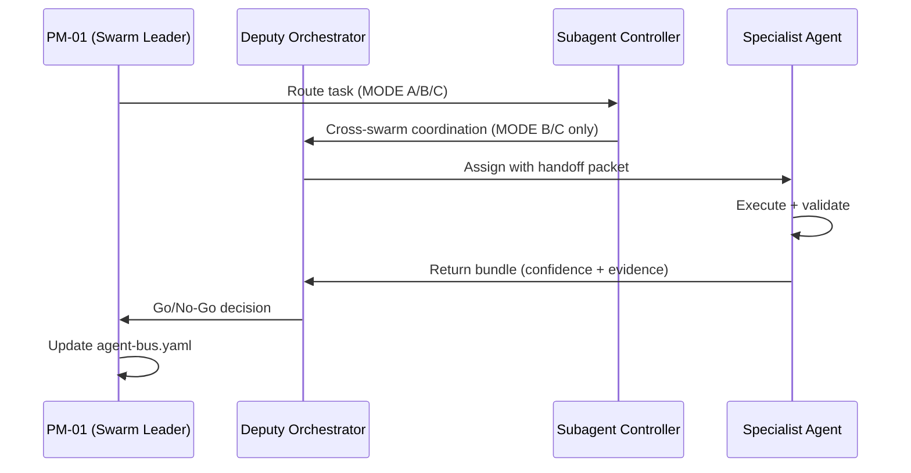
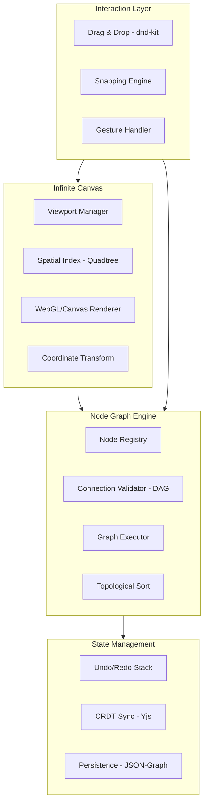

# NEZAM — System Architecture

> **Version:** 2.0.0 | **Last updated:** 2026-05-18

---

## Overview

NEZAM is a **workspace governance layer** built on a canonical `.cursor/` source that syncs to 15+ AI tools. The architecture has four main layers:

1. **Canonical Layer** — `.cursor/` as the single source of truth
2. **Sync Engine** — `pnpm ai:sync` propagates to all tool mirrors
3. **Runtime Layer** — State YAMLs, agent bus, and memory files
4. **Product Layer** — SDD pipeline, design system, visual builder

---

## System Architecture Diagram



---

## Canonical Source Structure

```
.cursor/
├── agents/                 ← 155+ agent definitions
│   ├── swarm-leader.md     ← PM-01: primary orchestrator
│   ├── deputy-swarm-leader.md
│   ├── subagent-controller.md
│   ├── lead-*.md           ← 12 swarm managers
│   └── [specialist].md     ← Domain specialists
│
├── commands/               ← 14 slash commands
│   ├── start.md            ← /start
│   ├── plan.md             ← /plan
│   ├── develop.md          ← /develop
│   ├── check.md            ← /check
│   ├── scan.md             ← /scan
│   ├── fix.md              ← /fix
│   ├── guide.md            ← /guide
│   ├── git.md              ← /git
│   ├── deploy.md           ← /deploy
│   ├── create.md           ← /create
│   ├── settings.md         ← /settings
│   ├── nezam.md            ← /nezam
│   ├── wireframe.md        ← /wireframe
│   └── help.md             ← /help
│
├── rules/                  ← 11 governance rules
│   ├── workspace-orchestration.mdc   ← Pipeline order, response style
│   ├── sdd-pipeline-v2.mdc           ← 4 product types + monorepo
│   ├── multi-tool-sync.mdc           ← Tool sync contract
│   ├── design-gates.mdc              ← 7 design gates
│   ├── design-server-gates.mdc       ← Wireframe lock gate
│   ├── agent-lazy-load.mdc           ← Context optimization
│   ├── cli-orchestration.mdc         ← CLI routing
│   ├── docs-reports-policy.mdc       ← Reports placement
│   ├── plan-phase-scaffold.mdc       ← Scaffold gate
│   ├── ui-ux-swarm-library-ds-content.mdc
│   └── workspace-client-onboarding-gate.mdc
│
├── skills/                 ← 84+ skills (13 categories)
│   ├── system/             ← Orchestration, routing, memory
│   ├── design/             ← Tokens, wireframes, components
│   ├── frontend/           ← React, Next.js, RTL
│   ├── backend/            ← API, DB, auth, payments
│   ├── infrastructure/     ← DevOps, CDN, monitoring
│   ├── quality/            ← Security, testing, a11y
│   ├── content/            ← Arabic, editorial, CMS
│   ├── research/           ← SEO, AEO, IA
│   ├── analytics/          ← Charts, dashboards
│   ├── cms-saas/           ← Headless CMS, SaaS
│   ├── mobile-testing/     ← Mobile QA
│   ├── s8/                 ← S8 analytics
│   └── external/           ← Git, deployment, handoff
│
└── state/                  ← Runtime YAML state
    ├── onboarding.yaml
    ├── plan_progress.yaml
    ├── develop_phases.yaml
    ├── agent-bus.yaml
    ├── agent-status.yaml
    ├── AGENT_REGISTRY.yaml
    └── HANDOFF_QUEUE.yaml
```

---

## Sync Engine Architecture



**Sync kinds:**
- `memory-inject` — generates root `.md` from template + live command/agent/skill/rule indexes
- `markdown-copy` — copies `.cursor/commands|agents|skills` as-is into mirror folder
- `rules-copy` — copies `.cursor/rules/*.mdc` into mirror folder
- `toml-commands` — converts `.cursor/commands/*.md` to `.toml` format (Gemini/Qwen)

---

## Runtime State Architecture



**State files:**

| File | Purpose |
|------|---------|
| `onboarding.yaml` | PRD lock, design lock, build mode, tone |
| `plan_progress.yaml` | SEO, IA, content, arch, design, scaffold flags |
| `develop_phases.yaml` | Phase 1–6 status and testing_passed |
| `agent-bus.yaml` | Inter-agent handoff messages |
| `agent-status.yaml` | Last active agent, pending handoffs |
| `HANDOFF_QUEUE.yaml` | Session-to-session context queue |

---

## Agent Communication Protocol



**Execution modes:**
- **MODE A** — Single agent, one scope, no cross-swarm dependency
- **MODE B** — 2–4 agents, one swarm, shared context via PHASE_HANDOFF.md
- **MODE C** — Multiple swarms, phase gate transition, full hardlock verification

---

## Design System Architecture

```mermaid
graph TD
    subgraph Tokens["Token Hierarchy"]
        PT[Primitive Tokens] --> ST[Semantic Tokens]
        ST --> CT[Component Tokens]
    end

    subgraph Gates["7 Design Gates"]
        G1[Token-First CSS]
        G2[Fluid Typography]
        G3[Animation Budget]
        G4[Progressive 3D]
        G5[Component API]
        G6[Perf + A11y]
        G7[Alignment]
    end

    subgraph Output["Design Artifacts"]
        DM[DESIGN.md]
        WL[wireframes_locked.json]
        DC[DESIGN_CHOICES.yaml]
    end

    Tokens --> Gates
    Gates --> Output
    Output --> DEV[/develop unlocked]
```

---

## Visual Builder Architecture



**Performance targets:**
- 60fps pan/zoom with 5,000+ nodes
- < 1ms coordinate transform
- < 100MB asset heap
- Spatial indexing for O(log n) visibility queries

---

## MENA/Arabic Architecture

```mermaid
graph LR
    subgraph Content["Content Layer"]
        MA[Masri Content Specialist]
        KH[Khaleeji Specialist]
        LE[Levantine Specialist]
        MG[Maghrebi Specialist]
        MSA[MSA Formal Specialist]
    end

    subgraph SEO["SEO/AEO Layer"]
        AS[Arabic SEO/AEO Specialist]
        RD[Register Detection]
    end

    subgraph UI["UI Layer"]
        RTL[RTL Layout Specialist]
        AT[Arabic Typography]
        IC[Icon Mirroring]
    end

    subgraph Payments["Payment Layer"]
        MP[MENA Payment Routing]
        FW[Fawry]
        PM[Paymob]
        TB[Tabby]
        ST[STC Pay]
    end

    Content --> SEO
    SEO --> UI
    UI --> Payments
```



---

## Technology Stack

| Layer | Technology |
|-------|-----------|
| **Framework** | Next.js 15 (App Router), React 19 |
| **Database** | PostgreSQL (Neon), Prisma/Drizzle ORM |
| **Auth** | Clerk / Supabase Auth |
| **Payments** | Stripe + MENA regional (Fawry, Paymob) |
| **CMS** | Sanity / Contentful / Payload |
| **Canvas** | React Flow / custom WebGL |
| **State** | Zustand, TanStack Query |
| **Styling** | Tailwind CSS + CSS Variables (token-first) |
| **Testing** | Vitest, Playwright, axe-core |
| **CI/CD** | GitHub Actions, Vercel |
| **Monitoring** | Sentry, OpenTelemetry |
| **AI SDK** | Vercel AI SDK, OpenRouter |
