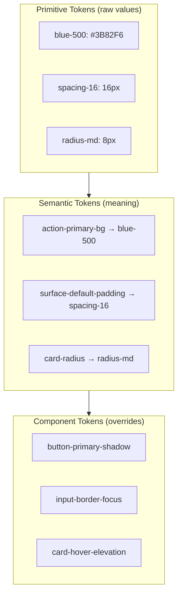
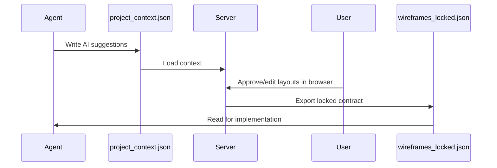

# NEZAM — Design System Documentation

> Token-first, RTL-ready, WCAG 2.2 AA compliant design system with 150+ brand profiles.

---

## Overview

The NEZAM design system enforces a **token-first** approach where every visual decision — color, spacing, typography, radius, elevation, motion — maps to a CSS variable. Zero hardcoded primitives in component styles.

---

## Design Profiles

NEZAM ships 150+ curated brand profiles in `.nezam/design/<brand>/design.md`.

```bash
# Browse available profiles
ls .nezam/design/

# Apply a profile to root DESIGN.md
pnpm run design:apply -- minimal
pnpm run design:apply -- bold
pnpm run design:apply -- editorial
pnpm run design:apply -- sahel        # MENA-optimized
```

Each profile defines:
- Color system (semantic tokens + dark/light themes)
- Typography scale (fluid clamp() values)
- Spacing rhythm (8px base grid)
- Motion presets (duration, easing, reduced-motion)
- Component inventory

---

## Token Architecture



### Token Naming Convention

```
[Category]-[Property]-[Concept]-[Variant]-[State]

Examples:
  color-background-primary-hover
  spacing-component-button-padding-lg
  radius-card-default
  motion-duration-fast
```

---

## 7 Design Gates

All 7 gates must pass before `/develop` is unlocked.

```mermaid
flowchart LR
    G1[Token-First CSS] --> G2[Fluid Typography]
    G2 --> G3[Animation Budget]
    G3 --> G4[Progressive 3D]
    G4 --> G5[Component API]
    G5 --> G6[Perf + A11y]
    G6 --> G7[Alignment]
    G7 --> DEV[/develop unlocked]
```

### Gate 1: Token-First CSS

Zero hardcoded design primitives outside governed token sources.

```bash
# Check for violations
pnpm run check:tokens
```

**Fails on:** `color: #333`, `padding: 16px`, `border-radius: 8px` in component CSS.
**Passes on:** `color: var(--color-text-primary)`, `padding: var(--spacing-md)`.

### Gate 2: Fluid Typography and Grid

```css
/* Required: clamp() for fluid scales */
font-size: clamp(1rem, 2.5vw, 1.5rem);

/* Required: CSS Grid/Flex with token-driven gaps */
gap: var(--spacing-lg);
```

### Gate 3: Animation Budget

- Animate only `transform` and `opacity` (composited properties)
- `prefers-reduced-motion` alternatives mandatory for all non-essential motion
- `will-change` scoped and temporary

### Gate 4: Progressive 3D

Fallback chain required: **R3F/WebGL → SVG/Canvas → static illustration**

### Gate 5: Component API

- Typed props + variant-driven (CVA or equivalent)
- `forwardRef` on interactive primitives
- Keyboard navigation + ARIA patterns
- Tree-shakeable exports

### Gate 6: Performance + Accessibility

| Metric | Target |
|--------|--------|
| LCP | < 2.5s |
| CLS | < 0.1 |
| INP | < 200ms |
| WCAG contrast | 4.5:1 (AA) |
| Focus rings | Visible, 2px offset |

### Gate 7: Alignment

All implemented UI traces to current `DESIGN.md`. Visual deviations require explicit spec update.

---

## RTL / Arabic Design

### CSS Logical Properties

```css
/* ✅ Use logical properties */
padding-inline-start: var(--spacing-md);
margin-inline-end: var(--spacing-sm);
border-inline-start: 2px solid var(--color-border);

/* ❌ Avoid physical properties for layout */
padding-left: 16px;
margin-right: 8px;
```

### Arabic Typography

```css
/* Arabic font stack */
font-family: 'Cairo', 'Noto Naskh Arabic', 'IBM Plex Sans Arabic', sans-serif;

/* Arabic needs looser line-height */
line-height: 1.6; /* vs 1.2 for Latin */

/* No kashida justification in web */
text-justify: none;
```

### Icon Mirroring Rules

| Icon type | Mirror in RTL? |
|-----------|---------------|
| Directional (arrows, chevrons) | ✅ Yes |
| Symmetric (close, settings) | ❌ No |
| Brand marks, logos | ❌ No |
| Clocks, play buttons | ❌ No |

---

## Wireframe Server

The wireframe server is a **mandatory human-in-the-loop gate** between DESIGN and SCAFFOLD phases.

```bash
# Start the wireframe server
pnpm run wireframe:server
# Opens http://localhost:4000
```

### Flow



### Gate

`/scaffold` is blocked until `wireframes_locked.json` exists and all P0 pages have `layout_approved: true`.

---

## Component Library

### Primitive Components

Built with shadcn/ui + NEZAM token mapping:

```bash
# Add a component
npx shadcn@latest add button
npx shadcn@latest add input
npx shadcn@latest add dialog
```

### Token Mapping

```css
/* globals.css — map shadcn variables to NEZAM tokens */
:root {
  --background: var(--nezam-color-surface-default);
  --foreground: var(--nezam-color-text-primary);
  --primary: var(--nezam-color-brand-primary);
  --border: var(--nezam-color-border-default);
  --radius: var(--nezam-radius-md);
}
```

### Extension Pattern

```tsx
// ✅ Extend via wrapper — never modify base components
import { Button, ButtonProps } from '@/components/ui/button'

interface BrandedButtonProps extends ButtonProps {
  icon?: React.ReactNode
}

export function BrandedButton({ icon, children, ...props }: BrandedButtonProps) {
  return (
    <Button {...props}>
      {icon}
      {children}
    </Button>
  )
}
```

---

## Motion System

### Token Presets

```yaml
# Motion tokens
duration-fast: 120ms
duration-base: 200ms
duration-slow: 400ms

easing-standard: cubic-bezier(0.4, 0, 0.2, 1)
easing-decelerate: cubic-bezier(0, 0, 0.2, 1)
easing-accelerate: cubic-bezier(0.4, 0, 1, 1)
```

### Reduced Motion

```css
@media (prefers-reduced-motion: reduce) {
  /* Instant or opacity-only fallback */
  .animated-element {
    transition: opacity 0.1s;
    animation: none;
  }
}
```

### 2-Variation Discipline

Every design iteration produces exactly **2 variations**:
- **Variation A** — Evolutionary (closest to existing, changes one element)
- **Variation B** — Progressive (pushes one design dimension deliberately)

Never present a single wireframe as "the design."
