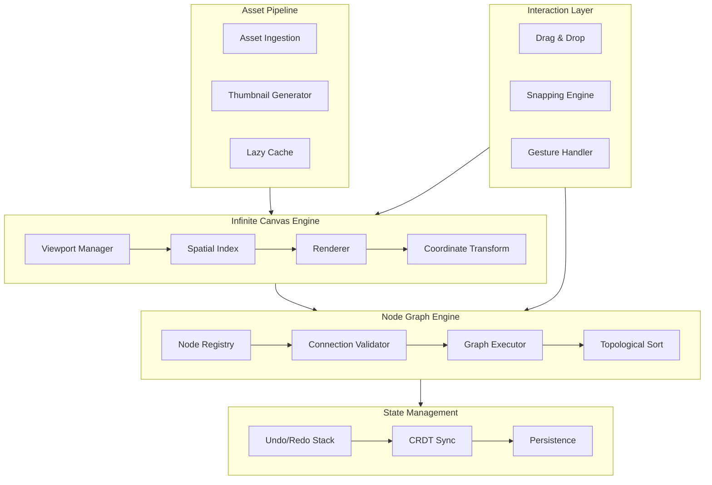
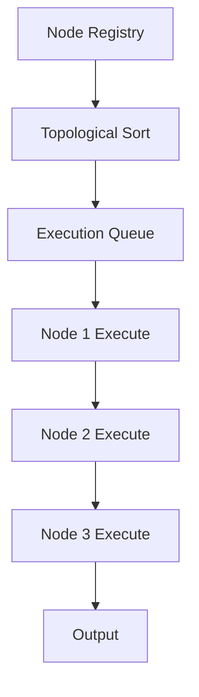
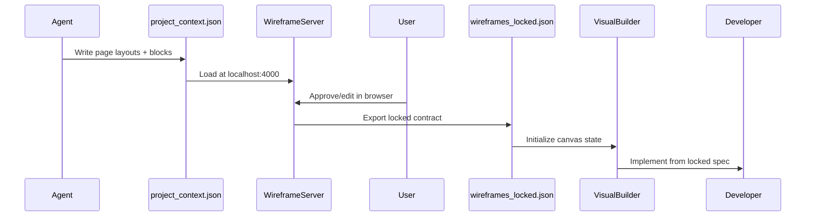

# NEZAM — Visual Builder & Infinite Canvas

> Architecture, agents, and implementation guide for the NEZAM visual builder system.

---

## Overview

The NEZAM visual builder is a **canvas-based application framework** for building node-graph UIs, infinite canvas editors, and drag-and-drop visual builders. It is governed by Swarm 17 (Visual Builder) with 5 specialist agents.

---

## Architecture



---

## Swarm 17 — Visual Builder Agents

| Agent | Code | Role |
|-------|------|------|
| `lead-visual-builder-architect` | VISUAL-GOD | Strategic authority, architecture decisions |
| `visual-canvas-architect` | CANVAS-PRIME | Viewport, spatial indexing, coordinate transforms |
| `node-logic-specialist` | NODE-FLOW | Graph theory, DAG validation, execution flow |
| `visual-interaction-designer` | INTERACT-VUE | DnD physics, snapping, gesture handling |
| `visual-state-engine` | STATE-FLOW | Undo/redo, CRDT sync, state persistence |
| `visual-asset-manager` | ASSET-LENS | Asset pipeline, thumbnails, lazy loading |

---

## Infinite Canvas Engine

### Viewport System

The canvas uses a **world coordinate system** separate from screen coordinates.

```typescript
// Screen → World coordinate transform
const screenToWorld = (screenX: number, screenY: number, viewport: Viewport) => ({
  x: (screenX - viewport.offset.x) / viewport.zoom,
  y: (screenY - viewport.offset.y) / viewport.zoom,
})

// World → Screen coordinate transform
const worldToScreen = (worldX: number, worldY: number, viewport: Viewport) => ({
  x: worldX * viewport.zoom + viewport.offset.x,
  y: worldY * viewport.zoom + viewport.offset.y,
})
```

### Spatial Indexing

For 10,000+ elements, NEZAM uses a **Quadtree** for O(log n) visibility queries:

```typescript
interface QuadTree {
  bounds: Rect
  elements: CanvasElement[]
  children: [QuadTree, QuadTree, QuadTree, QuadTree] | null
  maxElements: number  // default: 10
  maxDepth: number     // default: 8
}

// Query visible elements in viewport
const visibleElements = quadTree.query(viewportBounds)
```

### Performance Targets

| Metric | Target |
|--------|--------|
| Pan/zoom FPS | 60fps with 5,000+ nodes |
| Coordinate transform | < 1ms |
| Spatial query | < 5ms for 10,000 elements |
| Memory (asset heap) | < 100MB standard view |
| Zoom precision | 0.001 coordinate drift at deep zoom |

---

## Node Graph Engine

### Node Schema

```typescript
interface NodeDefinition {
  id: string
  type: string
  label: string
  inputs: PortDefinition[]
  outputs: PortDefinition[]
  data: Record<string, unknown>
  position: { x: number; y: number }
}

interface PortDefinition {
  id: string
  name: string
  dataType: 'string' | 'number' | 'boolean' | 'object' | 'array' | 'any'
  required: boolean
}
```

### Connection Validation

All connections are validated against a **DAG (Directed Acyclic Graph)** constraint:

```typescript
// Validate connection — prevents cycles
const validateConnection = (
  graph: Graph,
  sourceNodeId: string,
  targetNodeId: string
): ValidationResult => {
  // 1. Type compatibility check
  if (!isTypeCompatible(sourcePort.dataType, targetPort.dataType)) {
    return { valid: false, reason: 'Type mismatch' }
  }

  // 2. Cycle detection (DFS)
  if (wouldCreateCycle(graph, sourceNodeId, targetNodeId)) {
    return { valid: false, reason: 'Would create cycle' }
  }

  return { valid: true }
}
```

### Execution Flow



---

## State Management

### Undo/Redo Stack

```typescript
interface HistoryEntry {
  id: string
  timestamp: number
  action: 'add' | 'remove' | 'move' | 'connect' | 'disconnect' | 'update'
  before: Partial<GraphState>
  after: Partial<GraphState>
}

// Atomic state update
const applyAction = (state: GraphState, action: HistoryEntry): GraphState => {
  // Apply action atomically — rollback on failure
  try {
    return applyDelta(state, action.after)
  } catch (error) {
    return state  // Rollback to previous state
  }
}
```

### CRDT Sync (Collaborative)

For real-time collaboration, NEZAM uses **Yjs** CRDTs:

```typescript
import * as Y from 'yjs'
import { WebsocketProvider } from 'y-websocket'

const doc = new Y.Doc()
const provider = new WebsocketProvider('wss://sync.nezam.io', 'room-id', doc)

// Shared graph state
const sharedNodes = doc.getMap<NodeDefinition>('nodes')
const sharedEdges = doc.getArray<EdgeDefinition>('edges')
```

### Persistence Format

```json
{
  "version": "1.0",
  "nodes": [
    {
      "id": "node-1",
      "type": "input",
      "position": { "x": 100, "y": 200 },
      "data": { "value": 42 }
    }
  ],
  "edges": [
    {
      "id": "edge-1",
      "source": "node-1",
      "sourceHandle": "output",
      "target": "node-2",
      "targetHandle": "input"
    }
  ],
  "viewport": {
    "x": 0,
    "y": 0,
    "zoom": 1
  }
}
```

---

## Interaction System

### Drag & Drop

NEZAM uses **dnd-kit** for drag-and-drop with physics-based feedback:

```typescript
import { DndContext, useDraggable, useDroppable } from '@dnd-kit/core'

// Node drag with snapping
const { attributes, listeners, setNodeRef, transform } = useDraggable({
  id: node.id,
  data: { type: 'node', node },
})

// Apply snapping to grid
const snappedTransform = snapToGrid(transform, gridSize)
```

### Snapping Engine

```typescript
interface SnapResult {
  x: number
  y: number
  snappedToGrid: boolean
  snappedToElement: string | null
  alignmentGuides: AlignmentGuide[]
}

const snapToGrid = (position: Point, gridSize: number): Point => ({
  x: Math.round(position.x / gridSize) * gridSize,
  y: Math.round(position.y / gridSize) * gridSize,
})
```

### RTL Interaction

For RTL canvases, horizontal interactions are mirrored:

```typescript
const getDirectionalDelta = (delta: Point, isRTL: boolean): Point => ({
  x: isRTL ? -delta.x : delta.x,
  y: delta.y,
})
```

---

## Asset Pipeline

### Asset Ingestion

```typescript
interface AssetMetadata {
  id: string
  url: string
  type: 'image' | 'video' | 'svg' | 'icon'
  width: number
  height: number
  size: number  // bytes
  thumbnail?: string  // base64 data URL
}

// Lazy-load assets as they enter viewport
const loadAsset = async (assetId: string): Promise<AssetMetadata> => {
  const cached = assetCache.get(assetId)
  if (cached) return cached

  const asset = await fetchAsset(assetId)
  assetCache.set(assetId, asset)
  return asset
}
```

### Thumbnail Generation

```typescript
// Generate thumbnail for canvas preview
const generateThumbnail = async (
  nodeId: string,
  canvas: HTMLCanvasElement,
  size: { width: number; height: number }
): Promise<string> => {
  const ctx = canvas.getContext('2d')
  // Render node to offscreen canvas
  // Return as base64 data URL
  return canvas.toDataURL('image/webp', 0.8)
}
```

---

## Wireframe Server Integration

The visual builder integrates with the NEZAM wireframe server for design-to-code handoff.



### Locked Contract Schema

```typescript
interface WireframesLocked {
  version: string
  locked_at: string
  pages: LockedPage[]
  design_system: DesignSystemTokens
  navigation_map: NavigationNode[]
  implementation_contract: {
    deferred_pages: string[]
    approved_pages: string[]
  }
}

interface LockedPage {
  page_id: string
  route: string
  layout_approved: boolean
  blocks: LockedBlock[]
  states: PageStates
}
```

---

## Skills Reference

| Skill | Path | Purpose |
|-------|------|---------|
| `visual-canvas-engine` | `design/visual-canvas-engine` | Canvas system architecture |
| `graph-logic-engine` | `backend/graph-logic-engine` | Node graph validation |
| `visual-interaction-toolkit` | `design/visual-interaction-toolkit` | DnD, snapping, gestures |
| `visual-state-management` | `frontend/visual-state-management` | Undo/redo, CRDT |
| `visual-asset-pipeline` | `design/visual-asset-pipeline` | Asset ingestion, thumbnails |
