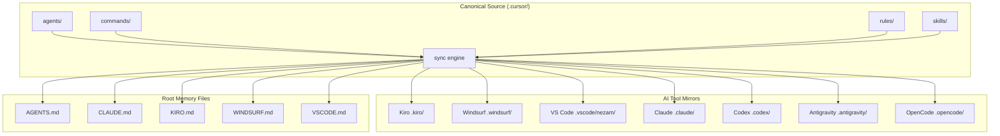
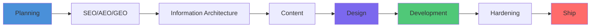
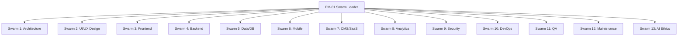
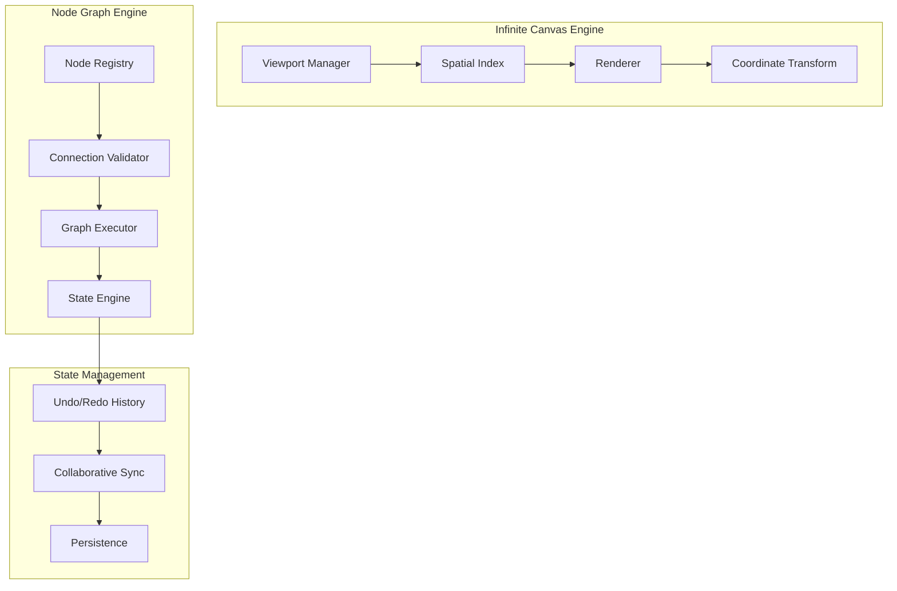
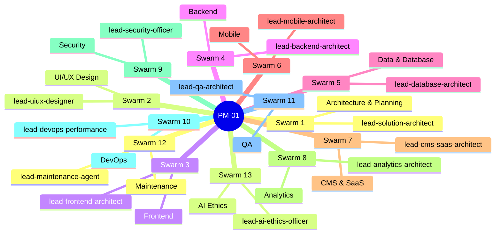

# NEZAM Workspace — Complete Documentation

> The NEZAM workspace is a **Specification-Driven Development (SDD)** system that orchestrates 13 specialist AI swarms, 155+ agents, and 84+ skills across a unified pipeline. It supports 15+ AI tools from a single canonical source.

---

## Table of Contents

1. [What is NEZAM?](#what-is-nezam)
2. [Product Vision & PRD](#product-vision--prd)
3. [Workspace Structure](#workspace-structure)
4. [Architecture](#architecture)
5. [AI Tool Support](#ai-tool-support)
6. [SDD Pipeline](#sdd-pipeline)
7. [Design System & UI](#design-system--ui)
8. [Visual Builder & Infinite Canvas](#visual-builder--infinite-canvas)
9. [Swarm Architecture](#swarm-architecture)
10. [Getting Started](#getting-started)

---

## What is NEZAM?

NEZAM is a **production-grade AI workspace kit** that turns any AI coding tool into a structured, governed development environment. It provides:

- **SDD Pipeline** — Planning → SEO → IA → Content → Design → Development → Hardening → Ship
- **13 Specialist Swarms** — 155+ agents organized into domain teams
- **15+ AI Tool Support** — Cursor, Claude, Kiro, Windsurf, VS Code, Copilot, Codex, and more
- **Design System** — 150+ brand profiles, token-first CSS, RTL/Arabic support
- **Visual Builder** — Infinite canvas, node-graph logic, drag-and-drop UI builder
- **MENA/Arabic First** — Egyptian Arabic (Masri) default, full RTL support, regional payment routing

---

## Product Vision & PRD

See [`docs/PRD.md`](./PRD.md) for the full Product Requirements Document.

### North Star

> Build the most complete AI-native development workspace for MENA-first products — where every tool, every agent, and every pipeline phase is governed, traceable, and production-ready.

### Core Problems Solved

| Problem | NEZAM Solution |
|---------|---------------|
| AI tools produce inconsistent output | SDD hardlocks enforce pipeline order |
| No governance across AI tools | Single `.cursor/` canonical source synced to 15+ tools |
| Arabic/MENA products lack AI support | Egyptian Arabic default, RTL-first design, MENA payment routing |
| Design-to-code gap | Token-first design system + wireframe server + design gates |
| Visual builder complexity | Infinite canvas + node-graph engine + state management |

### Success Metrics

- **Adoption:** 15+ AI tools supported with zero manual setup
- **Quality:** SDD gates enforce WCAG 2.2 AA, LCP < 2.5s, CLS < 0.1
- **Coverage:** 155+ agents covering all product domains
- **MENA:** Egyptian Arabic (Masri) as primary content depth path

---

## Workspace Structure

```
NEZAM/
├── .cursor/                    ← CANONICAL SOURCE (edit here only)
│   ├── agents/                 ← 155+ AI agent definitions
│   ├── commands/               ← 14 slash commands
│   ├── rules/                  ← 11 governance rules (.mdc)
│   ├── skills/                 ← 84+ skills (13 categories)
│   └── state/                  ← Runtime YAML state files
│
├── .nezam/                     ← NEZAM system internals
│   ├── design/                 ← 150+ brand design profiles
│   ├── design-server/          ← Interactive wireframe server
│   ├── memory/                 ← Project memory & context
│   ├── scripts/                ← Sync, check, and utility scripts
│   ├── templates/              ← Document templates
│   ├── tools/                  ← Getting-started guides per tool
│   └── workspace/              ← PRD, plans, architecture docs
│
├── .kiro/steering/             ← Kiro IDE mirror
├── .windsurf/                  ← Windsurf IDE mirror
├── .vscode/nezam/              ← VS Code + Copilot mirror
├── .claude/                    ← Claude Code mirror
├── .codex/                     ← Codex mirror
├── .antigravity/               ← Antigravity IDE mirror
├── .opencode/                  ← OpenCode mirror
├── .kilocode/                  ← Kilo Code mirror
│
├── docs/                       ← Project documentation
│   ├── WORKSPACE.md            ← This file
│   ├── PRD.md                  ← Product Requirements Document
│   ├── ARCHITECTURE.md         ← System architecture
│   ├── DESIGN.md               ← Design system (generated)
│   ├── STRUCTURE.md            ← Detailed file structure
│   └── plans/                  ← SDD planning artifacts
│
├── AGENTS.md                   ← Generated (Codex/Copilot root)
├── CLAUDE.md                   ← Generated (Claude root)
├── KIRO.md                     ← Generated (Kiro root)
├── WINDSURF.md                 ← Generated (Windsurf root)
├── VSCODE.md                   ← Generated (VS Code root)
├── GEMINI.md                   ← Generated (Gemini CLI root)
├── QWEN.md                     ← Generated (Qwen CLI root)
└── DESIGN.md                   ← Active design contract (root)
```

---

## Architecture

See [`docs/ARCHITECTURE.md`](./ARCHITECTURE.md) for the full architecture document.

### System Overview



### SDD Pipeline



### Swarm Architecture



---

## AI Tool Support

| Tool | Tier | Root File | Mirror Dir | Getting Started |
|------|------|-----------|------------|-----------------|
| **Cursor IDE** | 1 (Canonical) | `.cursor/` native | — | [CURSOR.md](.nezam/tools/CURSOR.md) |
| **Claude Code** | 1 | `CLAUDE.md` | `.claude/` | [CLAUDE_CODE.md](.nezam/tools/CLAUDE_CODE.md) |
| **Codex** | 1 | `AGENTS.md` | `.codex/` | [CODEX.md](.nezam/tools/CODEX.md) |
| **Copilot** | 1 | `AGENTS.md` | — | [COPILOT.md](.nezam/tools/COPILOT.md) |
| **Antigravity** | 1 | `.antigravity/` | `.antigravity/` | [ANTIGRAVITY.md](.nezam/tools/ANTIGRAVITY.md) |
| **Kiro IDE** | 2 | `KIRO.md` | `.kiro/steering/` | [KIRO.md](.nezam/tools/KIRO.md) |
| **Windsurf IDE** | 2 | `WINDSURF.md` | `.windsurf/` | [WINDSURF.md](.nezam/tools/WINDSURF.md) |
| **VS Code** | 2 | `VSCODE.md` | `.vscode/nezam/` | [VSCODE.md](.nezam/tools/VSCODE.md) |
| **Gemini CLI** | 2 | `GEMINI.md` | `.gemini/` | — |
| **Qwen CLI** | 2 | `QWEN.md` | `.qwen/` | — |
| **Kilo Code** | 2 | `.kilocode/` | `.kilocode/` | — |
| **OpenCode** | 2 | `AGENTS.md` | `.opencode/` | — |

**Sync all tools:**
```bash
pnpm ai:sync    # generate all mirrors from .cursor/
pnpm ai:check   # verify no drift
pnpm ai:status  # quick per-tool status
```

---

## SDD Pipeline

The Specification-Driven Development pipeline enforces quality gates at every phase transition.

### Phase Order (never skip)

```
0 → IDEA          PRD.md locked
1 → VALIDATE      Risks + improvements confirmed
2 → RESEARCH      SEO/AEO/GEO keywords + competitor gaps
3 → IA            Pages, nav labels, URL map
4 → CONTENT       Copy, headlines, CTAs, microcopy
5 → ARCHITECTURE  Stack, data model, API design
6 → DESIGN        Tokens, typography, components, motion
7 → WIREFRAME     Human-in-the-loop design gate
8 → SCAFFOLD      Full file tree + scaffold.sh
9 → BUILD         Feature slices, content-first
10 → HARDEN       Core Web Vitals + SEO + a11y + security
11 → SHIP         Deploy + monitoring + search console
```

### Hardlock Gates

| Gate | Requires | Blocks |
|------|----------|--------|
| G0 → Planning | PRD.md + DESIGN.md locked | `/plan` |
| G1 → Development | All 6 planning phases complete | `/develop` |
| G2-5 → Next Phase | Phase N complete + tests pass | Phase N+1 |
| G5 → Ship | Security audit + Lighthouse pass | `/deploy` |

---

## Design System & UI

### Design Profiles

NEZAM ships 150+ curated design profiles in `.nezam/design/<brand>/design.md`.

```bash
# Apply a design profile
pnpm run design:apply -- minimal
pnpm run design:apply -- bold
pnpm run design:apply -- editorial
```

### Token Architecture

```
Primitive tokens (raw values)
    ↓
Semantic tokens (meaning)
    ↓
Component tokens (overrides)
```

All spacing, color, radius, elevation, and typography must map to CSS variables. Zero hardcoded primitives in component styles.

### Design Gates (7 gates before `/develop`)

1. **Token-First CSS** — no hardcoded hex/px/rem
2. **Fluid Typography** — clamp() scales, container queries
3. **Animation Budget** — composited properties only, reduced-motion
4. **Progressive 3D** — R3F → SVG → static fallback chain
5. **Component API** — typed, variant-driven, tree-shakeable
6. **Performance + A11y** — LCP < 2.5s, CLS < 0.1, WCAG 2.2 AA
7. **Alignment** — all UI traces to current DESIGN.md

### RTL / Arabic Support

- Egyptian Arabic (Masri) as primary content depth
- CSS logical properties (`padding-inline-*`, `margin-inline-*`)
- `dir="rtl"` propagation from root
- Arabic font stack with correct line-height (1.4–1.6x)
- Icon mirroring rules (directional vs symmetric)

---

## Visual Builder & Infinite Canvas

NEZAM includes a full visual builder system for canvas-based applications.

### Architecture



### Key Agents

| Agent | Role |
|-------|------|
| `visual-canvas-architect` | Viewport, spatial indexing, coordinate transforms |
| `node-logic-specialist` | Graph theory, DAG validation, execution flow |
| `visual-interaction-designer` | DnD physics, snapping, gesture handling |
| `visual-state-engine` | Undo/redo, CRDT sync, state persistence |
| `visual-asset-manager` | Asset pipeline, thumbnails, lazy loading |
| `lead-visual-builder-architect` | Strategic authority for the entire domain |

### Performance Targets

- **60fps** during continuous pan/zoom with 5k+ nodes
- **< 1ms** coordinate transform calculation
- **< 100MB** asset heap for standard canvas view
- **Spatial indexing** via Quadtree/R-Tree for 10k+ elements

### Canvas Coordinate System

```
Screen coordinates → World coordinates
(screenX - viewport.offset.x) / viewport.zoom = worldX
(screenY - viewport.offset.y) / viewport.zoom = worldY
```

---

## Swarm Architecture

### 13 Swarms



### Agent Lazy-Load Protocol

At session start, only load:
- `swarm-leader.md` (always)
- `deputy-swarm-leader.md` (always)
- Active swarm agents (detected from `MEMORY.md` or user intent)

Full agent files load on-demand to minimize context overhead.

---

## Getting Started

### Quick Start (any tool)

```bash
# 1. Install dependencies
pnpm install

# 2. Set up git hooks
bash scripts/hooks/setup-hooks.sh

# 3. Sync all AI tool mirrors
pnpm ai:sync

# 4. Open in your preferred tool and run:
/start all
```

### First Session Checklist

- [ ] `pnpm ai:sync` completed successfully
- [ ] `DESIGN.md` exists at repo root (run `/start design` to create)
- [ ] `.nezam/workspace/prd/PRD.md` exists (run `/start prd` to create)
- [ ] `.cursor/state/onboarding.yaml` has `prd_locked: true`
- [ ] Run `/guide status` to see current pipeline state

### Key Scripts

| Script | What it does |
|--------|-------------|
| `pnpm ai:sync` | Sync `.cursor/` → all 15+ tool mirrors |
| `pnpm ai:check` | Verify no drift between canonical and mirrors |
| `pnpm ai:status` | Quick per-tool sync status |
| `pnpm run design:apply -- <brand>` | Apply a design profile to `DESIGN.md` |
| `pnpm run wireframe:server` | Start the interactive wireframe server |

### Slash Commands

| Command | Description |
|---------|-------------|
| `/start all` | Full onboarding flow |
| `/guide status` | Current pipeline status |
| `/guide next` | Single recommended next action |
| `/plan all` | Run complete SDD planning sequence |
| `/develop start` | Begin Phase 1 development |
| `/scan all` | Full quality scan |
| `/fix auto` | Auto-detect and fix issues |
| `/check gates` | Verify all gate prerequisites |
| `/nezam sync` | Run `pnpm ai:sync` + `pnpm ai:check` |
