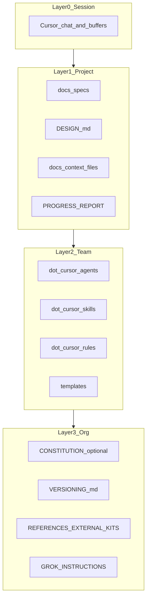

# Memory architecture (workspace)

Four conceptual layers. Nothing here replaces git history—**committed specs and docs remain source of truth.**

## Layer 0 — Session (runtime)

| What                       | Lifetime  | Examples                             |
| -------------------------- | --------- | ------------------------------------ |
| Cursor chat + open buffers | Ephemeral | Current thread, unstated assumptions |

**Practice:** end meaningful sessions by updating `docs/context/workspace.md`, `docs/context/project.md`, or `/SAVE log` entries.

## Layer 1 — Project (SDD truth)

| Path / artifact                      | Role                                                        |
| ------------------------------------ | ----------------------------------------------------------- |
| `docs/specs/`**                      | PRD, SDD, features, SEO research                            |
| `DESIGN.md` (repo root when present) | Prototype-first UI contract                                 |
| `docs/context/instructions.md`       | Assistant operating contract                                |
| `docs/context/workspace.md`          | Execution state, blockers                                   |
| `docs/context/project.md`            | Product truth, progress                                     |
| `docs/context/WORKSPACE_INDEX.md`    | Static map of kit layout, commands, templates, integrations |
| `docs/context/MEMORY.md`             | Hand-written durable bullets                                |
| `docs/reports/PROGRESS_REPORT.latest.md`  | External companion upload bundle                            |

## Layer 2 — Team (how assistants behave)

| Path / artifact           | Role                                      |
| ------------------------- | ----------------------------------------- |
| `.cursor/agents/`**       | Named persona lenses (charters, triggers) |
| `.cursor/skills/`**       | Long procedures (`SKILL.md`)              |
| `.cursor/rules/**`        | Short guardrails (`.mdc`)                 |
| `docs/templates/*.template.md` | Scaffolds for `/CREATE`                   |

## Layer 3 — Organizational (constitution & references)

| Path / artifact                         | Role                                                             |
| --------------------------------------- | ---------------------------------------------------------------- |
| `docs/CONSTITUTION.md` (optional)       | Invariants and quality gates — create via `/CREATE constitution` |
| `docs/specs/sdd/VERSIONING.md`          | Semver, tags, changelog policy                                   |
| `docs/reference/external-kits/CATALOG.md`      | Curated external repos and kits                                  |
| `docs/external-ai/GROK_INSTRUCTIONS.md` | External browser assistant behavior                              |

## Layer diagram

