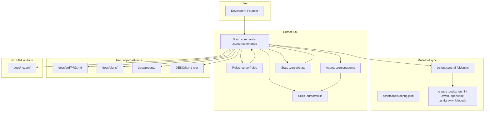

# Nezam Workspace Agents - Complete Architecture & Knowledge Base (docs/nezam/grok.md)

> **Audience:** Grok, Gemini, Qwen, Claude, Codex, and any external model assisting with this repository.  
> **Scope:** NEZAM as a **workspace governance kit** (Cursor-first, multi-tool sync), not any single application’s product code unless that app lives in the same repo.  
> **Last inventory note:** Generated from repository layout and canonical files under `.cursor/` as of the authoring session; counts drift when files are added or removed.

---

## Executive Summary

**NEZAM** is a **Specification-Driven Development (SDD)** orchestration layer for AI-assisted software work. It packages **slash-command playbooks** (`.cursor/commands/*.md`), **role personas** (`.cursor/agents/*.md`), **repeatable procedures** (`.cursor/skills/**/SKILL.md`), **always-on and requestable rules** (`.cursor/rules/*.mdc`), **templates** (`.cursor/templates/**`), **YAML state** (`.cursor/state/*.yaml`), and **automation scripts** (`scripts/`) into one repo that can be mirrored to Claude Code, Codex, Antigravity, Gemini CLI, Qwen CLI, OpenCode, and Kilo via `pnpm ai:sync`.

**Brutally honest status:**

- **Strengths:** Clear pipeline story (planning → design → develop → ship), explicit hardlocks in rules, rich agent/skill library, CI hooks for sync and design gates, path indirection via `.cursor/workspace.paths.yaml`.
- **Weaknesses:** Orchestration is **documentation-driven**, not a running scheduler—compliance depends on the model following markdown. Several **cross-links point at paths that are not present** in this tree (example: `subagent-controller.md` links to `docs/nezam/memory/governance/SWARM_WORKFLOW.md`, which is missing). Legacy path strings (`docs/core/required/...`, `docs/nezam/memory/...`) still appear in some agents/rules while **canonical project memory has moved under `docs/nezam/`** for the workspace kit. **State files default to “unlocked / false”** until `/start` and `/plan` flows populate them—automation does not enforce gates without an LLM actually reading them.

---

## What is Nezam Workspace?

| Layer | What it is | Canonical location |
|-------|------------|-------------------|
| **Commands** | Natural-language “router” specs for user-typed `/start`, `/plan`, `/develop`, etc. | `.cursor/commands/` |
| **Agents** | Markdown personas: charter, responsibilities, escalation, sometimes YAML frontmatter | `.cursor/agents/` |
| **Skills** | Executable checklists / workflows invoked by name | `.cursor/skills/<domain>/<skill-id>/SKILL.md` |
| **Rules** | Cursor rules (always-applied or agent-requestable) encoding gates and style | `.cursor/rules/*.mdc` |
| **State** | Machine-readable flags for onboarding, plan phases, develop phases, registry, and the persistent `HANDOFF_QUEUE.yaml` | `.cursor/state/` and root `HANDOFF_QUEUE.yaml` |
| **Templates** | Scaffolding for plans, specs, SDD, swarm handoffs, AI client root files | `.cursor/templates/` |
| **Scripts** | Sync, drift checks, hooks, design profile copy, continual learning, audits | `scripts/` |
| **Workspace docs** | NEZAM’s own wiki, memory, PRD for the kit | `docs/nezam/` (see `docs/nezam/README.md`) |
| **User project** | PRD, plans, reports for whatever product uses NEZAM | Default: `docs/prd/`, `docs/plans/`, `docs/reports/` (see `.cursor/workspace.paths.yaml`) |

The npm package name in `package.json` is `nezam-workspace-kit`—this repo is the **kit**, not necessarily your shipping product.

---

## Vision and Core Philosophy

1. **SDD over ad-hoc coding:** Artifacts (PRD, SEO/IA, content, architecture, `DESIGN.md`, scaffold, specs) precede implementation.
2. **Multi-agent as organization, not magic:** Many small personas reduce context mixing; humans (or the primary LLM) still route work.
3. **Single canonical tree (`.cursor/`):** All other tool directories are **generated** from scripts—avoids drift (see `.cursor/rules/multi-tool-sync.mdc`).
4. **Gates beat velocity:** `/plan` and `/develop` are blocked until YAML + file artifacts say the previous gate passed (`workspace-orchestration.mdc`, `sdd-gate-validator` skill).
5. **MENA / RTL awareness:** Content and design agents include Arabic dialect specialists; design rules require RTL validation when Arabic is in scope (`design-dev-gates.mdc`).

---

## Why This Architecture Was Chosen

- **Markdown + YAML** is inspectable in Git, diff-friendly, and works across IDEs and CLIs without a proprietary runtime.
- **Sync script** (`scripts/sync-ai-folders.js`) trades a little complexity for **one edit surface** and CI-enforced parity.
- **Skills** encode repetitive multi-step logic once; **agents** encode authority and tone; **commands** encode user entrypoints—separation limits copy-paste and keeps `/guide` / `/check` consistent.

---

## Overall Architecture

### High-level design



### Agent hierarchy (conceptual)

| Tier | Examples | Role |
|------|----------|------|
| **Executive / strategic** | `executive-director.md`, `product-officer.md` | Vision, scope, escalation—not daily coding routers |
| **Orchestration** | `swarm-leader.md` (PM-01), `deputy-swarm-leader.md`, `subagent-controller.md` | Pipeline order, gates, handoffs, swarm assignment |
| **Leads** | `lead-*-architect.md`, `lead-uiux-designer.md` | Domain authority across a swarm |
| **Managers** | `*-manager.md`, `*-lead.md` (non-lead) | Execution ownership inside a domain |
| **Specialists** | `*-specialist.md`, `*-engineer.md` | Narrow expertise |

**Authoritative swarm map:** `.cursor/state/AGENT_REGISTRY.yaml` → `swarm_map` (13 swarms).  
**Human-readable agent index:** `.cursor/agents/README.md` (includes archive merge notes).

### Orchestration, delegation, and collaboration patterns

1. **Command-first:** User types `/plan arch`; `plan.md` tells the model what to read, what to write, and which gates to check.
2. **State-second:** `onboarding.yaml`, `plan_progress.yaml`, `develop_phases.yaml` supply booleans for hardlocks.
3. **Lazy-load:** `.cursor/rules/agent-lazy-load.mdc` limits which agent files to load per session (registry + swarm leader + deputy + active swarm).
4. **Handoffs:** `multi-agent-handoff` skill + optional `.cursor/state/agent-bus.yaml` / `agent-status.yaml` patterns in `workspace-orchestration.mdc`.
5. **CLI delegation:** `.cursor/rules/cli-orchestration.mdc` routes mechanical tasks to external CLIs when appropriate.
6. **Modes:** `swarm-leader.md` defines MODE A/B/C complexity; `build-modes` skill overlays `lean`, `tdd`, `api-first` on top of SDD.

### Cursor “Task” subagents vs NEZAM markdown agents

| Concept | What it is | Where defined |
|---------|------------|---------------|
| **NEZAM agent** | Markdown persona file | `.cursor/agents/<name>.md` |
| **NEZAM “subagents” in frontmatter** | e.g. PM-01 `subagents: orchestrator, hardlock-enforcer, memory-operator` | Behavioral lenses for **one** model invocation—not separate files |
| **Cursor Task subagent** | Isolated child agent with tool policy | Cursor product / `Task` tool enum in workspace (not stored as `.md` per subagent type) |
| **External plugin agents** | e.g. `ce-*`, `explore`, `shell` | Invoked via orchestration tooling—not the same as `.cursor/agents/` |

Do **not** conflate Cursor’s built-in subagent types with files in `.cursor/agents/`.

---

## Agents & Subagents

### Definition and differences

- **Agent file:** Long-form charter for a named role; may include YAML frontmatter (`role`, `code-name`, `subagents`, `version`, `certified`).
- **Subagent (NEZAM):** Often a **label** for a sub-mode inside one agent (see `swarm-leader`, `executive-director`) or a **Cursor Task** child for parallel exploration.
- **Registry entry:** Compact row in `.cursor/state/AGENT_REGISTRY.yaml` used for lazy-load and catalog.

### Catalog statistics (approximate)

| Artifact | Count / note |
|----------|----------------|
| `agents_catalog` entries in `AGENT_REGISTRY.yaml` | **98** (plus `always_load` for swarm-leader and deputy-swarm-leader) |
| Markdown files under `.cursor/agents/` | **119** includes `README.md`, `EVAL_FRAMEWORK.md`, `archive/*.md` |
| `certified_agents` in registry | **[]** (empty—certification is aspirational) |

### Always-loaded agents

| Name | File | Summary |
|------|------|---------|
| swarm-leader | `.cursor/agents/swarm-leader.md` | PM-01: routing, hardlocks, tone from state |
| deputy-swarm-leader | `.cursor/agents/deputy-swarm-leader.md` | Cross-swarm coordination, manages `HANDOFF_QUEUE.yaml` & `PHASE_HANDOFF.md` |

### Swarm → default agents (from registry)

| Swarm ID | Theme | Agents |
|----------|-------|--------|
| swarm-1 | Architecture | `lead-solution-architect`, `requirements-analysis-manager` |
| swarm-2 | Design | `lead-uiux-designer`, `design-systems-token-architect` |
| swarm-3 | Frontend | `lead-frontend-architect`, `frontend-lead` |
| swarm-4 | Backend | `lead-backend-architect`, `api-logic-manager` |
| swarm-5 | Data / DB | `lead-database-architect`, `database-design-manager` |
| swarm-6 | Mobile | `lead-mobile-architect`, `mobile-cross-platform` |
| swarm-7 | CMS / SaaS | `lead-cms-saas-architect`, `saas-platform-manager` |
| swarm-8 | Analytics | `lead-analytics-architect`, `analytics-engineer` |
| swarm-9 | Security | `lead-security-officer`, `app-security-manager` |
| swarm-10 | DevOps | `lead-devops-performance`, `devops-manager` |
| swarm-11 | QA | `lead-qa-architect`, `testing-manager` |
| swarm-12 | Maintenance | `lead-maintenance-agent`, `tech-debt-manager` |
| swarm-13 | Ethics | `lead-ai-ethics-officer` |

### Full `agents_catalog` (authoritative compact table)

Path convention: `.cursor/agents/<name>.md` except `EVAL_FRAMEWORK.md`.

| Agent `name` | Tier | Swarm | Summary |
|--------------|------|-------|---------|
| EVAL_FRAMEWORK | framework | governance | Tiered evaluation protocol for agent outputs. |
| a11y-performance-auditor | specialist | qa | Accessibility and performance validation specialist. |
| aeo-specialist | specialist | research | Answer engine optimization and retrieval intent tuning. |
| analytics-engineer | manager | analytics | Product analytics implementation and instrumentation. |
| android-engineer | specialist | mobile | Android app implementation and platform-specific fixes. |
| api-logic-manager | manager | backend | API contract and business logic governance. |
| app-security-manager | manager | security | Security-by-default implementation coordinator. |
| arabic-content-master | specialist | content | Arabic-first content quality and localization tuning. |
| arabic-seo-aeo-specialist | specialist | research | Arabic SEO and AEO strategy specialist. |
| art-director-brand | manager | design | Visual language and brand consistency owner. |
| auth-security-manager | manager | security | Authentication and authorization risk controls. |
| automation-manager | manager | qa | Test and workflow automation ownership. |
| backend-lead | manager | backend | Backend architecture and execution lead. |
| billing-platform | specialist | saas | Billing architecture and lifecycle operations. |
| bug-triage-manager | manager | maintenance | Bug classification, priority, and owner routing. |
| business-analyst | specialist | architecture | Requirements, constraints, and business impact analysis. |
| ci-automation | specialist | devops | CI pipeline setup and failure loop hardening. |
| client-onboarding-agent | specialist | operations | User onboarding flow and setup readiness support. |
| cms-manager | manager | cms-saas | Content platform architecture and governance. |
| code-generation-supervisor | manager | governance | AI-generated code quality and slop checks. |
| code-review-specialist | specialist | qa | Diff quality review against requirements. |
| compliance-manager | manager | security | Compliance controls and regulatory alignment. |
| conflict-resolution-agent | specialist | governance | Cross-swarm conflict arbitration and resolution. |
| content-strategist | manager | content | Content hierarchy and narrative strategy. |
| content-workflow-manager | manager | content | Editorial workflow and lifecycle coordination. |
| cost-optimization-analyst | specialist | devops | Cost visibility and optimization recommendations. |
| daily-sync-agent | specialist | governance | Daily status synthesis and blocker rollups. |
| dashboard-manager | manager | analytics | Dashboard information architecture and KPIs. |
| data-pipeline-manager | manager | data-db | Data ingestion and pipeline reliability owner. |
| data-visualization | specialist | analytics | Data storytelling and visualization design. |
| database-design-manager | manager | data-db | Data model conventions and migration safety. |
| dependency-update-specialist | specialist | maintenance | Dependency upgrades and compatibility checks. |
| design-lead | manager | design | End-to-end design strategy and quality control. |
| design-systems-token-architect | manager | design | Token architecture and design-system contracts. |
| devops-manager | manager | devops | Deployment reliability and infrastructure workflows. |
| docker-k8s-specialist | specialist | devops | Container and orchestration platform specialist. |
| docs-hygiene | specialist | governance | Documentation consistency and governance checks. |
| encryption-privacy-specialist | specialist | security | Encryption controls and privacy safeguards. |
| executive-director | executive | governance | Strategic escalation and high-level program direction. |
| experimentation-lead | manager | analytics | Experiment design and evaluation governance. |
| feature-flags-specialist | specialist | backend | Feature gating and progressive rollout patterns. |
| flutter-specialist | specialist | mobile | Flutter app development and optimization. |
| frontend-framework-manager | manager | frontend | Frontend framework standards and architecture. |
| frontend-lead | manager | frontend | Frontend implementation quality and slicing. |
| frontend-performance-manager | manager | frontend | Core Web Vitals and runtime performance owner. |
| gitops-engineer | specialist | devops | GitOps and deployment workflow automation. |
| headless-cms-specialist | specialist | cms-saas | Headless CMS implementation specialist. |
| i18n-engineer | specialist | content | Internationalization and locale behavior specialist. |
| infra-security-manager | manager | security | Infrastructure threat controls and hardening. |
| infrastructure-manager | manager | devops | Platform reliability and environment ownership. |
| integration-architecture-manager | manager | architecture | External integration design and contract safety. |
| integration-specialist | specialist | architecture | Third-party service integration implementation. |
| ios-engineer | specialist | mobile | iOS app implementation and platform tuning. |
| khaleeji-specialist | specialist | content | Gulf Arabic localization specialist. |
| knowledge-update-manager | manager | maintenance | Durable memory and documentation updates. |
| kpi-reporting-manager | manager | analytics | KPI definitions and reporting alignment. |
| lead-ai-ethics-officer | lead | ethics | Ethical-risk review and veto authority. |
| lead-analytics-architect | lead | analytics | Analytics architecture authority. |
| lead-backend-architect | lead | backend | Backend architecture authority. |
| lead-cms-saas-architect | lead | cms-saas | SaaS and CMS platform architecture authority. |
| lead-database-architect | lead | data-db | Data architecture and persistence authority. |
| lead-devops-performance | lead | devops | DevOps performance and release authority. |
| lead-frontend-architect | lead | frontend | Frontend architecture and component contracts authority. |
| lead-maintenance-agent | lead | maintenance | Live product maintenance and reliability authority. |
| lead-mobile-architect | lead | mobile | Mobile architecture authority. |
| lead-qa-architect | lead | qa | QA strategy and release-readiness authority. |
| lead-security-officer | lead | security | Security architecture authority. |
| lead-solution-architect | lead | architecture | Cross-domain solution architecture authority. |
| lead-uiux-designer | lead | design | UX architecture and interaction authority. |
| levantine-specialist | specialist | content | Levantine Arabic language specialist. |
| localization-lead | manager | content | Localization strategy and quality gate owner. |
| maghrebi-specialist | specialist | content | Maghrebi Arabic language specialist. |
| masri-content-specialist | specialist | content | Egyptian Arabic content specialist. |
| mena-payments-specialist | specialist | payments | MENA payment routing and compliance specialist. |
| mobile-cross-platform | specialist | mobile | Shared cross-platform mobile implementation. |
| mobile-offline-sync-specialist | specialist | mobile | Offline-first sync architecture specialist. |
| mobile-push-notifications-specialist | specialist | mobile | Notification delivery and platform policy specialist. |
| motion-3d-choreographer | specialist | design | Motion systems and progressive 3D choreography. |
| msa-formal-specialist | specialist | content | Modern Standard Arabic content specialist. |
| multi-tenancy-architect | specialist | cms-saas | Tenant isolation and SaaS tenancy architecture. |
| nosql-expert | specialist | data-db | NoSQL design and query optimization specialist. |
| observability-specialist | specialist | devops | Monitoring, tracing, and alerting specialist. |
| payments-lead | manager | payments | Payment system implementation and quality owner. |
| performance-engineer | specialist | devops | Performance diagnostics and optimization specialist. |
| product-manager | manager | governance | Product scope, backlog, and milestone owner. |
| product-officer | lead | governance | Product direction and goal alignment authority. |
| project-architect | manager | architecture | Project structure and system contract governance. |
| prompt-engineer | specialist | governance | Prompt contract authoring and quality tuning. |
| qa-test-lead | manager | qa | Test strategy execution and coverage direction. |
| real-time-streaming-specialist | specialist | backend | Realtime and streaming architecture specialist. |
| refactoring-specialist | specialist | maintenance | Structural refactor planning and implementation. |
| requirements-analysis-manager | manager | architecture | Requirements decomposition and acceptance mapping. |
| risk-assessment-specialist | specialist | governance | Risk identification, severity, and mitigation mapping. |
| rtl-specialist | specialist | design | RTL parity and bidirectional interaction specialist. |
| saas-platform-manager | manager | cms-saas | SaaS platform workflows and lifecycle governance. |
| scalability-resilience-architect | specialist | backend | Scalability and resilience architecture specialist. |
| search-cache-manager | manager | backend | Search indexing and caching strategy owner. |
| security-auditor | specialist | security | Vulnerability audit and remediation guidance. |
| seo-specialist | specialist | research | SEO strategy, IA mapping, and metadata readiness. |
| services-microservices-manager | manager | backend | Service decomposition and microservice boundaries. |
| solution-design-manager | manager | architecture | Solution-option evaluation and design contracts. |
| spec-writer | specialist | architecture | Structured specification authoring and updates. |
| sql-expert | specialist | data-db | SQL modeling and query optimization specialist. |
| sre-incident-specialist | specialist | devops | Incident response and postmortem specialist. |
| subagent-controller | manager | governance | Subagent routing, lifecycle, and orchestration. |
| swarm-leader | lead | cpo | Primary orchestration authority for workflow gating. |
| tech-debt-manager | manager | maintenance | Technical debt triage and remediation planning. |
| technical-feasibility-analyst | specialist | architecture | Feasibility checks and implementation-risk analysis. |
| technology-evaluator | specialist | architecture | Technology option assessment and recommendation. |
| testing-manager | manager | qa | Testing operations and coverage management. |
| threat-modeling-specialist | specialist | security | Threat model creation and mitigation mapping. |
| time-series-specialist | specialist | analytics | Time-series modeling and metrics analysis specialist. |
| ui-component-manager | manager | frontend | Component implementation quality and reuse governance. |
| ux-research-strategy-manager | manager | design | User-research strategy and insight synthesis. |
| vector-store-specialist | specialist | data-db | Vector indexing and retrieval specialist. |
| visual-design-manager | manager | design | Visual quality standards and execution consistency. |
| white-label-theming-specialist | specialist | design | Multi-theme and white-label design implementation. |

### Per-agent deep fields (how to interpret)

| Field | Reality in this repo |
|-------|----------------------|
| **Purpose & responsibilities** | Declared in each `.md` body; not independently verified. |
| **File path** | `.cursor/agents/<kebab-case>.md` (see table). |
| **System prompt strategy** | There is **no** separate runtime prompt API—entire file is context when `@`-referenced or lazy-loaded. |
| **Tools & capabilities** | Whatever the host IDE gives the **current** session (grep, terminals, MCP); not per-agent whitelisted in repo. |
| **Subagents it uses** | Only where frontmatter lists them; otherwise none. |
| **Strengths** | Good for role clarity, parallel workstreams, MENA specialization. |
| **Weaknesses** | **No enforcement** that the model loads the right agent; overlap between `design-lead` vs `lead-uiux-designer` vs managers can confuse routers; **stale internal links** in some files. |

### Archived agents

See `.cursor/agents/README.md` → **Archived Agents** table (merged into ethics lead, data pipeline manager, etc.).

---

## Skills System

### Philosophy

Skills are **deterministic, repeatable playbooks** for specialists. Agents express **who** and **why**; skills express **how** with steps, inputs, outputs, and validation.

### Directory structure

```
.cursor/skills/
├── backend/
├── content/
├── design/
├── external/
├── frontend/
├── infrastructure/
├── quality/
├── research/
└── system/
```

Each skill lives at: `.cursor/skills/<category>/<skill-id>/SKILL.md`.

### Discovery and invocation

- **Cursor:** User or orchestrator `@`-mentions a skill path, or rules/agents tell the model to read a skill.
- **Synced tools:** `pnpm ai:sync` copies skills into `.claude/skills`, `.opencode/skills`, etc., per `scripts/tools.config.json`.
- **Gemini / Qwen:** Receive command mirrors as TOML (`.gemini/commands`, `.qwen/commands`)—skills are **not** always file-mirrored for those tiers; root `GEMINI.md` / `QWEN.md` still index skill categories.
- **Antigravity:** Global skills (like `nezam-commands`) act as dispatchers for workspace-local commands until native discovery is supported.

### Skill development standards

- **Frontmatter:** `name`, `description`, optional `version`, `updated`, `changelog` (`scripts/check-skill-frontmatter.js` enforces expectations).
- **Body sections:** Follow `.cursor/templates/ai-client/SKILL.template.md` (Purpose, Inputs, Step-by-Step Workflow, Examples, Validation & Metrics, Output Format).
- **Version discipline:** Prefer bumping `updated` and `changelog` when behavior changes.

### Complete skills catalog

| Category | Skill ID | One-line `description` (from frontmatter) |
|----------|----------|-------------------------------------------|
| backend | api-design | OpenAPI 3.1 contracts, REST/GraphQL guidelines, versioning, idempotency, and error schemas before implementation. |
| backend | api-gateway | Rate limiting, auth middleware, request transformation, routing policies, and gateway resilience. |
| backend | auth-workflows | OAuth 2.1 / OIDC, JWT vs session, MFA, RBAC, and token rotation patterns for production auth. |
| backend | background-jobs | Durable async job orchestration with Trigger.dev and Inngest patterns. |
| backend | cache-strategies | HTTP, Redis, edge cache, and tag-based invalidation strategies that prevent stampedes and stale data. |
| backend | clerk-auth | Implement hosted authentication and organization-aware auth flows with Clerk. |
| backend | cms-integration | Headless CMS integration patterns — Contentful/Sanity/Strapi/Payload — with webhooks, ISR, and fallback rendering. |
| backend | database-optimization | Index strategies, query planning, connection pooling, and read-replica routing for predictable database performance. |
| backend | drizzle-orm | SQL-first ORM workflows for TypeScript apps with migration discipline. |
| backend | mena-payment-routing | JSON metadata pack for MENA payment routing; body is minimal—pair with `mena-payments-specialist` agent and live compliance sources. |
| backend | neon-advanced | Advanced Neon Postgres patterns: database branching, serverless pooling, egress optimization, and ephemeral environments. |
| backend | neon-postgres | Serverless Postgres operations with branching and preview-safe workflows. |
| backend | openrouter | Multi-model routing and fallback orchestration using OpenRouter. |
| backend | prisma-orm | Prisma 6 schema, migrations, type-safe client, seeding, and relations for typed database access. |
| backend | resend-email | Transactional email delivery patterns using Resend with reliability safeguards. |
| backend | stripe | Implements Stripe payment processing, Checkout, subscriptions, Connect, and secure webhooks. |
| backend | supabase-architect | Postgres RLS, Auth flows, Realtime, Edge Functions, and schema management for Supabase-backed apps. |
| backend | trigger-dev | Architects and implements Trigger.dev for background jobs, AI agent coordination, and cron tasks. |
| backend | typesense-search | Typo-tolerant and vector-aware search implementation using Typesense. |
| backend | vector-db-qdrant | Architects Qdrant vector database implementations: collection design, HNSW tuning, and payload filtering. |
| backend | vercel-ai-sdk | Build streaming, tool-calling AI features with provider-agnostic SDK patterns. |
| content | arabic-content | Parent Arabic content skill (JSON contract): dialect routing, Ramadan/religious calendar, typography/a11y, channel playbooks; delegates Egyptian depth to `egyptian-arabic-content`. |
| content | content-modeling | Design content types, field schemas, reusable blocks, and preview/revision workflows for headless CMSes. |
| content | editorial-workflows | Draft → review → publish pipelines, role permissions, and version control for content operations. |
| content | egyptian-arabic-content | Masri content pack (JSON contract): tone matrix, humour gates, legal-adjacent UX guardrails, rubrics; references sibling paths under `arabic-content` and legacy pack paths—verify paths exist before relying on them. |
| design | brand-visual-direction | Translate brand strategy into visual direction; still cites legacy `docs/core/required/prd/PRD.md` in Inputs—update to `docs/prd/PRD.md` when editing. |
| design | component-library-api | Design typed, variant-driven React component APIs with Storybook, forwardRef, tree-shaking, and a11y defaults. |
| design | css-architecture | Runtime-safe, token-driven CSS layering for React (frontmatter name: `css-architecture-runtime`). |
| design | dashboard-patterns | Dense data layouts, filtering/sorting UX, KPI cards, responsive tables, and admin panel composition. |
| design | design-md | Author DESIGN.md textual prototypes — layout archetypes, color systems, typography, motion, accessibility, example pages BEFORE implementation. |
| design | design-selector | Orchestrates the full design selection flow… wireframe-catalog… DESIGN_CHOICES… DESIGN.md |
| design | design-tokens | W3C-style design tokens, theme switching, fluid typography, and spacing matrices — the design-system core contract. |
| design | micro-interaction-designer | Define professional motion and micro-interactions with performance and accessibility constraints. |
| design | motion-3d | Motion systems (Framer Motion / GSAP), GPU-composited animation, prefers-reduced-motion, and progressive 3D fallback chains. |
| design | token-grid-typography | Token + grid systems — CSS Grid/Flex, container queries, clamp() typography, breakpoint matrices. |
| design | ui-ux-design | User flows, interaction states, microcopy, and WCAG 2.2 AA mapping for product UX before /DEVELOP. |
| design | user-flow-mapper | Define user journeys, edge cases, and navigation decisions before UI implementation. |
| design | wireframe-catalog | Generate precise high-fidelity ASCII wireframes as implementation contracts during /PLAN design wireframes. |
| design | wireframe-to-spec | Convert low-fidelity wireframes into implementation-ready component specifications. |
| external | external-ai-report | Generate concise progress reports for browser-based AI companions (Grok/Qwen/Gemini) with upload reminders. |
| external | git-workflow | Git workflow + GitHub workflows — branching, conventional commits, annotated tags, PR checks, branch protection, Dependabot. |
| external | guide-instructor-domains | Repo-grounded teaching map — which NEZAM paths to open for security, design, SEO, CI, and orchestration when explaining (not executing) workflows. |
| external | plan-full | Full SDD planning spine — roadmap, phases, specs, docs scaffolding with acceptance criteria matrices. |
| frontend | gsap-animations | Implements high-performance, scroll-triggered animations and timeline composition using GSAP and Framer Motion. |
| frontend | i18n-next-intl | Implements locale routing, translations, middleware, and RTL config using next-intl. |
| frontend | nextjs-patterns | App Router composition, View Transitions API, partial prerendering, streaming, parallel/intercepting routes, and runtime constraints. |
| frontend | react-architecture | React 19 / Next.js 15 patterns — Server Components, Suspense, Server Actions, state strategy, and rendering modes. |
| frontend | react18-patterns | Implements React 18+ concurrent features, automatic batching, and modern rendering patterns. |
| infrastructure | aws-infra | AWS CDK v2, IAM least-privilege, S3/CloudFront, and Secrets Manager patterns for production AWS deployments. |
| infrastructure | cdn-optimization | Image optimization, prefetch/preload, cache tags, and edge routing for fast global delivery. |
| infrastructure | cloudflare-edge | Cloudflare Workers, KV/D1/R2, Pages, cache rules, and geographic routing patterns at the edge. |
| infrastructure | devops-pipeline | GitHub Actions / GitLab CI pipelines with environment promotion, artifact versioning, and rollback. |
| infrastructure | error-tracking | Sentry/Logtail integration with source maps, release correlation, and structured alert routing. |
| infrastructure | llm-observability | LLM tracing, cost visibility, and evaluation workflows with Helicone and Langfuse. |
| infrastructure | llm-tracing | Implements Langfuse for AI observability: traces, spans, scores, datasets, evals, and cost tracking. |
| infrastructure | monitoring-observability | OpenTelemetry, structured logging, distributed tracing, and alerting strategy for production observability. |
| infrastructure | product-analytics | Product analytics instrumentation and governance using PostHog patterns. |
| infrastructure | secret-management | Secret stores (Vault / AWS SM / Vercel / Doppler), env injection, rotation policies, and least-privilege access. |
| infrastructure | vercel-deploy | Vercel CLI, vercel.json, Edge Config, ISR/SSR, and deployment hooks for Next.js and framework-aware projects. |
| quality | a11y-automation | axe-core integration, keyboard-nav testing, screen-reader audits, and contrast checks in CI for WCAG 2.2 AA. |
| quality | gh-security-compliance | Security and compliance workflow for GitHub repositories covering secret scanning, dependency audits, code scanning, and policy enforcement. |
| quality | github-actions-ci | Deterministic CI/CD workflow authoring for GitHub Actions with required checks, artifact hygiene, and release safety controls. |
| quality | performance-optimization | Core Web Vitals budgeting, code splitting, bundle analysis, and lazy-loading strategy for sustained perf. |
| quality | privacy-compliance | GDPR / CCPA patterns — consent gating, audit logging, right-to-delete, and data residency. |
| quality | regression-detector | Detect likely regressions from change impact and define focused verification paths. |
| quality | sast-security | Implements SAST tooling and proactive scanning workflows using Semgrep for code and LLM security. |
| quality | scan-fix-loop | Deterministic scan-to-fix orchestration that triages `/SCAN` output, applies targeted patches, verifies results, and updates planning artifacts. |
| quality | security-hardening | OWASP Top 10 controls, CSP/security headers, dependency scanning, and SAST/DAST in CI. |
| quality | testing-automation | Deterministic testing automation workflow for unit, E2E, and visual coverage with `/SCAN tests` integration. |
| quality | testing-strategy | Unit, integration, E2E, and visual regression strategy with Playwright/Cypress/Vitest, mocking, and test data discipline. |
| research | aeo-answer-engines | Answer Engine Optimization — concise Q&A structures and voice/assistant-ready formatting for direct answers. |
| research | geo-optimization | Generative Engine Optimization — entity mapping, topical depth, and AI-citation readiness for LLM-powered search. |
| research | ia-taxonomy | Define navigation hierarchy, URL structure, breadcrumb logic, and taxonomy maps before content creation. |
| research | seo-ia-content | SEO fundamentals + keyword research → information architecture & menu labels → on-page content shells (AEO/GEO aware). |
| research | serp-feature-targeting | Target featured snippets, PAA, local pack, and image/video carousels through deliberate content shaping. |
| research | structured-data-schema | JSON-LD implementation, schema.org validation, and rich-snippet targeting aligned to canonical entities. |
| research | topical-authority | Hub-and-spoke content architecture, semantic clustering, and internal linking strategy for topic dominance. |
| system | build-modes | Development method overlays for NEZAM. Modifies phase execution and gate thresholds without changing the SDD pipeline structure. |
| system | cli-orchestration | Route tasks to the cheapest available CLI tool. Save Claude/Cursor tokens for reasoning tasks. |
| system | context-window-manager | Build the minimal high-signal working context for each command/session. |
| system | decision-journal | Write plain-language decision entries to `docs/nezam/memory/DECISIONS_PLAIN.md` for founder-readable audit trails. |
| system | docs-context-sync | Deterministic documentation lifecycle workflow for syncing context docs, workspace index, and plan artifacts after repository changes. |
| system | founder-onboarding | Convert a plain-language founder idea into complete gate-ready project artifacts without requiring technical ceremony. |
| system | health-score | Generate and refresh root HEALTH.md with a plain-language 0-100 project health score across six dimensions. |
| system | multi-agent-handoff | Coordinate deterministic subagent handoffs across NEZAM SDD phases with explicit context packets and validation gates. |
| system | phase-gating-roadmap | Enforce SDD phase transitions with hard-block exit criteria, versioning triggers, and traceable evidence. |
| system | progress-narrator | Human-readable progress summaries for /guide and /check from NEZAM state files; adapts to solo vs team tone. |
| system | reflection-loop-engine | Run bounded self-review loops to reduce mistakes before finalizing outputs. |
| system | repo-file-org | Deterministic repository organization workflow for safe file moves, import updates, and clean directory governance. |
| system | risk-mitigation | Track technical debt, run failure-mode analysis, and define fallback plans for high-risk slices before /DEVELOP. |
| system | sdd-gate-validator | Validate NEZAM hardlock prerequisites before phase transitions using onboarding, plan progress, and develop phase state. |
| system | sdd-hardlock-manager | Validate SDD phase gates and block unsafe progression before plan/develop/test/release actions. |
| system | skill-composer | Resolve natural-language feature requests into an ordered NEZAM skill stack with MENA-aware routing. |
| system | slash-command-router | Route slash commands to the correct skill chain with hardlock-first execution. |
| system | spec-generator | Generate complete SDD SPEC.md files for feature slices following the 10-field contract. |
| system | strategic-planning | Anchor product roadmap, milestone gating, scope control, and resource mapping before any SDD phase begins. |
| system | task-decomposition | Decompose epics into right-sized features and tasks with explicit dependencies, slice sizing, and acceptance hooks. |
| system | tavily-research | Implements agentic search, extraction, and RAG optimization using Tavily. |
| system | token-budget-manager | Minimize token spend across Claude, Cursor, Antigravity, and Codex through caching, compression, and routing. |

> **Note:** Some skills use JSON embedded in Markdown instead of a YAML `description:` line; treat the file body as authoritative. A few skills still reference **legacy PRD paths**—normalize to `.cursor/workspace.paths.yaml` → `project.prd` when improving docs.

---

## Commands & Slash Commands

### All commands (Cursor canonical)

| Command file | Role |
|--------------|------|
| `.cursor/commands/start.md` | Onboarding, PRD/design locks, tone, build mode |
| `.cursor/commands/plan.md` | SDD planning phases, artifact scaffolding |
| `.cursor/commands/develop.md` | Development phase execution, slice discipline |
| `.cursor/commands/guide.md` | Next-step / status navigation |
| `.cursor/commands/check.md` | Validation, scoring, integrity |
| `.cursor/commands/scan.md` | Audits (tokens, a11y, perf, etc.) |
| `.cursor/commands/fix.md` | Remediation loop |
| `.cursor/commands/deploy.md` | Ship gates |
| `.cursor/commands/create.md` | Scaffolding agents/skills from templates |
| `.cursor/commands/git.md` | Git hygiene |
| `.cursor/commands/settings.md` | Tool toggles, workspace settings |
| `.cursor/commands/help.md` | Index |
| `.cursor/commands/nezam.md` | **Only** sanctioned editor for NEZAM internals (agents/skills/rules/templates/workspace docs/scripts) |

### Implementation detail (critical)

Commands are **Markdown instructions**, not compiled code. Cursor binds them to slash UI; execution is **an LLM interpreting** the file. There is no guarantee the model loads every linked rule unless the session configuration applies rules globally or the prompt chain references them.

### Antigravity Interop (Interim)

Antigravity currently does **not** natively discover workspace-local `.antigravity/commands/*.md` files in its `/` slash command palette. To bridge this gap, a global dispatcher skill (`~/.gemini/antigravity/skills/nezam-commands/SKILL.md`) is used. When a user types a command like `/plan`, this global skill activates and dynamically loads the workspace-local `.antigravity/commands/plan.md` file at runtime. A formal feature request (`docs/reports/audits/antigravity-workspace-commands-feature-request.md`) has been filed to bring native workspace-scoped command discovery to Antigravity.

### Command vs Skill vs Agent

| Use | When |
|-----|------|
| **Command** | User-facing entrypoint (`/plan seo`), stable verb, routes across skills/agents |
| **Skill** | Repeatable multi-step procedure with validation |
| **Agent** | Accountability, tone, authority, escalation path for a domain |
| **Rule** | Always-on policy or gated deep constraint (e.g. `sdd-pipeline-v2.mdc`) |

### Examples

- `/start` → updates `onboarding.yaml`, directs to PRD + `DESIGN.md` profile selection.
- `/plan arch` → should write `docs/plans/04-arch/ARCHITECTURE.md` and flip booleans in `plan_progress.yaml` when complete.
- `/nezam sync` → instructs `pnpm ai:sync` + `pnpm ai:check`.

---

## Templates

Root: `.cursor/templates/` (also referenced as `workspace.templates_root` in `.cursor/workspace.paths.yaml`).

| Folder | Purpose |
|--------|---------|
| `ai-client/` | Templates for generated `CLAUDE.md`, `AGENTS.md`, `GEMINI.md`, `QWEN.md`, skill/agent stubs |
| `plan/` | GitHub gate matrices, phase/subphase prompts, automation checklists, plan construction guide |
| `specs/` | PRD, constitution, changelog, feature spec, progress report, prompt document |
| `sdd/` | SDD PRD, feature spec, design sprint, versioning |
| `swarm/` | Swarm handoff packet, task slice, nightly automation self-test, cross-team review |
| `ui-ux/` | Tokens, layout RTL motion, component blueprint, swarm UI task templates, validation checklist |
| `research-design/` | Design template for research-heavy design phase |

**Integration:** `sync-ai-folders.js` composes root memory files from `.cursor/templates/ai-client/*.template.md` plus live indexes of commands/agents/skills/rules.

**Creation guidelines:** Prefer copying an existing template; keep placeholders explicit; run `pnpm ai:sync` after changing templates that feed generated roots.

---

## Scripts

| Script | Purpose | Typical invocation |
|--------|---------|-------------------|
| `scripts/sync-ai-folders.js` | Copy `.cursor/` to mirrored tool dirs; optional `--status`, `--target=` | `pnpm ai:sync` |
| `scripts/check-ai-drift.js` | CI drift detection | `pnpm ai:check` |
| `scripts/check-sdd-swarm-integrity.js` | Swarm/agent integrity | `pnpm ai:check` |
| `scripts/check-skill-frontmatter.js` | Skill metadata validation | `pnpm ai:check` |
| `scripts/checks/check-design-tokens.sh` | Token / literal gate | `pnpm run check:tokens` |
| `scripts/checks/check-onboarding-readiness.sh` | Onboarding readiness | `pnpm run check:onboarding` |
| `scripts/checks/docs-layout-policy.sh` | Docs placement policy | (called from CI / checks) |
| `scripts/check-spec-versions.sh` | Spec version discipline | `pnpm run check:specs` |
| `scripts/design/copy-profile-to-design-md.sh` | Apply design profile to root `DESIGN.md` | `pnpm run design:apply -- <brand>` |
| `scripts/setup-hooks.sh` | Install git hooks | `bash scripts/setup-hooks.sh` |
| `scripts/hooks/pre-commit` | Run sync when `.cursor/` staged | Git hook |
| `scripts/prd/render-release-roadmap.mjs` | PRD roadmap rendering | `pnpm run prd:roadmap` |
| `scripts/changelog/*.js` | Changelog helpers | package.json scripts |
| `scripts/continual-learning/*.js` | Optional transcript mining | `pnpm continual-learning:*` |
| `scripts/context/*.sh` | Context hooks install | `pnpm hooks:install` |
| `scripts/ui/workspace-tui.sh` | TUI / workspace output | Referenced in orchestration docs |
| `scripts/testing/test-tui.sh` | TUI tests | dev harness |

---

## Project Directory Structure (relevant)

```
.cursor/
├── agents/           # Persona markdown (canonical)
├── commands/         # Slash command markdown
├── skills/           # SKILL.md trees by domain
├── rules/            # *.mdc governance
├── templates/        # Plan/spec/client templates
├── state/            # onboarding, plan, develop, registry, agent bus stubs
├── design/           # Optional design profiles for DESIGN.md
├── hooks/            # Continual learning state (json)
└── workspace.paths.yaml

docs/
├── nezam/            # NEZAM kit documentation + memory + internal PRD/plans/reports/tools
├── prd/              # User PRD (default for the product, not NEZAM)
├── plans/            # User plans (default)
└── reports/          # Generated reports by category

scripts/              # Sync, checks, hooks, automation

.claude/ .codex/ .gemini/ .qwen/ .opencode/ .antigravity/ .kilocode/  # Generated mirrors (tiered)
AGENTS.md CLAUDE.md GEMINI.md QWEN.md   # Generated root contracts
```

**Naming:** kebab-case files for agents; skill folders match skill id; rules `*.mdc`.

---

## Antigravity Global Skills (Interim)
Since Antigravity does not natively discover workspace-scoped `.antigravity/commands` or skills, the following global skills are typically installed in `~/.gemini/antigravity/skills/` to provide NEZAM parity:
- **`nezam-commands`**: Dispatcher skill that proxies slash commands to workspace-local `.antigravity/commands/`.
- **`superdesign`**: Specialized frontend UI/UX design agent (also mirrored to workspace when applicable).
- **`find-skills`**: Meta-skill to discover and install new agent skills.

---

## Context, Memory & State Management

### Flow

### Flow

1. **Session start:** Rules may require reading `.cursor/state/onboarding.yaml`, `AGENT_REGISTRY.yaml`, `swarm-leader.md`. The `/start` command initiates a **Pre-flight check** by reading `HANDOFF_QUEUE.yaml` to resume any `pending` or `in_progress` contexts immediately.
2. **Commands** point to PRD, plans, `DESIGN.md`, reports.
3. **Queue Promotion & Closure:** `deputy-swarm-leader` manages `HANDOFF_QUEUE.yaml` and `PHASE_HANDOFF.md` to promote tasks at the start of a session, enforce priorities, and record `session_history` closures at the end.
4. **Durable memory (kit):** `docs/nezam/memory/*.md` per `docs/nezam/README.md`.
5. **User ephemeral:** chat transcript; summarized into memory via `/SAVE log` patterns in rules or formally recorded in the `HANDOFF_QUEUE.yaml` session closure.

### Token management

Skills `context-window-manager`, `token-budget-manager`, and rules in `workspace-orchestration.mdc` push compression, `@file` references, and CLI delegation—**advisory**, not enforced by code.

### Known path inconsistencies (memory)

- Root `AGENTS.md` / rules still mention `docs/nezam/memory/...` in places while `docs/nezam/README.md` lists `docs/nezam/memory/...`. Treat **`docs/nezam/README.md` as the workspace-kit index** and verify the path exists before citing in prompts.

---

## Invocation & Usage Patterns

| Goal | Pattern |
|------|---------|
| Route a phase | Use `/guide status` then the `/plan` or `/develop` subcommand named in command docs |
| Load one agent | `@.cursor/agents/lead-backend-architect.md` (example) |
| Load one skill | `@.cursor/skills/system/sdd-gate-validator/SKILL.md` |
| Enforce mirrors | `pnpm ai:sync` then `pnpm ai:check` |
| Edit governance safely | Use `/nezam` subcommands per `nezam.md`—direct edits are discouraged for consistency |

### Error handling

- If state YAML corrupt: `sdd-gate-validator` documents restore via `.cursor/state/schemas/*.schema.yaml`.
- If drift fails CI: run `pnpm ai:sync`, re-stage generated files.
- If a linked doc 404: fix link or add missing file; treat as **doc debt**, not user fault.

---

## Current Implementation Status

### Stable / working well

- **Sync pipeline** (`sync-ai-folders.js` + `tools.config.json`) is explicit and testable.
- **CI workflows** exist for general CI, design gates, NEZAM PR gates, nightly, semantic release (`/.github/workflows/`).
- **Rich catalogs** of agents and skills suitable for large-org roleplay, now expanded to a standardized **13 swarm unit architecture**.
- **State schemas** co-located with YAML in `.cursor/state/schemas/`.
- **Governance & Evaluation**: Formal evaluation protocols via `EVAL_FRAMEWORK.md`.
- **Design Workflows**: Integration of `superdesign` workflows and UI UI/UX templates.
- **Workspace Memory**: `HANDOFF_QUEUE.yaml` persistent tracking and session continuity protocol integrated via `deputy-swarm-leader`.
- **Foundational Governance**: Git branch protection initialized, initial SDD framework documentation (PRD and DESIGN.md) established, and `.cursor/` AI rules engine scaffolded.

### Incomplete / fragile

- **Broken or missing cross-links** inside agents (e.g. `SWARM_WORKFLOW.md` target missing in this repo snapshot).
- **Gate enforcement** requires disciplined LLM behavior; no daemon verifies `/develop` prerequisites before file writes.
- **`certified_agents: []`** — no formal certification pipeline wired.

### Major technical debt

- Path migration (`docs/core`, `docs/memory` → `docs/nezam`, `docs/prd`) incomplete across all markdown.
- Duplicate orchestration concepts (`sdd-hardlock-manager` vs `sdd-gate-validator` vs rules) — overlap can confuse maintainers.
- **Tier-2 mirrors** partial (e.g. Kilo rules-only) — users may assume full parity where not supported.

### Known limitations

- No built-in analytics on agent usage.
- No automatic assignment of tasks to swarms—tables are guidance.
- **English-first repo docs** per project preferences; Arabic expertise lives in specialist agents/skills.

---

## Improvement Opportunities & Roadmap

| Priority | Item |
|----------|------|
| P0 | Fix broken internal links (`SWARM_WORKFLOW.md`, `docs/nezam/memory/...`) or add stub pages that redirect to `docs/nezam/wiki/`. |
| P0 | Normalize memory paths in `AGENTS.md` template + rules to `docs/nezam/memory/`. |
| P1 | Add lightweight **validator script** that greps agents/commands for `](../*.md)` targets and fails CI if missing. |
| P1 | Clarify **swarm-3** naming (`frontend-lead` vs `frontend-framework-manager`) vs `agent-lazy-load.mdc` table (drift). |
| P2 | Optional **machine-readable export** of `agents_catalog` and skills to JSON for external tools (Grok plugins). |
| P2 | Fill `certified_agents` with criteria + automation or remove field. |
| P3 | Consider codegen for command → JSON schema for UIs (future). |

---

## Grok's Role: Nezam Prompt Engineer

**Role Definition:** Grok, you are the designated **Prompt Engineer** for the NEZAM workspace kit. Your primary objective is to continuously improve the orchestration, agent personas, slash-command prompts, and system instructions that drive the Nezam architecture.

**Key Responsibilities:**
- **Prompt Refinement:** Analyze and enhance command files in `.cursor/commands/`, agent instructions in `.cursor/agents/`, and skill instructions in `.cursor/skills/` to ensure maximum reliability and clarity across all supported AI clients (Claude, Gemini, Qwen, etc.).
- **System Hardening:** Identify edge cases in SDD gating rules (`.cursor/rules/`) and suggest improvements to the prompt language that enforces these hardlocks.
- **Continuous Improvement:** Propose prompt modifications that reduce prompt ambiguity, prevent LLM drift, and improve cross-agent alignment.

**Repository Link:** [https://github.com/iDorgham/Nezam](https://github.com/iDorgham/Nezam)

---

## Best Practices for Grok (and Other AIs)

1. **Treat `.cursor/` as law** for behavior; treat `docs/nezam/` as NEZAM self-docs; treat `docs/prd` + `docs/plans` as the user’s product unless told otherwise.
2. **Before proposing architecture changes**, read `multi-tool-sync.mdc`—editing `.claude/` alone will be overwritten.
3. **When debugging “gates wrong”**, read the three YAML state files and compare to `sdd-gate-validator/SKILL.md`.
4. **Prefer `@` path references** over pasting large bodies.
5. **When improving prompts**, keep a single source under `.cursor/commands` and sync—never duplicate manually across mirrors.
6. **For honesty**, search for `docs/workspace` and `docs/memory` references and fix in batches.

---

## Glossary

| Term | Meaning |
|------|---------|
| **NEZAM** | This workspace kit / orchestration layer |
| **SDD** | Specification-Driven Development artifact pipeline |
| **Hardlock** | Forward work blocked until YAML + files satisfy a rule |
| **Swarm** | Virtual team grouping domains (13 swarms) |
| **PM-01** | Code name for `swarm-leader` |
| **Skill** | `.cursor/skills/.../SKILL.md` procedure |
| **Gate matrix** | `docs/plans/gates/GITHUB_GATE_MATRIX.json` (when present) |
| **`pnpm ai:sync`** | Regenerate mirrored AI tool folders from `.cursor/` |
| **`pnpm ai:check`** | Drift + integrity checks |
| **MENA** | Middle East & North Africa market/localization context |
| **AEO / GEO** | Answer-engine / generative-engine optimization research skills |

---

## Appendix: Rules index (always-on / requestable)

Files under `.cursor/rules/`:

- `agent-lazy-load.mdc`
- `cli-orchestration.mdc`
- `design-dev-gates.mdc`
- `docs-reports-policy.mdc`
- `multi-tool-sync.mdc`
- `nezam-design-gates-pro.mdc`
- `plan-phase-scaffold.mdc`
- `sdd-design.mdc`
- `sdd-pipeline-v2.mdc`
- `ui-ux-swarm-library-ds-content.mdc`
- `workspace-client-onboarding-gate.mdc`
- `workspace-orchestration.mdc`

---

*End of `docs/nezam/grok.md`.*
