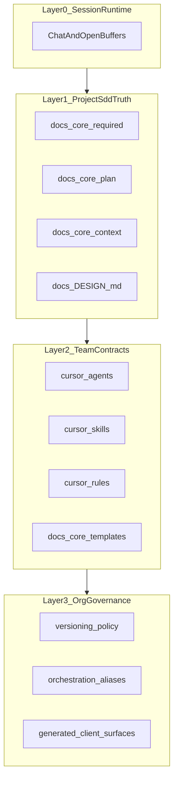

# Memory Architecture (Workspace)

Four conceptual memory layers. Nothing here replaces git history; committed specs and docs remain the source of truth.

## Layer 0 - Session Runtime

| What | Lifetime | Examples |
| --- | --- | --- |
| Cursor chat and open buffers | Ephemeral | Current thread, temporary assumptions |

Practice: close meaningful sessions by updating durable docs and/or running `/SAVE log`.

## Layer 1 - Project SDD Truth

| Path or Artifact | Role |
| --- | --- |
| `docs/core/required/**` | PRD, project prompt, SDD artifacts, feature specs |
| `docs/workspace/plans/**` | Phase and task execution state |
| `.cursor/design/<brand>/design.md` | Active design profile used by `/DEVELOP` flows |
| `docs/workspace/context/CONTEXT.md` | Current project context and active priorities |
| `docs/workspace/context/WORKSPACE_INDEX.md` | Static workspace map and capability index |
| `docs/workspace/context/MEMORY.md` | Durable project facts and recurring preferences |
| `docs/reports/progress/PROGRESS_REPORT.latest.md` | External companion upload bundle |

## Layer 2 - Team Behavior Contracts

| Path or Artifact | Role |
| --- | --- |
| `.cursor/agents/**` | Team and persona charters, routing lenses |
| `.cursor/skills/**/SKILL.md` | Deterministic workflows and procedure contracts |
| `.cursor/rules/*.mdc` | Guardrails, hardlocks, and precedence policy |
| `docs/workspace/templates/{specs,research-design,ai-client,sdd,plan}/**/*.template.{md,json}` | Reusable scaffolds for generated artifacts |
| `docs/workspace/plans/templates/**` | Plan and execution templates used by teams |

## Layer 3 - Organizational and Cross-Client Governance

| Path or Artifact | Role |
| --- | --- |
| `docs/core/VERSIONING.md` | Versioning, tag, and release policy |
| `docs/workspace/context/governance/ORCHESTRATION_ALIASES.md` | Alias and swarm routing governance |
| `AGENTS.md`, `CLAUDE.md`, `GEMINI.md`, `QWEN.md` | Generated cross-client memory surfaces |
| `.claude/**`, `.antigravity/**`, `.gemini/**`, `.qwen/**`, `.codex/**`, `.opencode/**` | Generated client mirrors synced from `.cursor/` |

## Layer Diagram

